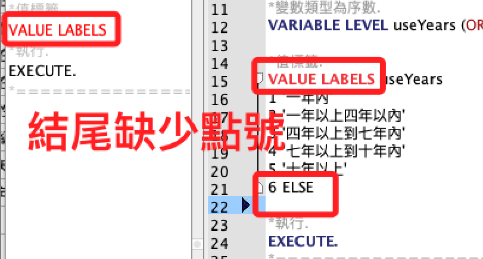

# 語法

_在 SPSS 中，所使用的語法被稱為 `SPSS Syntax`。這些語法指令讓用戶可以自動化數據分析、管理數據以及生成統計報告。SPSS Syntax 通常由指令和相關參數組成，這些指令指示 SPSS 如何處理和分析數據。_

<br>

## 說明

1. 指令 (Commands)：每個指令都指示 SPSS 執行特定的操作，例如 `FREQUENCIES` 指令用於生成頻率分布，`DESCRIPTIVES` 指令用於計算描述性統計。

<br>

2. 子指令 (Subcommands)：指令可以有多個子指令，這些子指令進一步指定指令的細節。例如，在 `FREQUENCIES` 指令中，可以使用 `/STATISTICS` 子指令來指定要計算的統計量。

<br>

3. 參數 (Parameters)：參數提供給指令和子指令具體的數據或選項。例如，在 `FREQUENCIES` 指令中，可以指定一個或多個變數名作為參數。

<br>

4. 分號 (Semicolon)：每個指令通常以分號結束，表示指令的結束。

<br>

5. 點號 `.`：指令的結束須以半形的點 `.` 作為結尾；在實務上，部分語句沒有結尾不會出錯，語法編輯器會顯示紅色。

    

<br>

## 範例

1. 以下是一個簡單的 SPSS Syntax 示例。

    ```spss
    FREQUENCIES VARIABLES=age gender
    /STATISTICS=MEAN MEDIAN MODE.
    ```

<br>

2. 這段語法將生成 `age` 和 `gender` 變數的頻率分布，並計算這些變數的平均值、中位數和眾數。

<br>

3. SPSS Syntax 可以存儲在 `.sps` 文件中，這樣可以重複使用和分享。通過使用 SPSS Syntax，用戶可以更精確地控制數據分析過程，並使分析過程更加透明和可重複。

<br>


___

_END_