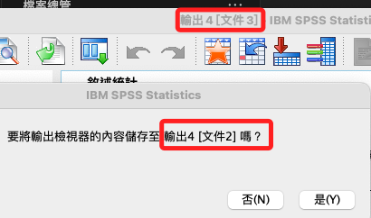

# 輸出

1. 與 `語法` 相同都透過 `檔案 -> 新建` 來開啟，若在執行語法的過程中想觀察輸出資訊，可在執行語法時令開啟 `輸出` 視窗。

<br>

## 開啟與關閉

1. 開啟新的輸出檢視器；`文件1` 是輸出檢視器中括號內 `[]` 的名稱，用以識別檢視器。

    ```bash
    OUTPUT NEW NAME=文件1.
    ```

<br>

2. 關閉指定的輸出檢視器；參數 `NAME` 不可為空，另外，當指定文件不存在時不會報錯。

    ```bash
    OUTPUT CLOSE NAME=文件1.
    ```

<br>

3. 特別注意，SPSS 的輸出檢視器有時候會出現文件名稱與檢視器不吻合的情況。

    

<br>

___

_持續補充_