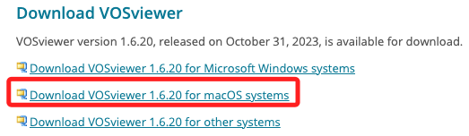
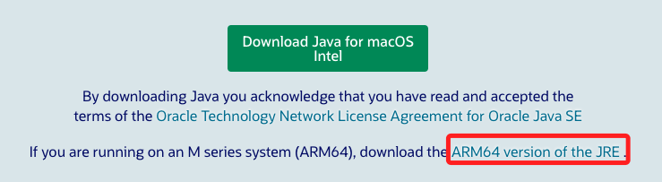
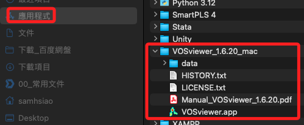
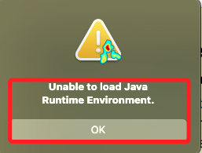
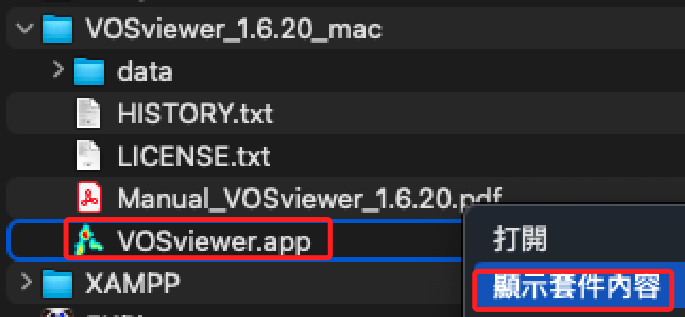
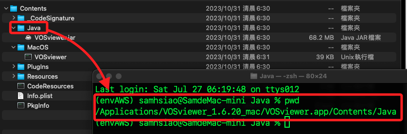
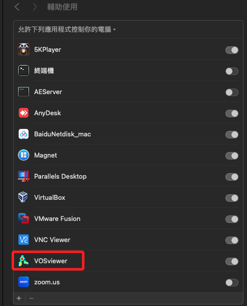
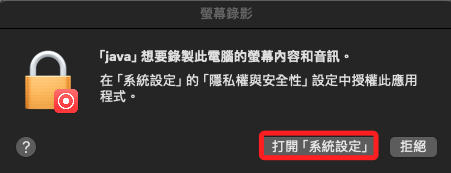
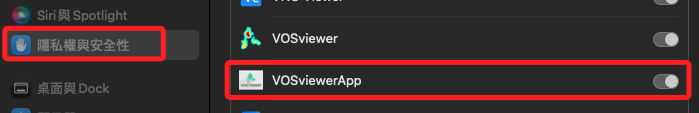
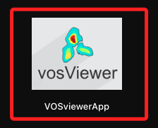

# 環境設置

<br>

## 先完成必要的下載

1. 進入官網下載並安裝 [VOSvierer](https://www.vosviewer.com/download)。

    

<br>

2. 下載並安裝 [ARM64 version of the JRE](https://www.java.com/en/download/)。

    

<br>

3. 將 VOSviewer 解壓縮後的資料夾拖曳到應用程式內。

    

<br>

4. 點擊啟動會顯示如下訊息。

    

<br>

5. 在 `.app` 文件點擊右鍵 `顯示套件內容`。

    

<br>

6. 確認 `VOSvierer.jar` 文件所在位置。

    

<br>

## 簡易啟動

_方法一：快速啟動_

1. 開啟 `.jar` 文件所在的終端機，運行以下指令啟動；但這樣每次都要輸入指令來啟動，有點麻煩。

    ```bash
    java -jar VOSviewer.jar
    ```

<br>

2. 初次啟動會顯示加入輔助使用。

    

<br>

## 製作腳本 

_方法二：製作一個簡單的腳本來自動運行 `java -jar VOSviewer.jar`_

<br>

1. 在桌面建立腳本 `run_vosviewer.command`。

    ```bash
    cd ~/Desktop && nano run_vosviewer.command
    ```

<br>

2. 編輯腳本文件。

    ```bash
    #!/bin/bash
    cd /Applications/VOSviewer_1.6.20_mac/VOSviewer.app/Contents/Java
    java -jar VOSviewer.jar
    ```

<br>

3. 賦予腳本可執行權限 `+x`。

    ```bash
    chmod +x run_vosviewer.command
    ```

<br>

4. 在桌面雙擊 `run_vosviewer.sh` 文件即可啟動 VOSviewer。

    ```bash
    ./run_vosviewer.sh
    ```

<br>

## 打包為應用程式包

_方法三：製作圖標並添加到應用程式_

<br>

1. 進入桌面並建立應用程式包結構。

    ```bash
    cd ~/Desktop && mkdir -p VOSviewerApp.app/Contents/MacOS
    ```

<br>

2. 在應用程式包中建立一個新的啟動腳本 `run_vosviewer.command`。

    ```bash
    nano VOSviewerApp.app/Contents/MacOS/run_vosviewer.command
    ```

<br>

3. 編輯腳本 `run_vosviewer.command`。

    ```bash
    #!/bin/bash
    cd /Applications/VOSviewer_1.6.20_mac/VOSviewer.app/Contents/Java
    java -jar VOSviewer.jar
    ```

<br>

4. 賦予腳本執行權限 `+x`。

    ```bash
    chmod +x VOSviewerApp.app/Contents/MacOS/run_vosviewer.command
    ```

<br>

5. 找一個合適的 `PNG 格式` 圖標，使用 [Image2Icon](https://img2icnsapp.com/) 將其轉換為 `.icns` 格式，命名為 `vosviewer.icns`，並將文件暫時存放在 `~/Downloads`。

<br>

6. 將生成的 `vosviewer.icns` 文件複製或移動到 `VOSviewerApp.app/Contents/Resources` 目錄下。

    ```bash
    mkdir -p VOSviewerApp.app/Contents/Resources && cp ~/Downloads/vosviewer.icns VOSviewerApp.app/Contents/Resources/
    ```

<br>

7. 建立並編輯 `Info.plist` 文件。

    ```bash
    nano VOSviewerApp.app/Contents/Info.plist
    ```

<br>

8. 在文本編輯器中輸入以下內容。

    ```xml
    <?xml version="1.0" encoding="UTF-8"?>
    <!DOCTYPE plist PUBLIC "-//Apple//DTD PLIST 1.0//EN" "http://www.apple.com/DTDs/PropertyList-1.0.dtd">
    <plist version="1.0">
    <dict>
        <key>CFBundleIdentifier</key>
        <string>com.yourdomain.VOSviewerApp</string>
        <key>CFBundleName</key>
        <string>VOSviewerApp</string>
        <key>CFBundleVersion</key>
        <string>1.0</string>
        <key>CFBundleExecutable</key>
        <string>run_vosviewer.command</string>
        <key>CFBundleIconFile</key>
        <string>vosviewer.icns</string>
    </dict>
    </plist>
    ```

<br>

9. 將應用程式包移動到應用程式目錄中。

    ```bash
    mv VOSviewerApp.app /Applications/
    ```

<br>

10. 在應用程式中點擊啟動。

    

<br>

11. 若出現相關提示，則將應用加入 `隱私與安全性` 的 `輔助使用`。

    

<br>

12. 在應用程式中會找到，可點擊啟動或加入快捷。

    

<br>

___

_END_
