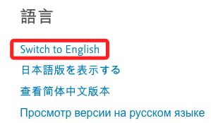
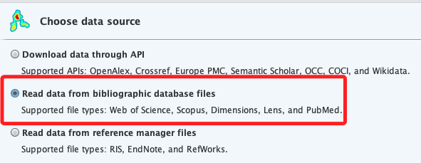

# scopus

 

## 操作說明

1. 進入電子資料庫總覽。

    

 

2. 搜尋 `scopus` 後點擊進入。

    

 

## 關鍵字查詢

_Visually impair*、accessibility、VR_

 

1. 輸入關鍵字。

    

 

2. 滾動到下方，切換到英文。

    

 

3. 搜尋到 `17` 筆，先勾選 `All`，然後輸出為 `CSV`。

    

 

4. 除了 `Fundings details` 以外都勾選起來，點擊 `Export `。

    

 

## VOSviewer

1. 開啟應用，點擊左側 `Create`。

    

 

2. Choose type of data -> Create a map based on bibliographic data -> Nex。

    

 

3. Read data from bibliographic database files -> Next。

    

 

4. Read data from bibliographic database files -> Next。

    

 

5. Scopus -> 選擇檔案(剛剛export的csv檔) -> Next。

    

 

6. 選 `Co-occurrence`、`All keywords`、`Full counting`，這三個都是本來就選好的 -> Next。

    

 

7. Minimun number of occurrences of a keyword -> 1 
這應該是指關鍵字重複出現的次數，選「1」次就是指全部的關鍵字 -> Next。

    

 

8. 再來這裡就是按照原本選定的關鍵字數量即可 -> Next>

    

 

9. 看一下沒啥問題 -> Finish。

    

 

10. 可能會出現警告，可不予理會。

    

 

## 結果

1. 出現關聯圖。

    

 

2. 存擋，自己命名。

    

 

3. 預設儲存在 `Downloads`，會存為兩個 `.txt` 文件。

    

 

4. 也可以選擇螢幕截圖。

    

 

5. 可以點擊 Analysis 頁籤來作翻轉以利分析。

    

 

6. 上方 `Overlay Visualization` 頁籤可查看不同年代的資訊變化。

    

 

7. 也可觀察密度(Density)分析。

    

 

8. 還可以使用左右轉動來看看偏移的可視化資料分布。

    

 

___

_END_
