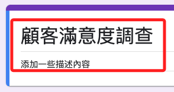
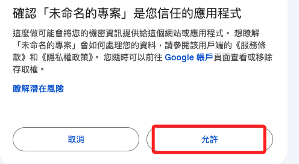

# 製作簡易的 Google 問卷

<br>

## 步驟

1. 進入 [Google 表單](https://forms.google.com)，並建立新表單。

    

<br>

2. 設置表單標題和描述。

    

<br>

3. 添加問題：點擊第一個問題框，輸入問題標題。例如：您對我們的服務滿意嗎？。

<br>

4. 在右側可選擇問題的類型。

<br>

5. 設置選項，以選擇題為例，在選項框中，輸入不同的選項。例如：很滿意、滿意、一般、不滿意、很不滿意。

<br>

6. 設置問題必填：如果某個問題是必須回答的，可以打開問題下方的 `必填` 開關。

<br>

7. 設置表單佈局：可以添加標題、圖片或視頻來豐富表單內容，這些功能都可以在右側工具欄中找到。

<br>

8. 預覽表單：點擊右上角的 `預覽` 按鈕來查看表單的實際效果。

<br>

9.  發佈表單：點擊右上角的 `發送` 按鈕來發佈表單；可以通過電子郵件發送表單鏈接，或複製鏈接並通過其他方式分享。

<br>

## 自動化建立問卷

_使用 Google Apps Script 來編寫腳本以自動化建立和發布表單_

<br>

1. 打開 Google Drive，點擊 `+ 新建` -> `更多` -> `Google Apps Script`，然後點擊 `建立指令碼`。

    

<br>

2. 建立腳本來生成 Google 表單，刪除默認代碼，並輸入以下代碼。
```js
function createAndSendForm() {
  // 創建新表單
  var form = FormApp.create('顧客滿意度調查');
  
  // 添加描述
  form.setDescription('請填寫以下問卷以幫助我們改進服務。');
  
  // 添加第一個問題（選擇題）
  var item = form.addMultipleChoiceItem();
  item.setTitle('您對我們的服務滿意嗎？')
      .setChoices([
        item.createChoice('很滿意'),
        item.createChoice('滿意'),
        item.createChoice('一般'),
        item.createChoice('不滿意'),
        item.createChoice('很不滿意')
      ]);
  
  // 添加第二個問題（簡答）
  form.addParagraphTextItem()
      .setTitle('您認為我們的服務有哪些需要改進的地方？');
  
  // 添加第三個問題（選擇題）
  form.addMultipleChoiceItem()
      .setTitle('您會推薦我們的服務給他人嗎？')
      .setChoices([
        item.createChoice('會'),
        item.createChoice('可能會'),
        item.createChoice('不會')
      ]);
  
  // 獲取表單的發佈鏈接
  var formUrl = form.getPublishedUrl();
  
  // 發送表單鏈接到指定郵箱
  var emailAddress = 'your-email@example.com';  // 修改為你的郵箱地址
  MailApp.sendEmail({
    to: emailAddress,
    subject: '自動生成的 Google 表單',
    body: '請填寫以下 Google 表單：\n' + formUrl
  });
  
  // 輸出表單 URL 以供檢查
  Logger.log('表單 URL：' + formUrl);
}
```

## 運行腳本

1. 點擊工具欄中的儲存圖標，然後點擊執行。

<br>

2. 系統會要求授權，點擊 `審查權限`。

    

<br>

3. 按照提示授權腳本訪問你的 Google 帳戶。

    

<br>

4. 腳本將自動建立表單並發送鏈接到指定的郵箱。

<br>

## 查看表單

1. 打開郵箱，找到包含表單鏈接的郵件。

<br>

2. 點擊鏈接查看生成的 Google 表單。

<br>

___

_END_
