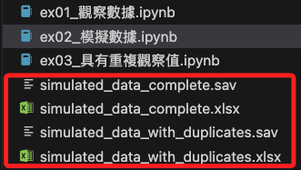

# 說明

_因為數據涉及研究版權，以下先改寫研究數據，生成模擬數據來展示接下來的各種操作_

<br>

## 建立專案

1. 建立並進入專案資料夾，這裡配合後續教程中使用的路徑，將示範的資料夾建立在桌面；資料夾若以存在則直接進入。

    ```bash
    mkdir ~/Desktop/00_論文實作 && cd ~/Desktop/00_論文實作
    ```

<br>

2. 編輯兩個腳本，`ex01_觀察數據.ipynb` 與 `ex02_模擬數據.ipynb`，功能如名稱描述，代碼如下；建立文件後啟動 VSCode。

    ```bash
    touch ex01_觀察數據.ipynb ex02_模擬數據.ipynb && code .
    ```

<br>

3. 腳本 `ex02_模擬數據.ipynb` 運行後，會建立兩個數據文件。

    

<br>

## 編輯腳本

1. 腳本一：`ex01_觀察數據.ipynb`，觀察原始資料的內容，這部分僅作為我編寫講義的紀錄，不提供原始數據檔案；未來若同學有相同需求時，可參考同一模式處理。

    ```python
    # 導入必要庫
    import pandas as pd
    import pyreadstat

    # 讀取原始數據
    file_path = 'v01_01_匯入完成.sav'
    data, meta = pyreadstat.read_sav(file_path)

    # 顯示數據的前幾行以了解其結構
    print(data.head())
    print(data.columns)
    ```

<br>

2. 腳本二：`ex02_模擬數據.ipynb`，依據數據格式，生成模擬數據。

    ```python
    import pandas as pd
    import numpy as np
    import pyreadstat

    # 設定隨機種子以確保結果可重現
    np.random.seed(42)

    # 生理性別，理論上這會趨近各 50%
    # gender = np.random.choice(['男', '女'], size=400)
    # 若希望有點偏差，可以改用
    gender = np.random.choice(
        ['男', '女'], size=400, p=[0.55, 0.45]
    )

    # 年齡區間
    age_ranges = [
        '11 ~ 20歲', '21 ~ 30歲', '31 ~ 40歲',
        '41 ~ 50歲', '51 ~ 60歲', '61歲及以上'
    ]
    # 設定每個年齡區間的比例
    age_probabilities = [0.1, 0.5, 0.15, 0.1, 0.1, 0.05]
    age = np.random.choice(
        age_ranges, size=400, p=age_probabilities
    )

    # 是否使用 Instagram，'是'中簽率 99%，'否'中簽率有 1%
    used_instagram = np.random.choice(
        ['是', '否'], size=400, p=[0.99, 0.01]
    )

    # 是否知道Instagram有「隱藏此貼文的按讚數」
    know_hidden_likes = np.where(
        used_instagram == '是',
        # 設定'是'的機率為 80%
        np.random.choice(['是', '否'], size=400, p=[0.8, 0.2]),
        '否'
    )

    # IG使用年資
    usage_years = [
        '一年內（約在 2023 年下載）',
        '一年以上到四年內（約在 2020 年到 2022 年之間下載）',
        '四年以上到七年內（約在 2017 年到 2019 年之間下載）',
        '七年以上到十年內（約在 2014 年到 2016 年之間下載）',
        '十年以上（約在 2013 年以前下載）'
    ]

    # 設定每個年資段的比例
    usage_years_probabilities = [0.07, 0.2, 0.37, 0.28, 0.08]
    ig_usage_years = np.where(
        used_instagram == '是',
        np.random.choice(usage_years, size=400, p=usage_years_probabilities),
        '不適用'
    )

    # IG登入狀態頻率
    login_frequency = [
        '完全沒有', '數天一次', '一天一次', '數個小時一次',
        '一小時一次', '30分鐘一次', '10分鐘一次', '5分鐘一次'
    ]
    # 設定每個頻率的比例
    login_frequency_probabilities = [
        0.005, 0.2, 0.3, 0.3, 
        0.1, 0.05, 0.03, 0.015
    ]
    ig_login_frequency = np.where(
        used_instagram == '是',
        np.random.choice(
            login_frequency, size=400, p=login_frequency_probabilities),
        '不適用'
    )

    # 使用裝置時間
    device_usage_time = [
        '30分鐘或更少',
        '30分鐘以上，1小時以內',
        '1小時以上，3小時以內',
        '3小時以上'
    ]
    # 設定每個使用時間段的比例
    device_usage_time_probabilities = [0.18, 0.39, 0.33, 0.1]
    ig_device_usage_time = np.where(
        used_instagram == '是',
        np.random.choice(
            device_usage_time,
            size=400,
            p=device_usage_time_probabilities
        ),
        '不適用'
    )

    # 其他社交互動相關的問題
    social_interactions = [
        '非常不同意', '不同意', '普通', '同意', '非常同意'
    ]
    # 設定每個選項的比例
    social_interactions_probabilities = [0.1, 0.3, 0.4, 0.15, 0.05]
    social_responses = np.random.choice(
        # 樣本數及社交焦慮題目數
        social_interactions, size=(400, 19), p=social_interactions_probabilities
    )

    # IG貼文開啟和關閉「隱藏此貼文的按讚數」相關問題
    frequency_responses = [
        '不會如此', '很少如此', '有時如此', '經常如此', '總是如此'
    ]
    # 設定每個頻率的比例
    frequency_responses_probabilities = [0.1, 0.2, 0.4, 0.2, 0.1]
    hidden_likes_responses_open = np.random.choice(
        # 樣本數及單一水平題目數
        frequency_responses, size=(400, 18), p=frequency_responses_probabilities
    )
    hidden_likes_responses_close = np.random.choice(
        frequency_responses, size=(400, 18), p=frequency_responses_probabilities
    )

    # 模擬數據框架
    data = pd.DataFrame({
        '您的生理性別': gender,
        '您的年齡區間': age,
        '請問您是否曾使用Instagram？（若填否則不需填寫': used_instagram,
        '請問您是否知道Instagram有「隱藏此貼文的按讚數': know_hidden_likes,
        '您的IG使用年資（以初次使用為準，無論之後的': ig_usage_years,
        '無論Instagram應用程式的登入狀態，請問您的Instagr': ig_login_frequency,
        '無論是透過手機、平板還是電腦等裝置，請問您': ig_device_usage_time,
        '當我必須與權威人士（如老師、老闆等等）交談': social_responses[:, 0],
        '我對於跟他人眼神交流感到困難。': social_responses[:, 1],
        '當我必須談論我自己或是談論我的感受時，我會': social_responses[:, 2],
        '跟同事相處融洽對我來說很困難。': social_responses[:, 3],
        '如果在街上遇到熟人我會緊張。': social_responses[:, 4],
        '參與社交活動時我的身心會感到不舒服。': social_responses[:, 5],
        '如果要我跟另一個人單獨相處我會感到緊張。': social_responses[:, 6],
        '我覺得在派對或聚會等場合認識人很容易。': social_responses[:, 7],
        '我覺得跟別人交談很困難。': social_responses[:, 8],
        '想話題對我來說很容易。': social_responses[:, 9],
        '在我表達自己時我會擔心很尷尬。': social_responses[:, 10],
        '表達不同意別人的觀點對我來說很困難。': social_responses[:, 11],
        '跟有魅力的異性交談對我來說很困難。': social_responses[:, 12],
        '我很容易擔心自己在社交場合不知道該說什麼。': social_responses[:, 13],
        '跟不熟悉的人相處時我會感到緊張。': social_responses[:, 14],
        '在社交場合中我常常覺得自己會說話很尷尬。': social_responses[:, 15],
        '當要融入一群人的時候，我會擔心自己被忽視。': social_responses[:, 16],
        '跟一群人一起相處時，我會感到緊張。': social_responses[:, 17],
        '遇到不太熟識的人，我不確定是否需要打招呼。': social_responses[:, 18],
        '當我在IG貼文開啟「隱藏此貼文的按讚數和瀏覽': hidden_likes_responses_open[:, 0],
        '當我在IG貼文開啟「隱藏此貼文的按讚數和瀏覽_A': hidden_likes_responses_open[:, 1],
        '當我在IG貼文開啟「隱藏此貼文的按讚數和瀏覽_B': hidden_likes_responses_open[:, 2],
        '當我在IG貼文開啟「隱藏此貼文的按讚數和瀏覽_C': hidden_likes_responses_open[:, 3],
        '當我在IG貼文開啟「隱藏此貼文的按讚數和瀏覽_D': hidden_likes_responses_open[:, 4],
        '當我在IG貼文開啟「隱藏此貼文的按讚數和瀏覽_E': hidden_likes_responses_open[:, 5],
        '當我在IG貼文開啟「隱藏此貼文的按讚數和瀏覽_F': hidden_likes_responses_open[:, 6],
        '當我在IG貼文開啟「隱藏此貼文的按讚數和瀏覽_G': hidden_likes_responses_open[:, 7],
        '當我在IG貼文開啟「隱藏此貼文的按讚數和瀏覽_H': hidden_likes_responses_open[:, 8],
        '當我在IG貼文開啟「隱藏此貼文的按讚數和瀏覽_I': hidden_likes_responses_open[:, 9],
        '當我在IG貼文開啟「隱藏此貼文的按讚數和瀏覽_J': hidden_likes_responses_open[:, 10],
        '當我在IG貼文開啟「隱藏此貼文的按讚數和瀏覽_K': hidden_likes_responses_open[:, 11],
        '當我在IG貼文開啟「隱藏此貼文的按讚數和瀏覽_L': hidden_likes_responses_open[:, 12],
        '當我在IG貼文開啟「隱藏此貼文的按讚數和瀏覽_M': hidden_likes_responses_open[:, 13],
        '當我在IG貼文開啟「隱藏此貼文的按讚數和瀏覽_N': hidden_likes_responses_open[:, 14],
        '當我在IG貼文開啟「隱藏此貼文的按讚數和瀏覽_O': hidden_likes_responses_open[:, 15],
        '當我在IG貼文開啟「隱藏此貼文的按讚數和瀏覽_P': hidden_likes_responses_open[:, 16],
        '當我在IG貼文開啟「隱藏此貼文的按讚數和瀏覽_Q': hidden_likes_responses_open[:, 17],
        '當我在IG貼文關閉「隱藏此貼文的按讚數和瀏覽': hidden_likes_responses_close[:, 0],
        '當我在IG貼文關閉「隱藏此貼文的按讚數和瀏覽_A': hidden_likes_responses_close[:, 1],
        '當我在IG貼文關閉「隱藏此貼文的按讚數和瀏覽_B': hidden_likes_responses_close[:, 2],
        '當我在IG貼文關閉「隱藏此貼文的按讚數和瀏覽_C': hidden_likes_responses_close[:, 3],
        '當我在IG貼文關閉「隱藏此貼文的按讚數和瀏覽_D': hidden_likes_responses_close[:, 4],
        '當我在IG貼文關閉「隱藏此貼文的按讚數和瀏覽_E': hidden_likes_responses_close[:, 5],
        '當我在IG貼文關閉「隱藏此貼文的按讚數和瀏覽_F': hidden_likes_responses_close[:, 6],
        '當我在IG貼文關閉「隱藏此貼文的按讚數和瀏覽_G': hidden_likes_responses_close[:, 7],
        '當我在IG貼文關閉「隱藏此貼文的按讚數和瀏覽_H': hidden_likes_responses_close[:, 8],
        '當我在IG貼文關閉「隱藏此貼文的按讚數和瀏覽_I': hidden_likes_responses_close[:, 9],
        '當我在IG貼文關閉「隱藏此貼文的按讚數和瀏覽_J': hidden_likes_responses_close[:, 10],
        '當我在IG貼文關閉「隱藏此貼文的按讚數和瀏覽_K': hidden_likes_responses_close[:, 11],
        '當我在IG貼文關閉「隱藏此貼文的按讚數和瀏覽_L': hidden_likes_responses_close[:, 12],
        '當我在IG貼文關閉「隱藏此貼文的按讚數和瀏覽_M': hidden_likes_responses_close[:, 13],
        '當我在IG貼文關閉「隱藏此貼文的按讚數和瀏覽_N': hidden_likes_responses_close[:, 14],
        '當我在IG貼文關閉「隱藏此貼文的按讚數和瀏覽_O': hidden_likes_responses_close[:, 15],
        '當我在IG貼文關閉「隱藏此貼文的按讚數和瀏覽_P': hidden_likes_responses_close[:, 16],
        '當我在IG貼文關閉「隱藏此貼文的按讚數和瀏覽_Q': hidden_likes_responses_close[:, 17]
    })

    # 儲存為 .xlsx 文件
    xlsx_path = 'simulated_data_complete.xlsx'
    data.to_excel(xlsx_path, index=False)

    # 儲存為 .sav 文件
    sav_path = 'simulated_data_complete.sav'
    pyreadstat.write_sav(data, sav_path)

    print("文件已儲存為 .xlsx 和 .sav 格式。")
    ```

<br>

## 加入重複觀察值

1. 添加以下代碼加入重複觀察樣本，或修改原本樣本具有部分的重複觀察值。

    ```python
    '''第一類重複樣本'''
    # 複製前3個樣本的所有數據
    duplicate_1 = data.iloc[0:3].copy()
    # 將重複樣本添加到數據集中，也就是三個重複觀察值
    data = pd.concat([data, duplicate_1], ignore_index=True)

    '''第二類重複樣本'''
    # 複製第14到16的樣本的人口資訊與社交焦慮數據
    duplicate_2 = data.iloc[13:16, :26].copy()
    # 將第14到16樣本的數據覆蓋到第4到6樣本
    # 這樣第4到6樣本在這些欄位上的數據將與第14到16樣本完全一致
    data.iloc[3:6, :26] = duplicate_2.values

    '''第三類重複樣本'''
    # 假設第1到7列是人口資訊，第26到44列是顯示點讚相關列，第45到62列是隱藏點讚相關列
    # 複製第14到16的樣本的人口資訊及顯示/隱藏點讚數據
    duplicate_3 = data.iloc[13:16, np.r_[0:7, 25:44, 44:62]].copy()
    # 將第14到16樣本的人口資訊及顯示/隱藏點讚數據覆蓋到第7到9樣本
    data.iloc[6:9, np.r_[0:7, 25:44, 44:62]] = duplicate_3.values

    # 儲存為 .xlsx 文件
    xlsx_path = 'simulated_data_with_duplicates.xlsx'
    data.to_excel(xlsx_path, index=False)
    # 儲存為 .sav 文件
    sav_path = 'simulated_data_with_duplicates.sav'
    pyreadstat.write_sav(data, sav_path)

    print("具有重複觀察值的數據文件已儲存。")
    ```

<br>

2. 以下僅僅是提供刪除重複觀察值的代碼，無需加入以上腳本。

    ```python
    # 示範識別和刪除重複樣本
    def remove_duplicates(df):
        before_len = len(df)
        df = df.drop_duplicates()
        after_len = len(df)
        print(f"移除重複樣本前樣本數: {before_len}, 移除重複樣本後樣本數: {after_len}")
        return df

    # 讀取數據
    data, meta = pyreadstat.read_sav(sav_path)

    # 刪除重複樣本
    data = remove_duplicates(data)
    ```

<br>

___

_END：接著進入下一個步驟，使用模擬數據_