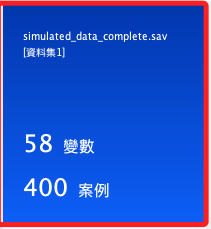
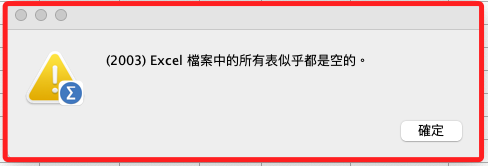
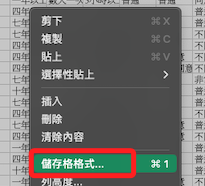
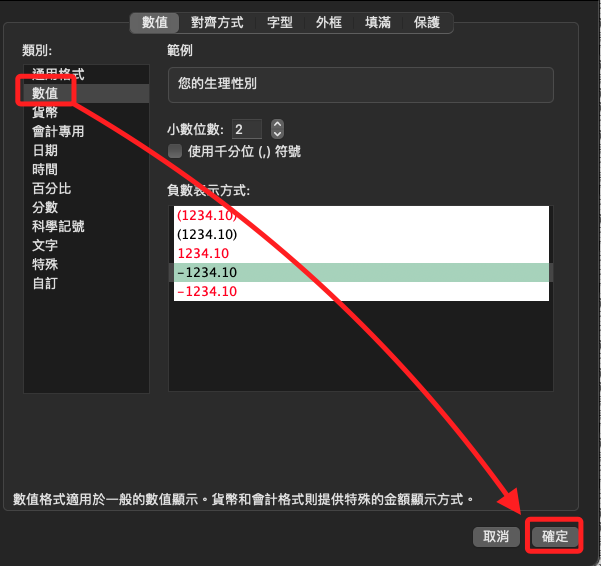
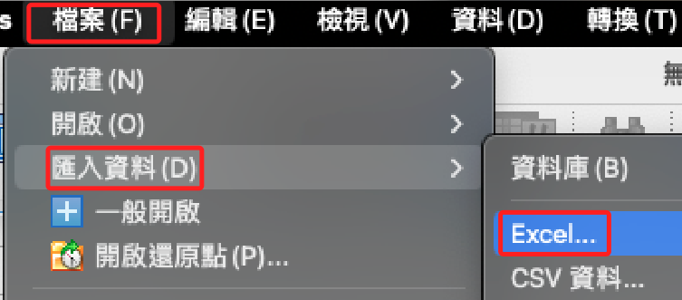
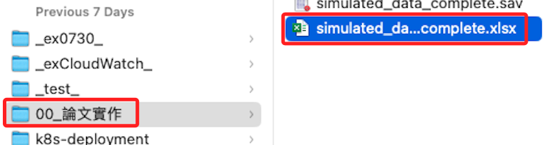
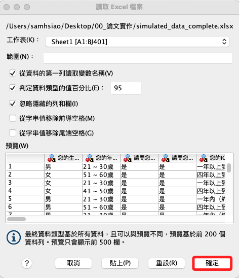

# 使用數據

<br>

## 步驟說明

1. 開啟 SPSS，假如有製作快速啟動，可透過終端機執行以下指令。

    ```bash
    spss
    ```

<br>

2. 在 SPSS 中選取 `檔案 -> 新建 -> 語法`，然後運行以下指令。

    ```bash
    GET FILE='/Users/samhsiao/Desktop/00_論文實作/simulated_data_complete.sav'.
    DATASET NAME 資料集1.
    ```

<br>

3. 當前有400個樣本及58個變數。

    

<br>

4. 特別注意，載入資料後，若 `資料編輯器` 並未顯示在前景，可點擊下方 Dock 上的 SPSS 圖標。

<br>

## 練習導入 EXCEL 文件

1. 假如直接使用 SPSS 開啟 .xlsx 文件，會看到如下訊息。

    

<br>

2. 如同下載 Google 表單一樣，要先使用 Excel 開啟文件，全選內容後點擊滑鼠右鍵，選取 `儲存格格式`。

    

<br>

3. 並將內容轉換為數值，確認後儲存並退出 Excel。

    

<br>

3. 啟動 SPSS，透過面板操作，匯入 Excel 資料。

    

<br>

4. 選擇桌面文件。

    

<br>

5. 直接點擊確認即可。

    

<br>

___

_完成以上步驟後，接續 `05_重新編碼` 繼續操作_