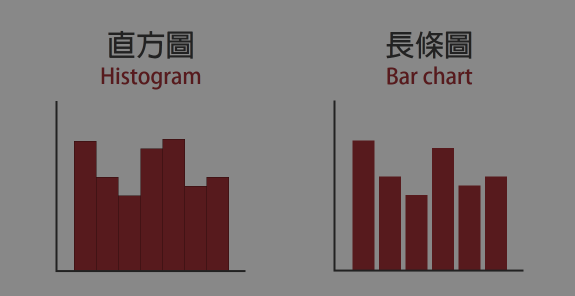
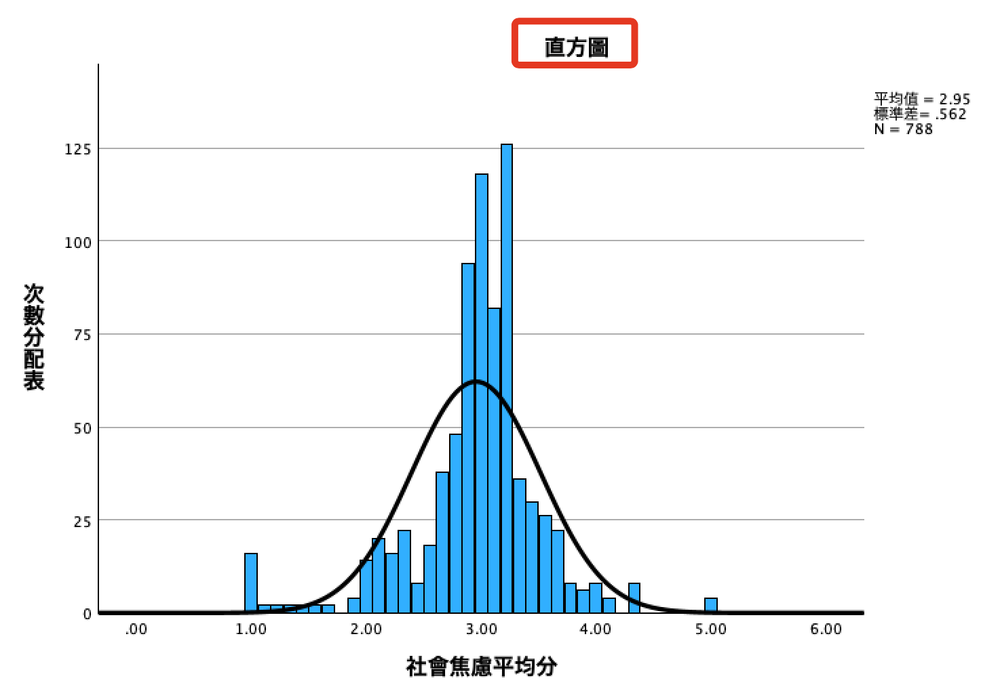
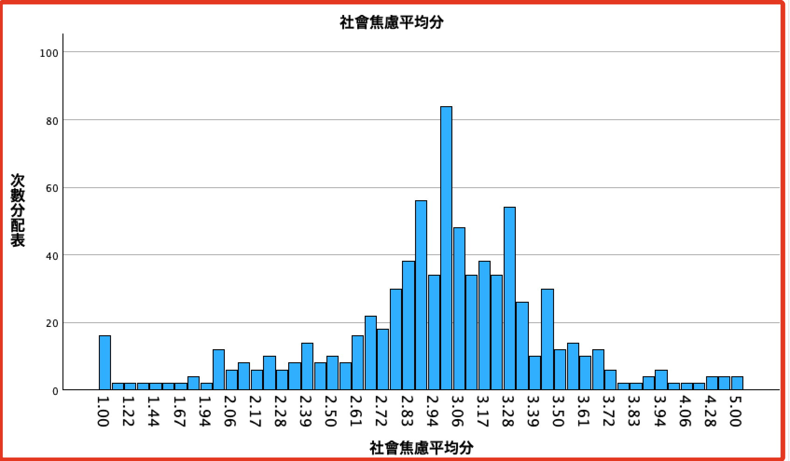
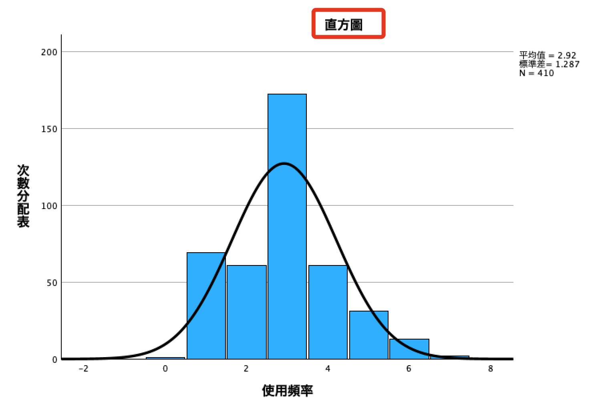
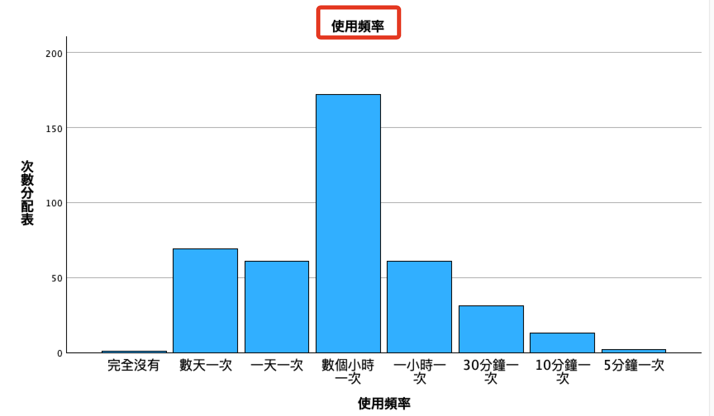

# 直方圖 vs 長條圖

 

## 說明

_直方圖與長條圖的使用情境是不同的_

 

1. 直方圖與連續型資料：直方圖通常用於展示連續型數據的分布。它顯示了數據在不同數值區間（稱為「桶」或「bin」）的頻率。直方圖非常適合於展示數據的整體分布，特別是用於檢視數據是否近似於某種理論分布（如常態分布）。

 

2. 長條圖與分類型資料：長條圖則用於顯示分類型（類別型）數據。在長條圖中，每個條代表一個類別，其高度表示該類別的頻率或計數。長條圖適合於展示不同類別的計數或比例。

 

3. 直方圖與常態曲線：直方圖常用於與常態分布曲線相結合，這可以幫助判斷數據是否近似常態分布。通過在直方圖上疊加一條常態分布曲線，可以直觀地展示數據的分布情況與常態分布的相似程度。

 

## 彙整

1. 直方圖適合連續型數據並可用於檢視數據的分布特性，包括是否近似常態分布。

 

2. 長條圖更適合於展示分類型數據。

 

## 圖型的間隔

1. 連續型資料 -> 直方圖

    把連續型資料繪製直方圖時，會依據連續的特質，每個直方之間相接無間距。

    

 

2. 連續型資料 -> 長條圖

    雖然是連續資料，因為長條圖的特性，所以會顯示出間隔

    

 

3. 分類型資料 -> 直方圖

    直方圖是連續資料使用，因為資料本身是不連續的分類資料，所以會呈現間隔，但依舊可以繪製出常態曲線。

    

 

4. 連續資料 -> 長條圖

    長條圖不會有「常態曲線」，且彼此存在間距。

    

/ 

___

_END_
