# 項目與總分相關

<br>

## 特別說明

_以下這個總分相關是使用轉換為長格式之後的數據，所以樣本數會膨脹，按理說，應該是要在轉換之前做，或是使用轉換前的資料來做，所以這裡先記錄一下方式，之後再修正所使用的資料。_

<br>

## 說明

1. 透過題目與構面總分的相關性檢驗題目同質性，與信度分析性質雷同。

<br>

2. 假如有做信度分析，在項目分析的時候可以不用重複這個檢驗，或是在信度分析出現狀況的時候，可進一步透過項目與總分相關性做確認。

<br>

## 步驟說明

1. 因為要計算總分，所以先將 tQ01~tQ18 轉換尺度（連續數值）。可以一個個透過下拉選單作修改。

    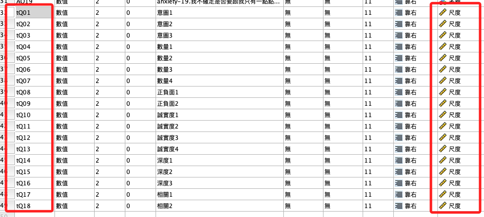

<br>

2. 或是透過語法將原本的「名義」改為「尺度」

    ```bash
    *========================.
    VARIABLE LEVEL tQ01 TO tQ18 (SCALE).
    *========================.
    ```

<br>

3. 然後要計算總分，分別對各構面以計算變數計算構面總分，先對其中的 tQ01-tQ03 做一次加總，並命名為 sumQ01，點擊「貼上」語法。

    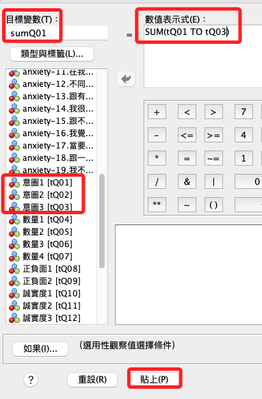

<br>

4. 複製並修改顯示在語法對話視窗的語法。

    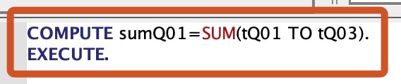

<br>

5. 除了複製並修改語法外，可進一步添加標籤以及設定尺度。

    ```bash
    *==============================.
    COMPUTE sumQ01=SUM(tQ01 TO tQ03).
    EXECUTE. 
    VARIABLE LABELS sumQ01 '意圖總分 tQ01 to tQ03'.
    VARIABLE LEVEL sumQ01 (SCALE).

    COMPUTE sumQ02=SUM(tQ04 TO tQ07).
    EXECUTE.
    VARIABLE LABELS sumQ02 '數量總分 tQ04 to tQ07'.
    VARIABLE LEVEL sumQ02 (SCALE).

    COMPUTE sumQ03=SUM(tQ08 TO tQ09).
    EXECUTE.
    VARIABLE LABELS sumQ03 '正負面總分 tQ08 to tQ09'.
    VARIABLE LEVEL sumQ03 (SCALE).

    COMPUTE sumQ04=SUM(tQ11 TO tQ13).
    EXECUTE.
    VARIABLE LABELS sumQ04 '誠實度總分 tQ11 to tQ13'.
    VARIABLE LEVEL sumQ04 (SCALE).

    COMPUTE sumQ05=SUM(tQ14 TO tQ16).
    EXECUTE.
    VARIABLE LABELS sumQ05 '深度總分 tQ14 to tQ16'.
    VARIABLE LEVEL sumQ05 (SCALE).

    COMPUTE sumQ06=SUM(tQ17 TO tQ18).
    EXECUTE.
    VARIABLE LABELS sumQ06 '相關總分 tQ17 to tQ18'.
    VARIABLE LEVEL sumQ06 (SCALE).
    *==============================.
    ```

<br>

6. 執行後得到結果。

    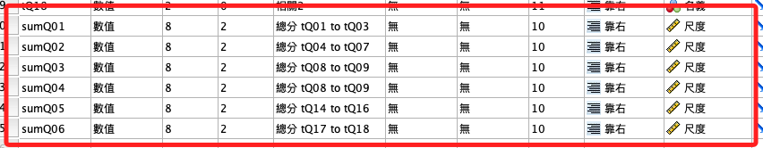

<br>

7. `分析 -> 相關 -> 雙變異數`。

    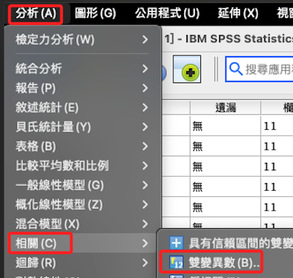

<br>

8. 使用第一個構面的三個題目（項目）與總分

    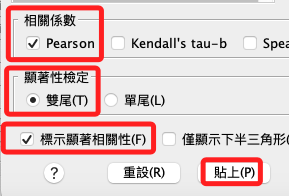

<br>

9. 其中使用的檢定項目如下，同樣貼上語法。

    

<br>

10. 顯示語法

    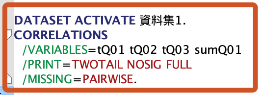

<br>

11. 可複製以下腳本

    ```bash
    *=========================.
    *雙變異數相關.
    CORRELATIONS
      /VARIABLES=tQ01 tQ02 tQ03 sumQ01
      /PRINT=TWOTAIL NOSIG FULL
      /MISSING=PAIRWISE.
    *=========================.
    ```

<br>

## 執行後

1. 第一個構面：全部高於0.3且顯著

    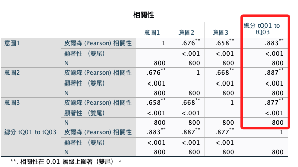

<br>

2. 第二個構面

    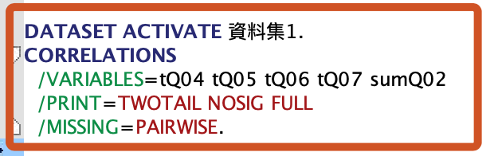

<br>

3. 語法

    ```bash
    *==============================.
    DATASET ACTIVATE 資料集1.
    CORRELATIONS
      /VARIABLES=tQ04 tQ05 tQ06 tQ07 sumQ02
      /PRINT=TWOTAIL NOSIG FULL
      /MISSING=PAIRWISE.
    *==============================.
    ```

<br>

4. 全部高於0.3且顯著

  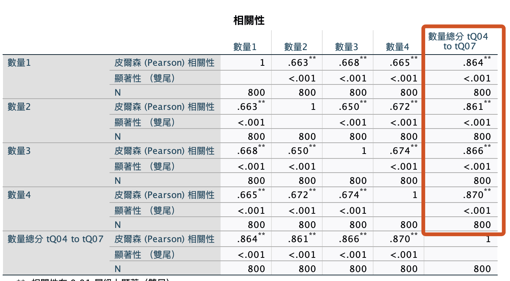

<br>

5. 第三個構面

    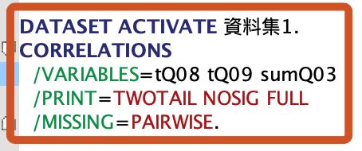

<br>

6. 語法

    ```bash
    *==============================.
    DATASET ACTIVATE 資料集1.
    CORRELATIONS
      /VARIABLES=tQ08 tQ09 sumQ03
      /PRINT=TWOTAIL NOSIG FULL
      /MISSING=PAIRWISE.
    *==============================.
    ```

<br>

7. 輸出：相關性

    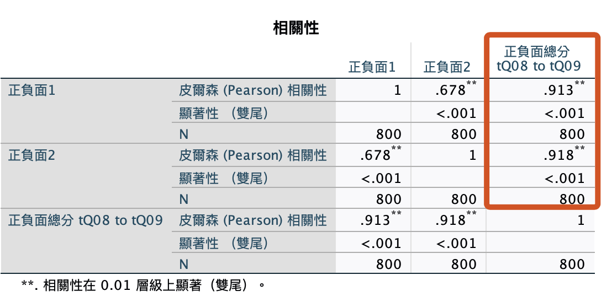

<br>

8. 剩下三個語法一起

    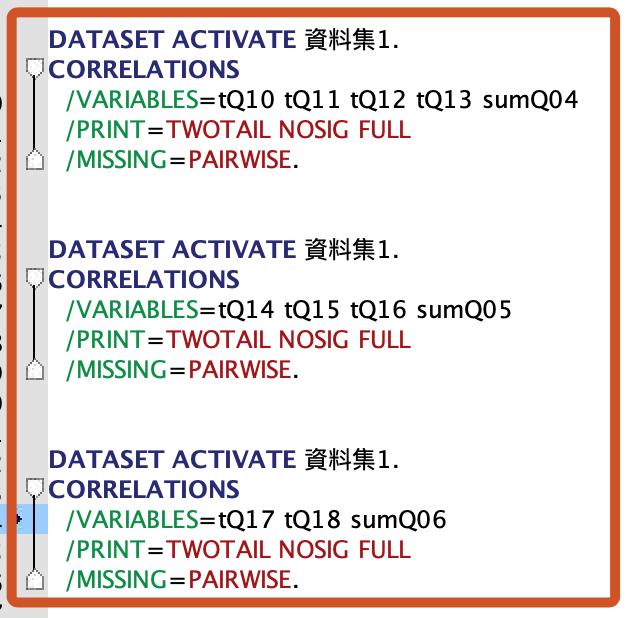

<br>

9. 語法

    ```bash
    *==============================.
    DATASET ACTIVATE 資料集1.
    CORRELATIONS
      /VARIABLES=tQ10 tQ11 tQ12 tQ13 sumQ04
      /PRINT=TWOTAIL NOSIG FULL
      /MISSING=PAIRWISE.


    DATASET ACTIVATE 資料集1.
    CORRELATIONS
      /VARIABLES=tQ14 tQ15 tQ16 sumQ05
      /PRINT=TWOTAIL NOSIG FULL
      /MISSING=PAIRWISE.


    DATASET ACTIVATE 資料集1.
    CORRELATIONS
      /VARIABLES=tQ17 tQ18 sumQ06
      /PRINT=TWOTAIL NOSIG FULL
      /MISSING=PAIRWISE.
    *==============================.
    ```

<br>

10. 第四個構面

    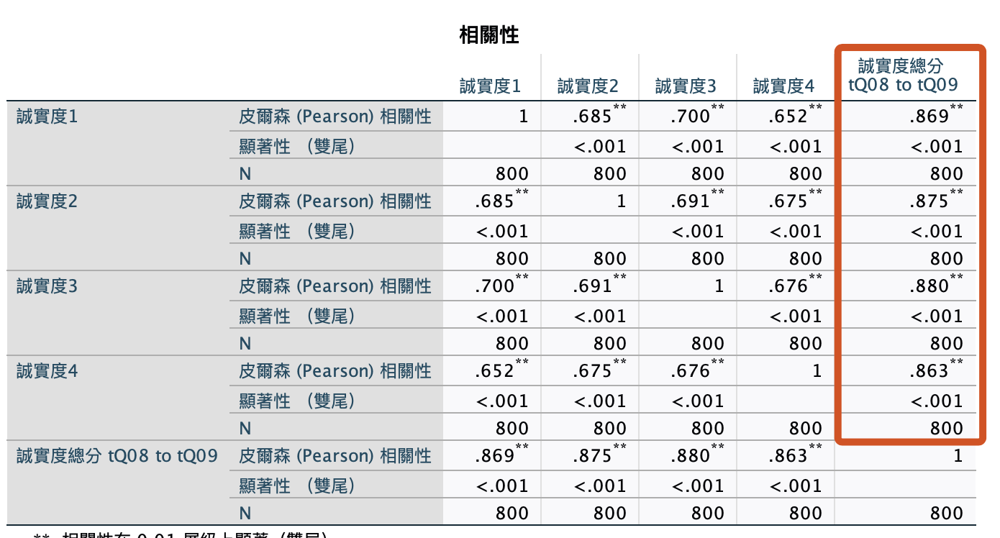

<br>

11. 第五個構面

    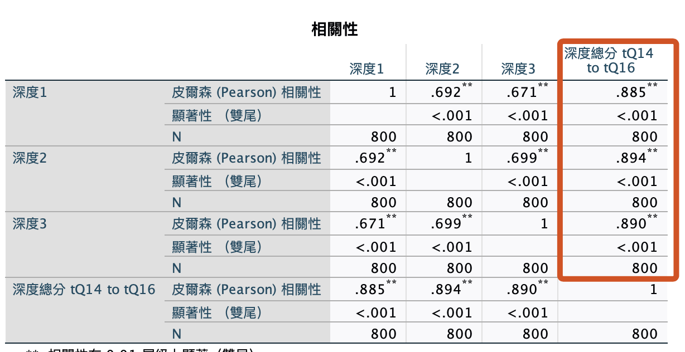

<br>

12. 第六個構面

    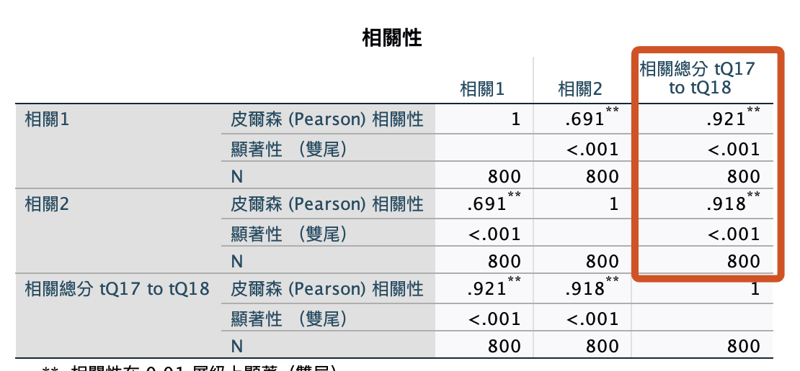

<br>

___

_END_