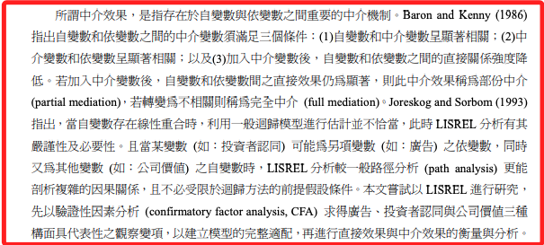

# 中介效應

 

## 名詞

1. 部份中介（partial mediation）

2. 完全中介（full mediation）

 

## 說明

1. 所謂中介效果，是指存在於自變數與依變數之間重要的中介機制。

 

2. 中介變數須滿足三個條件：

    1) 自變數和中介變數呈顯著相關；

    2) 中 介變數和依變數呈顯著相關；

    3) 加入中介變數後，自變數和依變數之間的直接關係強度降低。

 

3. 若加入中介變數後，自變數和依變數間之直接效果仍為顯著，則此中介效果稱為部份中介（partial mediation），若轉變為不相關則稱為完全中介（full mediation）。

 

## 參考

 

___

_END_