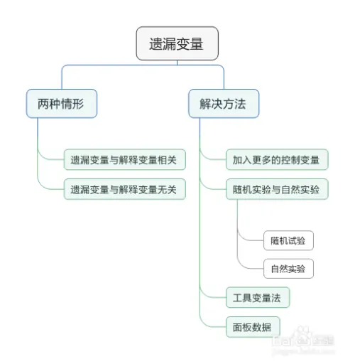

# 遺漏變量

 

## 名詞

1. 遺漏變量偏差（Omitted Variable Bias，OVB）

 

2. 高斯-馬可夫定理（Gauss-Markov Theorem）

 

3. 最佳線性不偏估計（Best Linear unbiased estimator，BLUE）

 

4. 獨立同分布（Independent and identically distributed，iid、 i.i.d.、IID）

 

5. 最小二乘法（OLS）

 

## 緣起

_試圖思考Ｔ檢定不顯著的原因，是否可能是「遺漏變量」？_

 

## 說明：高斯-馬可夫定理

1. 在統計學的線性迴歸模型中，如果線性模型滿足高斯馬可夫定理，則迴歸係數的「最佳線性不偏估計」就是普通最小平方法估計。

 

2. 最佳估計是指相較於其他估計量有更小變異數的估計量，同時把對估計量的尋找限制在所有可能的線性不偏估計量中，此外，誤差也不一定需要滿足獨立同分布或常態分布。

 

## 說明：獨立同分佈

_指一組隨機變數中每個變量的機率分布都相同，且這些隨機變數互相獨立。_

 

## 說明

1. 遺漏變量偏差發生在統計模型中一個或多個重要的解釋變量（自變量）被忽略時，可能導致模型估計結果產生偏差，這種偏差出現的原因是因為模型未能捕捉到所有影響因變量的因素，從而將遺漏變量的效應錯誤地歸因於模型中包含的變量。

 

2. 高斯-馬爾可夫定理認為，在傳統線性迴歸模型的假設下（其中一個關鍵假設是誤差項與解釋變量無關），「普通最小二乘法（OLS）估計」將是「最佳線性無偏估計（BLUE）」，然而，「遺漏變量偏差」違反了這些假設，導致OLS 估計器偏差且不一致。 

 

3. 遺漏變量偏差的方向和程度取決於遺漏變量與模型中包含的變量及因變量之間的關係，如果遺漏變量與包含的變量具有正（或負）相關，則可能會導致估計係數被高估（或低估）。

 

___

_END_