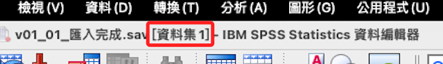
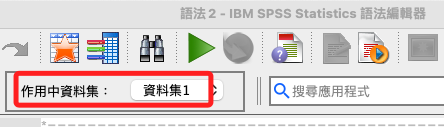
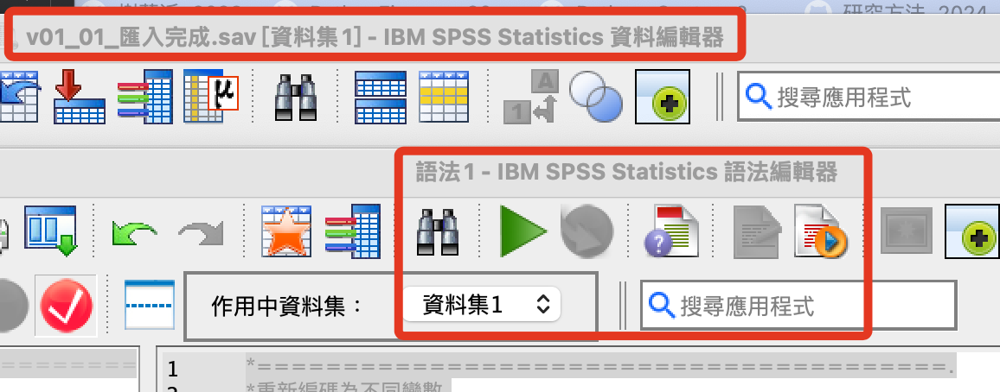

# 說明

_簡單提示_

<br>

1. 以下作業對於數據文件中的每一個資料欄位都將進行數據清洗操作。

<br>

2. 數據的清洗是個複雜的程序，在這個筆記中僅討論基礎的資料清洗，如遇到遺漏值時就對樣本進行刪除，不涉及進階的補全技術應用。    

<br>

3. 在開始編碼之前，可以重新開啟 `.sav` 檔案，並確認當前資料集是否為 `資料集1`，這將影響後續的 `語法` 是否需要修正，假如是 `資料集1` 會比較方便。

    

<br>

4. 假如不是 `資料集1`，關閉重新開啟即可。

<br>

5. 範例語句中多有使用 `*======.` 這樣的字樣，用意是便於視覺上的區隔，當有大量語句操作時，也可避免誤刪關鍵語句，此後不再贅述。

<br>

## 準備工作

_這裡再次補充一下準備的工作，後續可能就不再每次都贅述了_

<br>

1. 假如數據的資料集與作用中資料集不同時，可透過指令開啟指定的資料集，如 `資料集1`。

    ```bash
    *========================================.
    DATASET ACTIVATE 資料集1.
    *========================================.
    ```

<br>

2. 假如要變更當前資料集名稱或命名當前空白的資料集名稱為 `資料集1`。

    ```bash
    *==============================.
    *命名資料集.
    DATASET NAME 資料集1.
    *==============================.
    ```

<br>

3. 若要關閉當前輸出文件，並開啟新的輸出文件，注意其中的 `文件1` 必須吻合。

    ```bash
    *========================================.
    *關閉指定的輸出文件.
    OUTPUT CLOSE NAME=文件1.

    *開啟新的輸出文件.
    OUTPUT NEW NAME=文件1.
    *========================================.
    ```

<br>

4. 數據的資料集在 `資料編輯器` 上方會顯示。

    

<br>

5. 作用中資料集則在 `語法編輯器` 中顯示。

    

<br>

6. 所以在操作中，要特別留意這兩者是正確配對的。

    

<br>

___

_開啟語法編輯器進入下一步驟，其餘補充事後陸續寫入_
