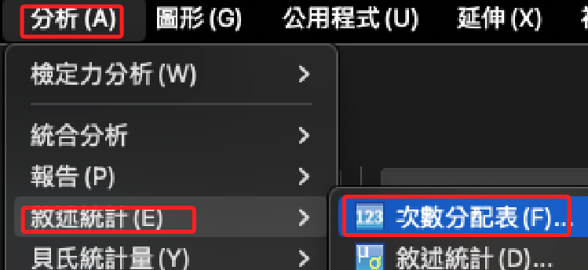
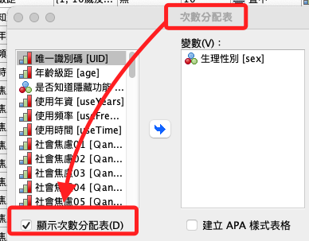
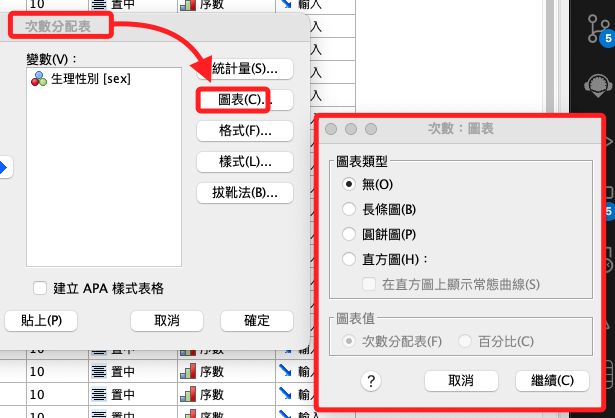
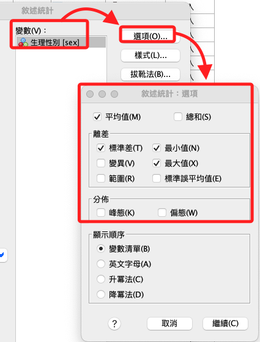
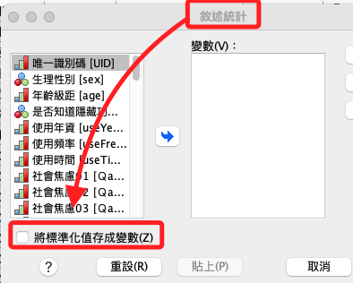

# 敘述統計

_敘述統計部分分為 `次數分配` 與 `敘述統計` 兩個功能選項_

 

## 次數分配

1. 主要是透過 `次數分配` 進行觀察：`分析 -> 敘述統計 -> 次數分配表`。

    

 

2. 在次數分配表左下角有個 `顯示次數分配表` 的選項，基本上都要勾選，否則不會顯示分配表。

    

 

3. 在次數分配表中可以繪圖表。

    

 

## 敘述統計

1. 也可以使用 `敘述統計`。

    

 

2. 敘述統計中可以轉存 `Z 分數`。

    

 

___

_END_