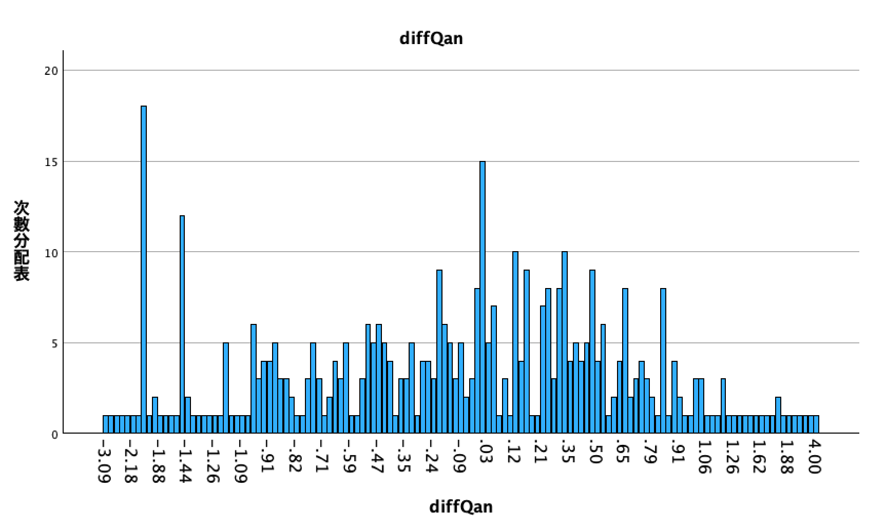
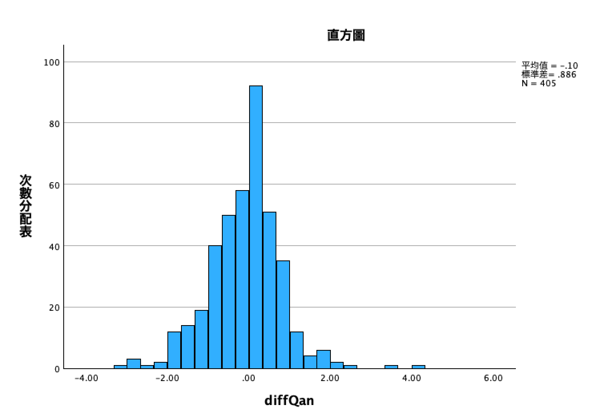

# 過濾與檢查 II

<br>

## 說明

1. 這部分是針對 `社會焦慮` 的 `第 08、10` 兩題 `Qan08`、`Qan10` 所進行的過濾與檢查。

2. 因為這部分的 `19` 題都是用來評估 `社交焦慮` 構面，所以思路上是反轉工作完成後，比對 `正向題17題` 與 `反轉題2題` 是否有極值現象，也就是觀察正向題與反向題的 `平均數差值` 是否過度偏差。

3. 並非檢驗出現極值現象都要進行題目的刪除，所有樣本與題目的刪除都必須有充分且合理的推理才能進行；再次強調，所有樣本或是題目在數據蒐集完成後的刪減，都需審慎地評估與完整地說明。

<br>

## 計算

1. 計算差值：建立新的變數 `diffQan` 用來表示差值。

    ```bash
    *========================================.
    *計算差值＝平均數-平均數.
    COMPUTE avgQanNR = MEAN( 
    Ｑan01, Ｑan02, Ｑan03, Ｑan04, Ｑan05, Ｑan06, Ｑan07, 
    Ｑan09, Ｑan11, Ｑan12, Ｑan13, Ｑan14, Ｑan15, Ｑan16, 
    Ｑan17, Ｑan18, Ｑan19).
    COMPUTE avgQan_R = MEAN(Ｑan08, Ｑan10).
    COMPUTE diffQan = avgQanNR  - avgQan_R.
    EXECUTE.
    DELETE VARIABLES avgQanNR avgQan_R.
    EXECUTE.
    *========================================.
    ```

<br>

2. 排序＆觀察：由差值的長條圖觀察其分佈。

    ```bash
    *========================================.
    *排序.
    SORT CASES BY diffQan(A).

    *次數分配＋長條圖.
    FREQUENCIES VARIABLES=diffQan  
    /BARCHART FREQ
    /ORDER=ANALYSIS.
    *========================================.
    ```

    

<br>

## 改用直方圖

1. 在統計學中，Barchart 長條圖與 Histogram 直方圖是用來呈現不同數據類型的工具，長條圖用於顯示 `類別數據` 的頻率或比例，X 軸表示 `數據中的類別`；而直方圖則用於顯示 `連續數據` 的分佈情況，X 軸表示 `數據範圍`。

<br>

2. 這部分觀察的 `差值` 是由計算所得的統計量，屬於連續類型數據，所以應該使用直方圖。

    ```bash
    *========================================.
    *排序.
    SORT CASES BY diffQan(A).

    *次數分配＋直方圖.
    FREQUENCIES VARIABLES=diffQan  
    /HISTOGRAM
    /ORDER=ANALYSIS.
    *========================================.
    ```

    

<br>

___

_END_
