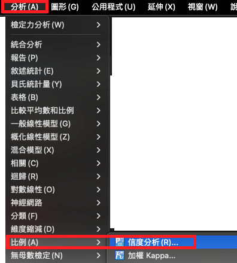
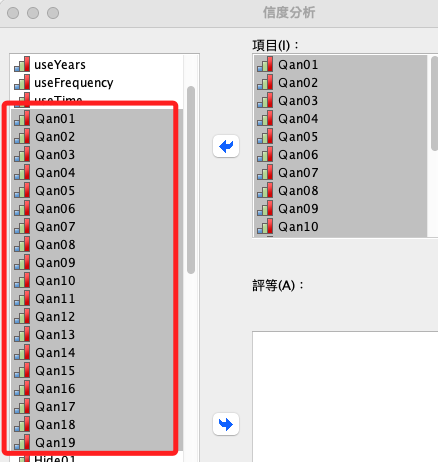
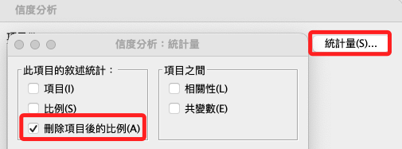
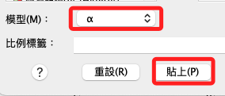
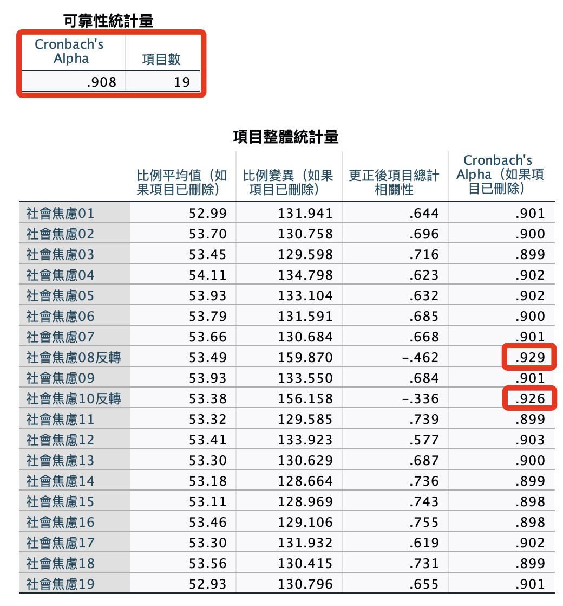
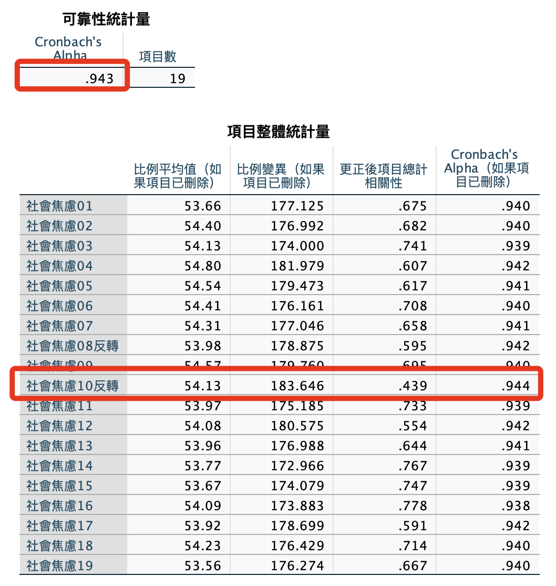
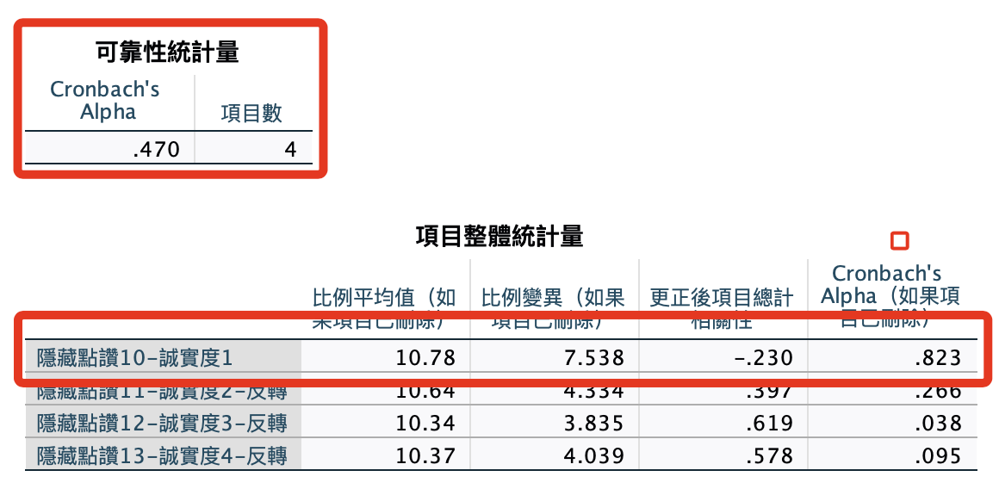
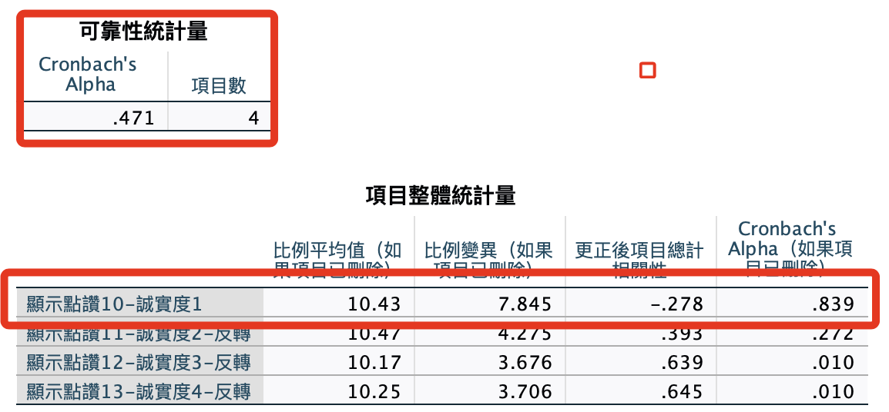

# 信度分析

_接下來的分析中，請著重於方法的使用，至於要使用哪一個過濾與刪除標準並非討論的重點，以下將使用 `15_反轉完成` 的數據作為演釋數據。_

<br>

## 說明

1. 更正後項目總計相關性：這一欄顯示了每個題目與問卷其餘部分的相關程度。一般來說，這個值越高意味著該題目與整體問卷的一致性越好。

<br>

## 面板操作

1. `分析 -> 比例 -> 信度分析`。

    

<br>

2. 選取數據：理論上每次對單一構面進行選取分析。

    

<br>

3. `統計量 -> 刪除項目後的比例`：要顯示刪除項目後比例變化。

    

<br>

4. 點擊 `貼上` 語法。

    

<br>

## 語法

_信度分析_

<br>

1. 開啟指定的資料集 `資料集1`。

    ```bash
    *========================================.
    DATASET ACTIVATE 資料集1.
    *========================================.
    ```

<br>

2. 社交焦慮-整體。

    ```bash
    *===============================================.
    *社交焦慮信度：完整19題的信度.

    RELIABILITY
      /VARIABLES=Ｑan01 TO Ｑan19
      /SCALE('ALL VARIABLES') ALL
      /MODEL=ALPHA
      /SUMMARY=TOTAL.
    *===============================================.
    ```

<br>

3. 嘗試進行刪除看看。

    

<br>

4. 社交焦慮-刪除兩題 Qan08、Qan10 。

    ```bash
    *===============================================.
    *社交焦慮19題的整體信度.

    RELIABILITY
      /VARIABLES= 
    Ｑan01 Ｑan02 Ｑan03 Ｑan04 Ｑan05 Ｑan06 Ｑan07 
    Ｑan09 
    Ｑan11 Ｑan12 Ｑan13 Ｑan14 Ｑan15 Ｑan16  Ｑan17 Ｑan18 Ｑan19 
      /SCALE('ALL VARIABLES') ALL
      /MODEL=ALPHA
      /SUMMARY=TOTAL.
    *===============================================.
    ```

<br>

5. 結果：影響不大無需理會。

    

<br>

6. 信度：隱藏-整體，我個人是覺得整體的檢定並無統計上的意義。

    ```bash
    *===============================================.
    *隱藏點讚自我揭露18題的統一信度.
    RELIABILITY
      /VARIABLES=
    Hide01 Hide02 Hide03 
    Hide04 Hide05 Hide06 Hide07 
    Hide08 Hide09  
    Hide10 Hide11 Hide12 Hide13 
    Hide14 Hide15 Hide16 
    Hide17 Hide18
      /SCALE('ALL VARIABLES') ALL
      /MODEL=ALPHA
      /SUMMARY=TOTAL.
    *===============================================.
    ```

<br>

7. 信度：隱藏-各構面。

    ```bash
    *===============================================.
    *構面 01.
    RELIABILITY
      /VARIABLES=Hide01 Hide02 Hide03 
      /SCALE('ALL VARIABLES') ALL /MODEL=ALPHA  /SUMMARY=TOTAL.

    *構面 02.
    RELIABILITY
      /VARIABLES=Hide04 Hide05 Hide06 Hide07  
      /SCALE('ALL VARIABLES') ALL  /MODEL=ALPHA  /SUMMARY=TOTAL.

    *構面 03.
    RELIABILITY
      /VARIABLES=Hide08 Hide09 
      /SCALE('ALL VARIABLES') ALL  /MODEL=ALPHA  /SUMMARY=TOTAL.

    *構面 04.
    RELIABILITY
      /VARIABLES=Hide10 Hide11 Hide12 Hide13  
      /SCALE('ALL VARIABLES') ALL  /MODEL=ALPHA  /SUMMARY=TOTAL.

    *構面 05.
    RELIABILITY
      /VARIABLES=Hide14 Hide15 Hide16   
      /SCALE('ALL VARIABLES') ALL  /MODEL=ALPHA  /SUMMARY=TOTAL.

    *構面 06.
    RELIABILITY
      /VARIABLES=Hide17 Hide18  
      /SCALE('ALL VARIABLES') ALL  /MODEL=ALPHA  /SUMMARY=TOTAL.
    *===============================================.
    ```

<br>

8. 報表：第四個構面需要處理。

    

<br>

## 檢定

1. 信度：顯示-整體。

    ```bash
    *===============================================.
    RELIABILITY
      /VARIABLES=Show01 Show02 Show03 Show04 Show05 Show06 Show07 Show08 Show09 Show10 Show11 Show12 
        Show13 Show14 Show15 Show16 Show17 Show18
      /SCALE('ALL VARIABLES') ALL
      /MODEL=ALPHA
      /SUMMARY=TOTAL.
    *===============================================.
    ```

<br>

2. 信度：顯示-各構面。

    ```bash
    *===============================================.
    *構面 01.
    RELIABILITY
      /VARIABLES=Show01 Show02 Show03 
      /SCALE('ALL VARIABLES') ALL  /MODEL=ALPHA  /SUMMARY=TOTAL.

    *構面 02.
    RELIABILITY
      /VARIABLES=Show04 Show05 Show06 Show07
      /SCALE('ALL VARIABLES') ALL  /MODEL=ALPHA  /SUMMARY=TOTAL.

    *構面 03.
    RELIABILITY
      /VARIABLES=Show08 Show09 
      /SCALE('ALL VARIABLES') ALL  /MODEL=ALPHA  /SUMMARY=TOTAL.

    *構面 04.
    RELIABILITY
      /VARIABLES=Show10 Show11 Show12 Show13
      /SCALE('ALL VARIABLES') ALL  /MODEL=ALPHA  /SUMMARY=TOTAL.

    *構面 05.
    RELIABILITY
      /VARIABLES=Show14 Show15 Show16 
      /SCALE('ALL VARIABLES') ALL  /MODEL=ALPHA  /SUMMARY=TOTAL.

    *構面 06.
    RELIABILITY
      /VARIABLES=Show17 Show18 
      /SCALE('ALL VARIABLES') ALL  /MODEL=ALPHA  /SUMMARY=TOTAL.
    *===============================================.
    ```

<br>

3. 報表：同樣是第四個構面需要處理

    

<br>

___

_END_