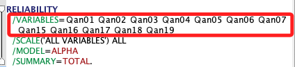

# 信度分析

_接下來的分析中，請著重於方法的使用，至於要使用哪一個過濾與刪除標準並非討論的重點，以下將使用 `15_反轉完成` 的數據作為演釋數據。_

<br>

## 說明與準備

1. 更正後項目總計相關性：這一欄顯示了每個題目與問卷其餘部分的相關程度。一般來說，這個值越高意味著該題目與整體問卷的一致性越好。

<br>

2. 載入要使用的數據來源，這裡是使用 `v01_15_反轉完成.sav`，並重開啟新的輸出文件。

    ```bash
    *==============================.
    *關閉指定的輸出文件.
    OUTPUT CLOSE NAME=文件1.

    *讀取 SPSS 資料檔案.
    GET FILE='/Users/samhsiao/Desktop/00_論文實作/v01_15_反轉完成.sav'.
    DATASET NAME 資料集1.

    *開啟新的輸出文件.
    OUTPUT NEW NAME=文件1.
    *==============================.
    ```

<br>

## 面板操作

_示範如何透過面板操作信度分析_

<br>

1. `分析 -> 比例 -> 信度分析`。

    

<br>

2. 選取數據：每次對單一構面進行選取並分析，如下圖所選取的是 `Qan01~Qan19`，選取完成點擊 `統計量`。

    

<br>

3. `統計量 -> 刪除項目後的比例`：要顯示刪除項目後比例變化，然後點擊 `繼續`。

    

<br>

4. 點擊 `貼上` 語法。

    

<br>

5. 可將其中的 `Qan01~Qan19` 改用 `TO`；輸出結果在後面一併討論。

    

<br>

## 語法

_信度分析_

<br>

1. 準備工作：開啟指定的資料集 `資料集1`。

    ```bash
    *========================================.
    DATASET ACTIVATE 資料集1.
    *========================================.
    ```

<br>

2. 與前面相同，使用 `社交焦慮-整體` 的 `19` 題。

    ```bash
    *===============================================.
    *社交焦慮信度：完整19題的信度.

    RELIABILITY
      /VARIABLES=Ｑan01 TO Ｑan19
      /SCALE('ALL VARIABLES') ALL
      /MODEL=ALPHA
      /SUMMARY=TOTAL.
    *===============================================.
    ```

<br>

3. 依據報表指示，嘗試將其中顯示刪除後可提高 α 值的 `08、10` 兩題進行刪除。

    

<br>

4. 先刪除 `Qan08` 進行觀察。

    ```bash
    *===============================================.
    *社交焦慮19題的整體信度.

    RELIABILITY
      /VARIABLES= 
      Ｑan01 Ｑan02 Ｑan03 Ｑan04 Ｑan05 Ｑan06 Ｑan07 
      Ｑan09 
      Ｑan11 Ｑan12 Ｑan13 Ｑan14 Ｑan15 Ｑan16  Ｑan17 Ｑan18 Ｑan19 
      /SCALE('ALL VARIABLES') ALL
      /MODEL=ALPHA
      /SUMMARY=TOTAL.
    *===============================================.
    ```

<br>

5. 結果從 `.908` 提升到 `.943`，此時顯示刪除 `第10題` 的影響已經不大，可不予處理。

    

<br>

## 相對不適合的信度分析範圍

_特別說明以下兩種分析條件，在很多的書籍中仍會針對整體數據進行信度分析，但這樣的檢定並不具備統計上的意義，這裡特別提出_

<br>

1. 隱藏點讚-整體：這樣對多構面同時進行的整體信度分析並無統計上的意義。

    ```bash
    *===============================================.
    *隱藏點讚自我揭露18題的統一信度.
    RELIABILITY
      /VARIABLES=
      Hide01 Hide02 Hide03 
      Hide04 Hide05 Hide06 Hide07 
      Hide08 Hide09  
      Hide10 Hide11 Hide12 Hide13 
      Hide14 Hide15 Hide16 
      Hide17 Hide18
      /SCALE('ALL VARIABLES') ALL
      /MODEL=ALPHA
      /SUMMARY=TOTAL.
    *===============================================.
    ```

<br>

2. 顯示點讚-整體。

    ```bash
    *===============================================.
    RELIABILITY
      /VARIABLES=
      Show01 Show02 Show03 
      Show04 Show05 Show06 Show07 
      Show08 Show09 
      Show10 Show11 Show12 Show13 
      Show14 Show15 Show16 
      Show17 Show18
      /SCALE('ALL VARIABLES') ALL
      /MODEL=ALPHA
      /SUMMARY=TOTAL.
    *===============================================.
    ```

<br>

## 各構面信度分析

1. 隱藏點讚：各構面獨立分析。

    ```bash
    *===============================================.
    *構面 01.
    RELIABILITY
      /VARIABLES=Hide01 Hide02 Hide03 
      /SCALE('ALL VARIABLES') ALL /MODEL=ALPHA  /SUMMARY=TOTAL.

    *構面 02.
    RELIABILITY
      /VARIABLES=Hide04 Hide05 Hide06 Hide07  
      /SCALE('ALL VARIABLES') ALL  /MODEL=ALPHA  /SUMMARY=TOTAL.

    *構面 03.
    RELIABILITY
      /VARIABLES=Hide08 Hide09 
      /SCALE('ALL VARIABLES') ALL  /MODEL=ALPHA  /SUMMARY=TOTAL.

    *構面 04.
    RELIABILITY
      /VARIABLES=Hide10 Hide11 Hide12 Hide13  
      /SCALE('ALL VARIABLES') ALL  /MODEL=ALPHA  /SUMMARY=TOTAL.

    *構面 05.
    RELIABILITY
      /VARIABLES=Hide14 Hide15 Hide16   
      /SCALE('ALL VARIABLES') ALL  /MODEL=ALPHA  /SUMMARY=TOTAL.

    *構面 06.
    RELIABILITY
      /VARIABLES=Hide17 Hide18  
      /SCALE('ALL VARIABLES') ALL  /MODEL=ALPHA  /SUMMARY=TOTAL.
    *===============================================.
    ```

<br>

2. 報表：第四個構面需要處理。

    

<br>

3. 顯示點讚：各構面獨立分析。

    ```bash
    *===============================================.
    *構面 01.
    RELIABILITY
      /VARIABLES=Show01 Show02 Show03 
      /SCALE('ALL VARIABLES') ALL  /MODEL=ALPHA  /SUMMARY=TOTAL.

    *構面 02.
    RELIABILITY
      /VARIABLES=Show04 Show05 Show06 Show07
      /SCALE('ALL VARIABLES') ALL  /MODEL=ALPHA  /SUMMARY=TOTAL.

    *構面 03.
    RELIABILITY
      /VARIABLES=Show08 Show09 
      /SCALE('ALL VARIABLES') ALL  /MODEL=ALPHA  /SUMMARY=TOTAL.

    *構面 04.
    RELIABILITY
      /VARIABLES=Show10 Show11 Show12 Show13
      /SCALE('ALL VARIABLES') ALL  /MODEL=ALPHA  /SUMMARY=TOTAL.

    *構面 05.
    RELIABILITY
      /VARIABLES=Show14 Show15 Show16 
      /SCALE('ALL VARIABLES') ALL  /MODEL=ALPHA  /SUMMARY=TOTAL.

    *構面 06.
    RELIABILITY
      /VARIABLES=Show17 Show18 
      /SCALE('ALL VARIABLES') ALL  /MODEL=ALPHA  /SUMMARY=TOTAL.
    *===============================================.
    ```

<br>

4. 報表：同樣是第四個構面需要處理

    

<br>

## 小結

_關於題目的刪除與處理翔後續說明_

<br>

___

_END_