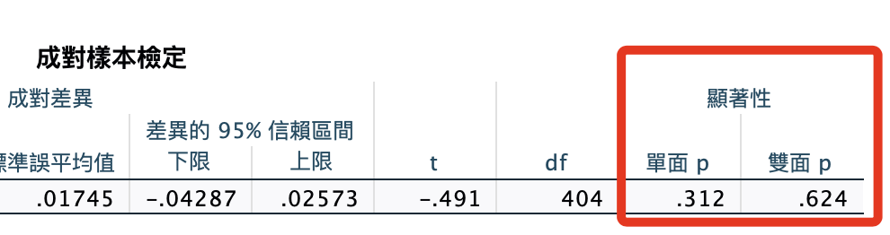
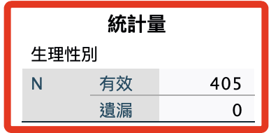

# 刪除題目

<br>

## 說明

1. 依據前一項檢查進行題目的刪除。

2. 刪除兩個水平下的第（10）題。

3. 這是一個迭代的過程，每次刪題之後，後續計算變數步驟都要重新做一次。

<br>

## 刪除

1. 刪除變數：Hide10 Show10。

    ```bash
    *========================================.
    *刪除變數.
    DELETE VARIABLES
    Hide10 Show10.
    
    *執行.
    EXECUTE.
    *========================================.
    ```

<br>

2. 存檔：信度分析刪除題目。

    ```bash
    *========================================.
    *儲存檔案.
    SAVE OUTFILE='/Users/samhsiao/Desktop/00_論文實作/v01_18_信度分析刪題1.sav'.
    *========================================.
    ```

<br>

3. 觀察：成對樣本T檢定＆樣本數。

    ```bash
    *========================================.
    *計算變數：平均數.
    COMPUTE X_avgHide=MEAN(Hide01 TO Hide18).
    COMPUTE X_avgShow=MEAN(Show01 TO Show18).

    *成對樣本T檢定.
    T-TEST PAIRS=X_avgHide WITH X_avgShow (PAIRED)
    /ES DISPLAY(TRUE) STANDARDIZER(SD)
    /CRITERIA=CI(.9500)
    /MISSING=ANALYSIS.

    *刪除原本變數.
    DELETE VARIABLES X_avgHide X_avgShow.

    *執行.
    EXECUTE.

    *性別.
    FREQUENCIES VARIABLES=sex
    /ORDER=ANALYSIS.
    *========================================.
    ```

<br>

4. 結果：不顯著，不用理會。

    

<br>

5. 樣本數。

    

<br>

## 後續處理

1. 排序變數。

    ```bash
    *========================================.
    *排序變數.
    MATCH FILES FILE = *
    /KEEP = UID sex age isKnowHideFunction useYears useFrequency useTime 
    Ｑan01 Ｑan02 Ｑan03 Ｑan04 Ｑan05 Ｑan06 Ｑan07 Ｑan08 
    Ｑan09 Ｑan10 Ｑan11 Ｑan12 Ｑan13 Ｑan14 Ｑan15 Ｑan16 
    Ｑan17 Ｑan18 Ｑan19 
    Hide01 Hide02 Hide03 Hide04 Hide05 Hide06 Hide07 Hide08 Hide09 Hide11 Hide12 Hide13 Hide14 Hide15 Hide16 Hide17 Hide18 
    Show01 Show02 Show03 Show04 Show05 Show06 Show07Show08 Show09 
    Show11 Show12 Show13 Show14 
    Show15 Show16 Show17 Show18.
    EXECUTE.
    *========================================.
    ```

<br>

## 輸出：EXCEL

1. 這裡進行輸出的用意是之後可用 Python 腳本進行樣本檢查，所以輸出為 EXCEL 檔案。

    ```bash
    *========================================.
    *輸出當前資料表為 EXCEL 檔案.
    SAVE TRANSLATE /TYPE=CSV
    /OUTFILE='/Users/samhsiao/Desktop/00_論文實作/v01_08.csv'
    /REPLACE
    /FIELDNAMES.
    EXECUTE.
    *========================================.
    ```

<br>

___

_END_