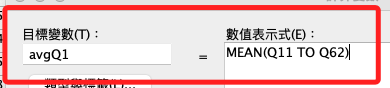
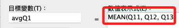
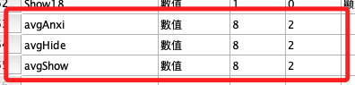
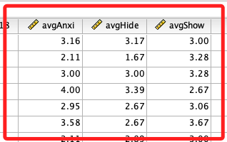
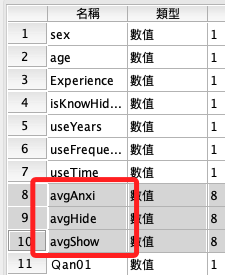

# 平均分數 I

<br>

## 說明

_要計算幾個平均數在後續的分析過程中使用_

<br>

1. 社交焦慮平均分數（avgAnxi）。

2. `隱藏點讚` 或 `顯示點讚` 兩種水平下的 `自我揭露平均分數（avgHide、avgShow）`。

3. 連續型的平均分數都將在後續步驟作為 `因變數`，可先進行 `常態性檢定`。

4. 可評估是否刪除極端值。

5. 特別注意，假如語法使用 `「 TO 」`，在刪除時若涉及第一題或最後一題，起始、結束的變數必須更改才不會報錯，以下暫時使用全部題目。 

<br>

## 面板操作說明

_新增平均數變數_

<br>

1. `轉換 -> 計算變數`。

    

<br>

2. 若變數的排序位置是連續的儲存格時，在語法中可以用 `TO` 來表示。

    

<br>

3. 若無法確定其排序關係，可使用無序的表達式，以 `列表（list）` 或 `數組（tuple）` 方式書寫，就是一個一個輸入並以逗號 `,` 間隔。

    

<br>

## 使用語法操作

1. 開啟指定的資料集 `資料集1`。

    ```bash
    *========================================.
    *切換當前使用的輸出文件.
    DATASET ACTIVATE 資料集1.
    *========================================.
    ```

<br>

2. 計算變數三個新的 `平均數`，分別命名為 `avgAnxi`、`avgHide`、`avgShow`；計算內容如公式中所列，分別是社交焦慮整體、隱藏點讚整體、顯示點讚整體。

    ```bash
    *========================================.
    *計算變數：平均數.
    COMPUTE avgAnxi=MEAN(Ｑan01 TO Ｑan19).
    COMPUTE avgHide=MEAN(Hide01 TO Hide18).
    COMPUTE avgShow=MEAN(Show01 TO Show18).
    EXECUTE.
    *========================================.
    ```

<br>

3. 完成時會增加三個變數。

    

<br>

4. 數據就是平均數。

    

<br>

## 進行相關的設置

1. 設定 `標籤、值標籤、小數位數、變數類型`。

    ```bash
    *========================================.
    *標籤名稱.
    VARIABLE LABELS avgAnxi '社會焦慮平均分'.
    VARIABLE LABELS avgHide '隱藏點讚平均分'.
    VARIABLE LABELS avgShow '顯示點讚平均分'.

    *變數寬度為「10」.
    VARIABLE WIDTH avgAnxi(10).
    VARIABLE WIDTH avgHide(10).
    VARIABLE WIDTH avgShow(10).

    *小數的寬度為「8」位數為「2」，F 為 Format 的意思.
    FORMATS avgAnxi (F8.2).
    FORMATS avgHide (F8.2).
    FORMATS avgShow (F8.2).

    *變數類型為尺度.
    VARIABLE LEVEL avgAnxi (SCALE).
    VARIABLE LEVEL avgHide (SCALE).
    VARIABLE LEVEL avgShow (SCALE).

    *執行.
    EXECUTE.
    *========================================.
    ```

<br>

2. 排序變數，將新增的變數移動到指定位置。

    ```bash
    *========================================.
    *排序變數.
    MATCH FILES FILE = *
    /KEEP = 
    UID sex age isKnowHideFunction useYears useFrequency useTime 
    avgAnxi avgHide avgShow 
    Ｑan01 Ｑan02 Ｑan03 Ｑan04 Ｑan05 Ｑan06 Ｑan07 Ｑan08 
    Ｑan09 Ｑan10 Ｑan11 Ｑan12 Ｑan13 Ｑan14 Ｑan15 Ｑan16 
    Ｑan17 Ｑan18 Ｑan19 
    Hide01 Hide02 Hide03 Hide04 Hide05 Hide06 Hide07 
    Hide08 Hide09 
    Hide11 Hide12 Hide13 Hide14 
    Hide15 Hide16 Hide17 Hide18 
    Show01 Show02 Show03 Show04 Show05 Show06 Show07 
    Show08 Show09 
    Show11 Show12 Show13 Show14 
    Show15 Show16 Show17 Show18.
    EXECUTE.
    *========================================.
    ```

<br>

3. 完成後，會將變數移動到所有分數的最上方，方便後續使用。

    

<br>

4. 存檔：添加三個平均數。

    ```bash
    *========================================.
    *儲存檔案.
    SAVE OUTFILE='/Users/samhsiao/Desktop/00_論文實作/v01_21_平均數01.sav'.
    *========================================.
    ```

<br>

5. 輸出為 EXCEL 文件，格式為 CSV。

    ```bash
    *========================================.
    *輸出當前資料表為 EXCEL 檔案.
    SAVE TRANSLATE /TYPE=CSV
    /OUTFILE='/Users/samhsiao/Desktop/00_論文實作/v01_21.csv'
    /REPLACE
    /FIELDNAMES.
    EXECUTE.
    *========================================.
    ```

<br>

___

_END_