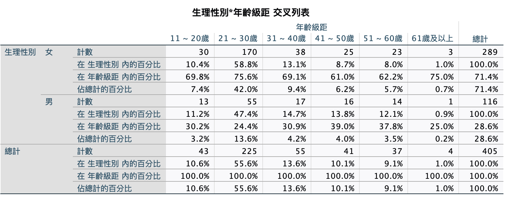
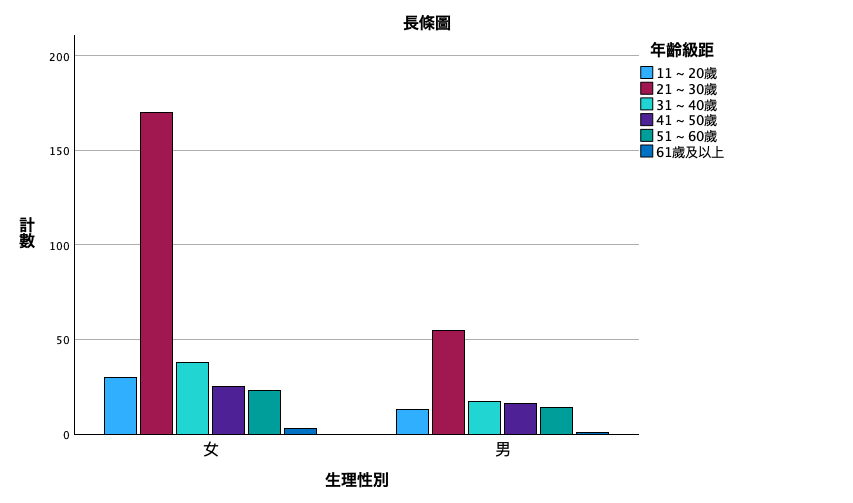
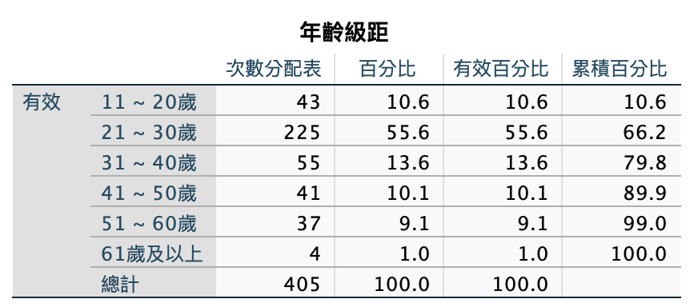
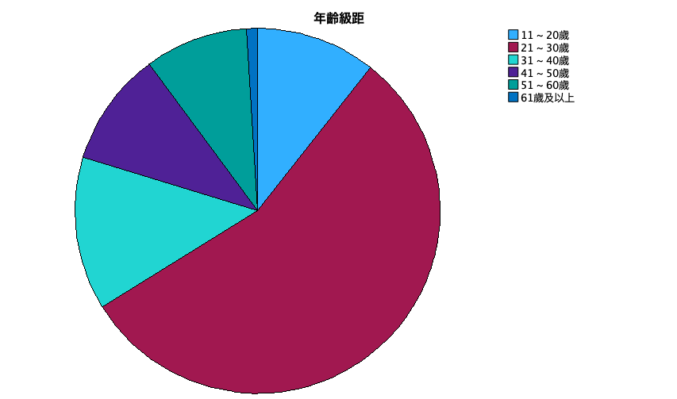

# 性別、年齡

<br>

## 交叉表：性別x年齡

1. 指令。

    ```bash
    *========================================.
    *交叉表：性別、年齡.
    CROSSTABS
    /TABLES=sex BY age
    /FORMAT=AVALUE TABLES
    /CELLS=COUNT ROW COLUMN TOTAL 
    /COUNT ROUND CELL
    /BARCHART.
    *========================================.
    ```

<br>

2. 表。

    

<br>

3. 圖。

    

<br>

## 交叉表：年齡、性別

1. 語法。

    ```bash
    *========================================.
    *交叉表：年齡、性別.
    CROSSTABS
    /TABLES=age BY sex
    /FORMAT=AVALUE TABLES
    /CELLS=COUNT ROW COLUMN TOTAL 
    /COUNT ROUND CELL
    /BARCHART.
    *========================================.
    ```

<br>

2. 表。

    

<br>

3. 圖。

    

<br>

## 次數分配：年齡

1. 語法。

    ```bash
    *========================================.
    *次數分配：年齡.
    FREQUENCIES VARIABLES=age
    /PIECHART FREQ
    /ORDER=ANALYSIS.
    *========================================.
    ```

<br>

2. 表。

    

<br>

3. 圖。

    

<br>

___

_END_