# 卡方擬合優度檢驗

<br>

## 說明

1. 透過卡方檢定，比對實驗的用戶年齡分佈與某個母體（台灣IG用戶分佈）的分佈是否符合統計意義上的相同。

<br>

## 步驟

1. 先對人口重新編組。

    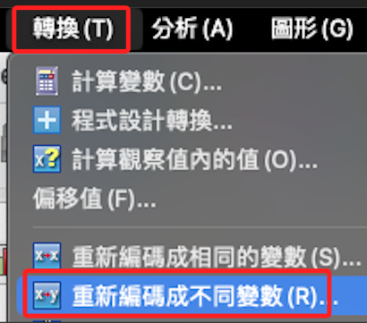

<br>

2. 重新編碼為不同變數「age_G3」。

    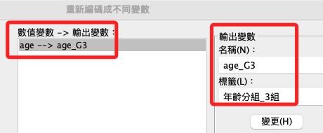

<br>

3. 簡易重新編碼。

    ```bash
    *========================================.
    *重新分組：年齡 age_G3.
    RECODE age (1 thru 2=1) (3 thru 4=2) (5 thru 7=3) (ELSE=4) INTO age_G3.

    *標籤名稱.
    VARIABLE LABELS age_G3 '年齡重分組'.

    *小數的位數為「0」，F 為 Format 的意思.
    FORMATS age_G3  (F1.0).

    *置中 CENTER.
    VARIABLE ALIGN age_G3 (CENTER).

    *變數類型為序數.
    VARIABLE LEVEL age_G3  (ORDINAL).

    *值標籤.
    VALUE LABELS age_G3
    1 '20歲以下'
    2 '21 ~ 40歲'
    3 '41歲以上'
    4 ELSE.

    *執行.
    EXECUTE.
    *========================================.
    ```

<br>

4. 觀察次數分配。

    ```bash
    *========================================.
    *次數分配＋繪圖：年齡.
    FREQUENCIES VARIABLES=age_G3 /BARCHART NORMAL /ORDER=ANALYSIS.
    *========================================.
    ```

<br>

5. 表。

    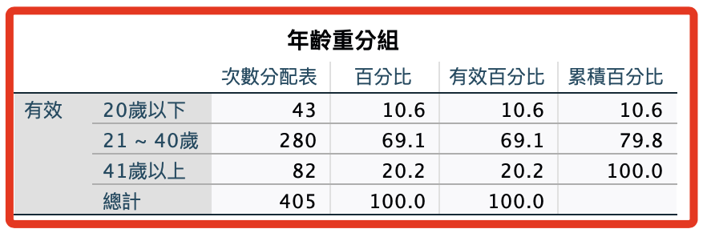

<br>

6. 圖。

    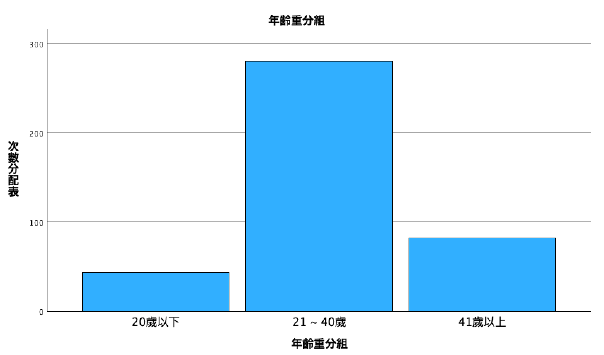

<br>

7. 排序：變數資訊。

    ```bash
    *========================================.
    *排序變數.
    MATCH FILES FILE = *
    /KEEP = 
    UID sex age age_G3 
    isKnowHideFunction useYears useFrequency useTime 
    avgAnxi avgHide avgShow avgAnxi_G3 
    diffHideShow diffHideShow_5 
    Ｑan01 Ｑan02 Ｑan03 Ｑan04 Ｑan05 Ｑan06 Ｑan07 Ｑan08 
    Ｑan09 Ｑan10 Ｑan11 Ｑan12 Ｑan13 Ｑan14 Ｑan15 Ｑan16 
    Ｑan17 Ｑan18 Ｑan19 
    Hide01 Hide02 Hide03 Hide04 Hide05 Hide06 Hide07 
    Hide08 Hide09 
    Hide11 Hide12 Hide13 Hide14 
    Hide15 Hide16 Hide17 Hide18 
    Show01 Show02 Show03 Show04 Show05 Show06 Show07 
    Show08 Show09 
    Show11 Show12 Show13 Show14 
    Show15 Show16 Show17 Show18.

    *執行.
    EXECUTE.
    *========================================.
    ```

<br>

8. 存檔。

    ```bash
    *========================================.
    *儲存檔案.
    SAVE OUTFILE='/Users/samhsiao/Desktop/02_論文_清心/00_論文數據/v6_23_卡方擬合建立age_G3.sav'.
    *========================================.
    ```

<br>

9. 要取得一組參考基準（10.47、64.84、24.69）。

    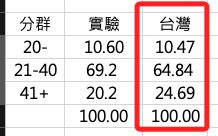

<br>

10. 分析 -> 無母數檢定 -> 舊式對話框 -> 卡方檢定。

    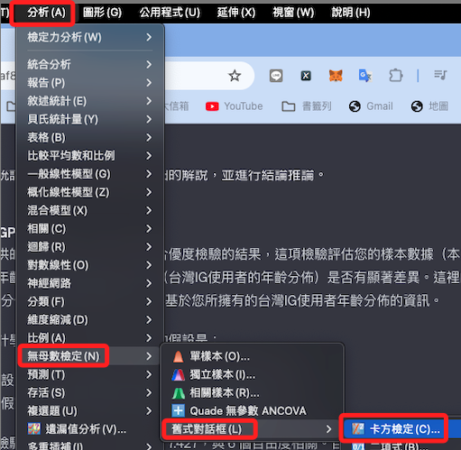

<br>

11. 使用新的分組變數，並且依序輸入參考數（10.47、64.84、24.69）。

    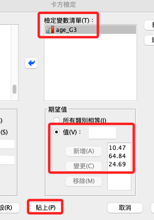

<br>

12. 卡方擬合優度。

    ```bash
    *========================================.
    *卡方擬合優度檢驗.
    NPAR TESTS
    /CHISQUARE=age_G3
    /EXPECTED=10.47 64.84 24.69
    /MISSING ANALYSIS.
    *========================================.
    ```

<br>

13. 報表。

    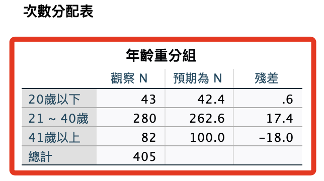

<br>

14. 結果不顯著，代表無法拒絕零假設。

    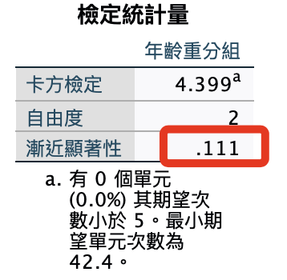

<br>

## 特別注意

1. 上面的步驟是透過分類變數進行累加次數的，無需進行以下步驟。

<br>

2. 以下步驟是說明如果是在 SPSS 中使用交叉表進行分析（如下方），則需要依循這個步驟進行，透過 SPSS 的「加權觀察值」功能在表內進行累積。

<br>

3. 下方僅說明如何進行「加權觀察值」，其他部份省略。

<br>

## 步驟

1. 加權觀察值。

    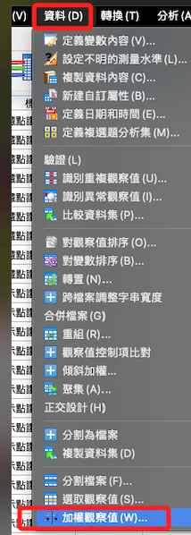

<br>

2. 選擇要加權的變數。

    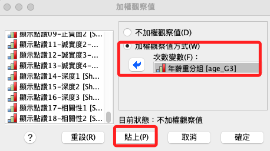

<br>

3. 語法：加權觀察值。

    ```bash
    *========================================.
    *加權觀察值：age_G3.
    WEIGHT BY age_G3.
    *========================================.
    ```

<br>

4. 關閉加權觀察值。

    ```bash
    *========================================.
    *關閉加權觀察值.
    WEIGHT OFF.
    *========================================.
    ```

<br>

___

_END_