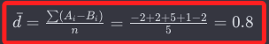

# 手算說明

_可透過手算T檢定檢驗的過程，從本質上理解T檢定的核心思想。_

<br>

## 步驟

1. 假設以下數據

    ```bash
    受试者  条件A得分	条件B得分	差值（A-B）
    1       20	        22	        -2
    2	    30	        28	        2
    3	    25	        20	        5
    4   	22	        21	        1
    5	    28	        30	        -2
    ```

<br>

## 手動進行成對樣本T檢定

1. 計算T值

2. 查表找出P值

3. 進行比對

<br>

## 手動計算

1. 計算差值（A-B）的平均值

    

<br>

2. 計算差值的標準差：（差值-差值平均）² 的和，再求平方根。

    

<br>

3. 差值的標準誤：標準差除以樣本數開根號

    

<br>

4. 計算T值：平均值/標準誤。

    

<br>

5. 查表進行比較。

<br>

___

_END_