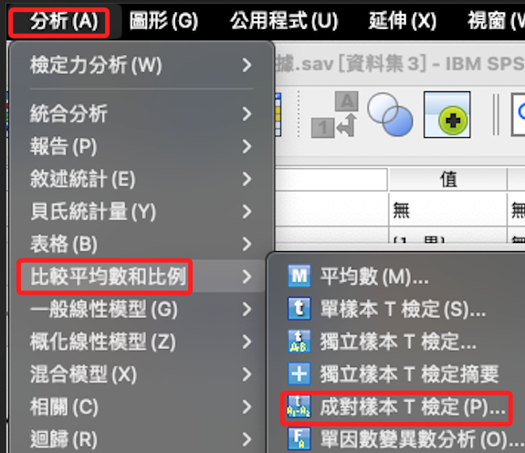
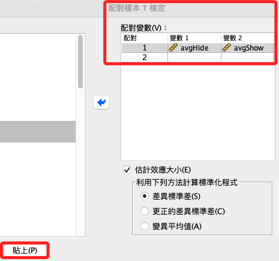
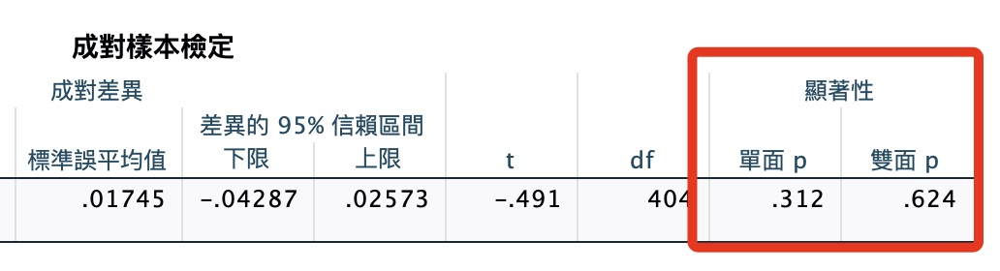
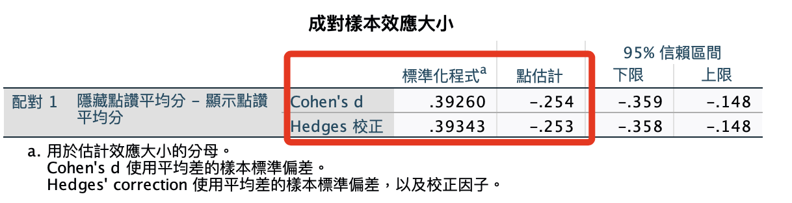

# 成對樣本T檢定（參數）

<br>

## 說明

1. 成對樣本描述的就是兩個相依樣本，可用於重複實驗的比較。

<br>

2. 成對樣本 T 檢定是重複測量變異數分析的一個特例，所以在處理二分類的簡單數據時，這兩種檢驗方法可能會得到相同結果。

<br>

3. 在這個步驟中，無論兩次測量間是否顯著，都可作為下一步使用更複雜的分析的參考。

<br>

## 步驟記錄

1. 分析 -> 比較平均數和比例 -> 成對樣本 T 檢定

    

<br>

2. 將兩個分類平均分數加入分組數據，然後貼上語法

    

<br>

3. 開啟指定的資料集

    ```bash
    *========================================.
    *開啟指定的資料集.
    DATASET ACTIVATE 資料集1.
    *========================================.
    ```

<br>

4. 對樣本T檢定：avgHide、avgShow

    ```bash
    *==============================.
    *成對樣本T檢定.
    T-TEST PAIRS=avgHide WITH avgShow (PAIRED)
    /ES DISPLAY(TRUE) STANDARDIZER(SD)
    /CRITERIA=CI(.9500)
    /MISSING=ANALYSIS.
    *==============================.
    ```

<br>

## 報表

1. 成對樣本檢定並不顯著，表示

    

<br>

2. 成對樣本效應大小（這個報表我就不更新了，重點是分析的模式，內容先不管）

    

<br>

## 說明

1. 成對樣本 T 檢定中會提供一個測量效果大小（effect size）的報表，其中使用兩種檢定分別是是「Cohen's d」和「Hedges' g」，這兩者分別適用於大樣本與小樣本。

<br>

2. 大樣本「Cohen's d」

    1) 通過將平均差異除以樣本標準偏差來計算，給出平均差異相對於變異的度量。

    2) 在報表中，Cohen's d 為 0.82594，表示平均差異大約是標準偏差的0.826倍。

    3) Cohen's d 的標準閾值是 0.2 為小效應，0.5 為中等效應，0.8及以上為大效應，實驗結果顯示存在較大的效應。

<br>

3. 小樣本「Hedges' g」

    1) 這數值是對 Cohen's d 的校正，考慮到的是小樣本可能導致的偏差，也就是在小樣本的情況下，Cohen's d 可能會高估效應大小，而 Hedges' g 對此進行校正。

    2) 在報表中，Hedges' g 為0.82750，與 Cohen's d 非常接近，表示樣本大小足夠，所以校正的影響不大。

<br>

## 結論

1. 報表顯示隱藏點讚平均和顯示點讚平均之間存在一個較大的效應規模（size），並且這個效果在統計上是顯著的，所以可以推論兩種條件下的自我揭露意願分數存在顯著差異。

<br>

2. 基於這個組內效應的顯著，有充分證據顯示可進行下一步重複測量變異數分析來分析組間效應（社交焦慮）。

<br>

___

_END_