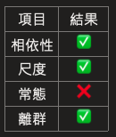

# 成對樣本T檢定的統計假設

 

## 統計假設

1. 相依性（實驗設計確認）

    數據必須是成對的或相依的，也就是每個受試者（實驗單位）在兩個不同條件（或時間點）下都有測量結果（觀測值）。

 

2. 區間或比例尺度（實驗數據確認）

    變數應該是連續的，並且至少在區間尺度上測量，最好是比例尺度。

 

3. 常態分佈（對數據進行檢查）

    配對差異（兩組測量值相減）應該近似於常態分佈，常態性的假設是基於配對差異的分佈，而不是原始數據的分佈。

 

4. 無極端離群值（對數據進行檢查）

    配對差異中不應有極端的離群值，因為極端值可能會對結果產生不成比例的影響，從而影響T檢定的有效性。

 

## 說明

1. 當這些假設無法滿足時，可能需要考慮使用其他統計方法，例如非參數的相依樣本檢定來處理不符合假設的資料。

 

2. 對於常態性假設，當樣本量較大時，由於中央極限定理的作用，T檢定對常態性的要求較不嚴格。

 

___

_END_