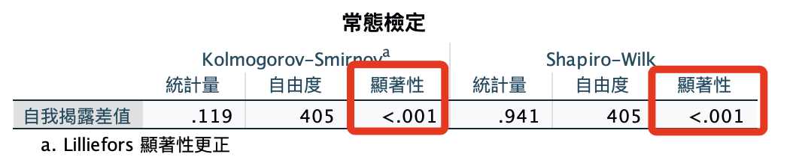
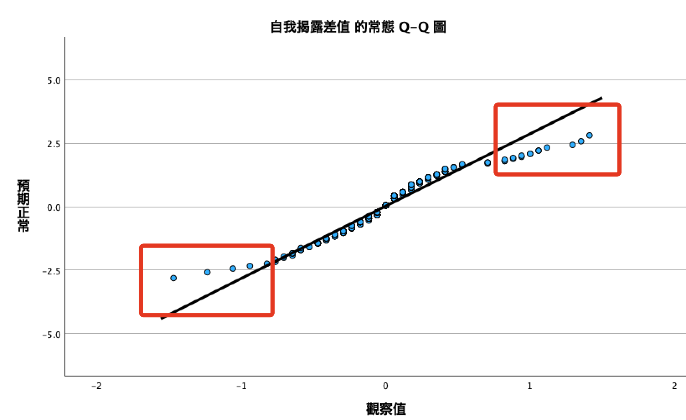
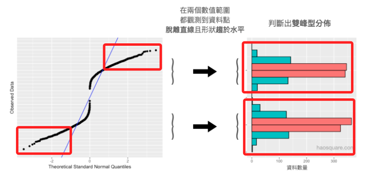

# 差分項常態檢定

<br>

## 常態檢定

1. 語法。

    ```bash
    *========================================.
    *差分項常態檢定.
    EXAMINE VARIABLES=diffHideShow
    /PLOT BOXPLOT NPPLOT
    /COMPARE GROUPS
    /STATISTICS DESCRIPTIVES
    /CINTERVAL 95
    /MISSING LISTWISE
    /NOTOTAL.
    *========================================.
    ```

<br>

2. 報表

    

<br>

3. 有點「山字形」分佈

    

<br>

4. 依據 [網路資訊](https://haosquare.com/normal-distribution-qqplot/) 佐證

    

<br>

___

_END_