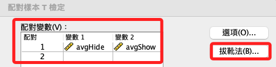
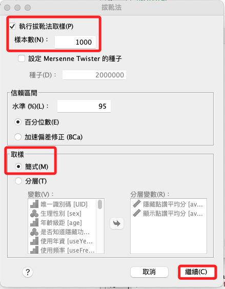
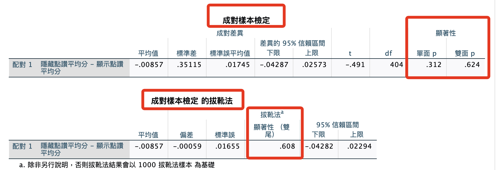

# 成對 T 檢定

<br>

## 步驟

1. 設定完成後，點選「拔靴法」

    

<br>

2. 使用預設的拔靴次數，並且不需要分層

    

<br>

## 常態檢定

1. 語法。

    ```bash
    *========================================.
    *T檢定＋拔靴法.
    BOOTSTRAP
    /SAMPLING METHOD=SIMPLE
    /VARIABLES INPUT=avgHide avgShow 
    /CRITERIA CILEVEL=95 CITYPE=PERCENTILE  NSAMPLES=1000
    /MISSING USERMISSING=EXCLUDE.
    T-TEST PAIRS=avgHide WITH avgShow (PAIRED)
    /ES DISPLAY(TRUE) STANDARDIZER(SD)
    /CRITERIA=CI(.9500)
    /MISSING=ANALYSIS.
    *========================================.
    ```

<br>

## 報表

1. 拔靴後不顯著，數據也相同

    

<br>

## 關於分層

1. 如果研究沒有明確的分層條件，在拔靴法中就不用特別考慮的子群體或分組，使用簡單拔靴法（`/SAMPLING METHOD=SIMPLE`）更適合分析需求。

<br>

2. 簡單拔靴法不考慮資料的任何內在分層結構，只是對資料進行隨機重抽樣，這樣做在沒有明確分層需求的情況下，可以簡化分析過程，同時避免引入不必要的複雜性。

<br>

## 結論

1. 如果加入拔靴法之後的結果不顯著，這表示即使考慮了「抽樣變異」，數據也沒有顯示出統計上顯著的差異，在這種情況下，可以進一步考慮使用非參數方法來處理資料，例如Wilcoxon符號秩檢驗。

<br>

2. 與拔靴法相同，非參數方法不對資料的分佈做常態性假設，因此適用於不滿足常態分佈假設的資料，非參數方法透過對資料的秩而不是實際值進行分析，提供了一種分析資料「中位數差異」的方法，對於不符合常態分佈假設的資料或樣本量較小的情況下特別有用。

<br>

3. 特別注意，在決定使用何種統計方法時，需考慮資料的特徵和研究的具體需求來選擇最合適的方法，當前置檢驗發現資料不符合統計基本假設，那非參數方法可提供更適合的分析路徑。

<br>

___

_END_