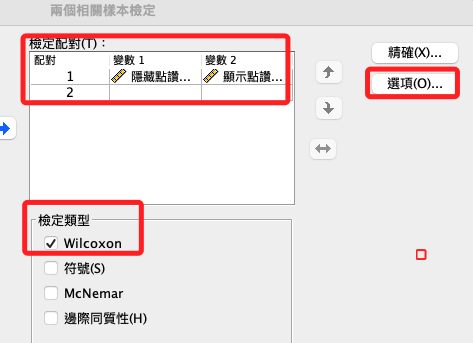
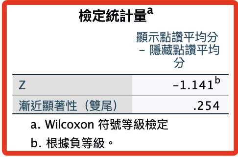

# Wilcoxon 符號等級檢定

<br>

## 說明

1. 用於檢定兩母群體統計量（中位數）差異，且母體不需符合特定分佈（如常態分佈），另外也無需符合變異數同質的假設。

<br>

2. 當樣本數夠大時，通常樣本個數（≧30）的樣本可視為樣本數夠大，可採用成對樣本Ｔ檢定（Two-sample t-test for paired data）檢定平均數差。

<br>

## 面板操作

1. `分析 -> 無母數 -> 舊式對話框 -> 2個相關樣本`

    

<br>

2. 加入要比較的兩個變數，勾選「Wilcoxon」，再點擊選項

    

<br>

3. 勾選敘述挺際

    

<br>

4. 貼上語法

    

<br>

## 語法

1. 非參數 Wilconxos 檢定

    ```bash
    *========================================.
    *非參數 Wilcoxon 符號秩中定.
    NPAR TESTS
    /WILCOXON=avgHide WITH avgShow (PAIRED)
    /STATISTICS DESCRIPTIVES 
    /MISSING ANALYSIS.
    *========================================.
    ```

<br>

## 報表

1. 報表：敘述統計，因為無母數檢定著重於樣本特性的描述，所以這裡也做一下敘述挺記的資訊，有助於對後續的解釋有基礎的訊息。

    

<br>

2. 報表：等級檢定

    

<br>

3. 報表：檢定統計量

    

<br>

## 報表：說明

1. 該檢定用於比較成對樣本的中位數差異。

<br>

2. 報表分為兩部分：等級部分和檢定統計量部分。

<br>

## 等級部分

1. 負等級：這部分有（160）對觀察值，其中「顯示點讚平均分」小於「隱藏點讚平均分」。平均等級是（165.24），表示這些觀察值在所有差異值中的平均等級，等級總和是（26438.50），表示所有負差異值的等級總和。

<br>

2. 正等級：有（177）對觀察值，其中「顯示點讚平均分」大於「隱藏點讚平均分」。平均等級是（172.40），等級總和是（30514.50）。

<br>

3. 連結空間：有（68）對觀察值，這些成對樣本的數值相同，即「顯示點讚平均分」等於「隱藏點讚平均分」。

<br>

4. 總計：總共有（405）對觀察值。

<br>

## 檢定統計量部分

1. Z 分數：這是一種標準化分數，檢定統計量是（-1.141），可用來衡量觀察到的統計量與其期望值間的距離。負值表示「顯示點讚平均分」傾向於小於「隱藏點讚平均分」。

<br>

2. 漸近顯著性（雙尾）：P值是檢測兩個成對樣本的中位數是否有顯著差異的概率值，P值（.254）大於（0.05），因此沒有充分證據拒絕虛無假設，即認為這兩個成對樣本的中位數無差異，換句話說，「顯示點讚平均分」與「隱藏點讚平均分」之間沒有顯著的差異。

<br>

## 結論

1. Wilcoxon 符號等級檢定的結果顯示，就統計上而言，這兩個變量之間沒有顯著的「中位數」差異。

<br>

___

_END_