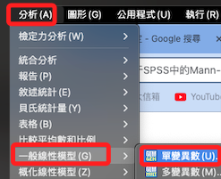
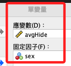
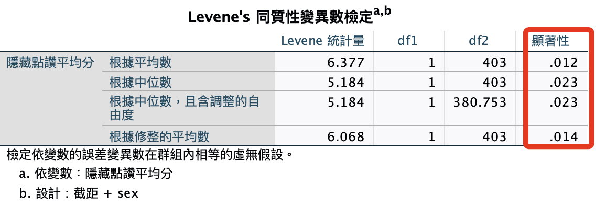
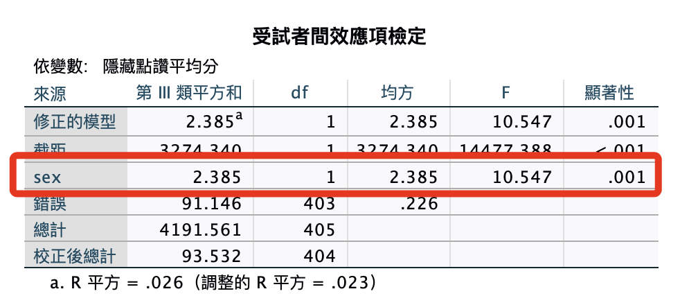
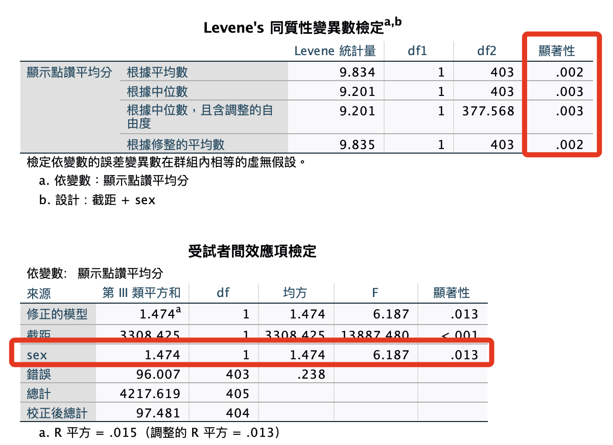
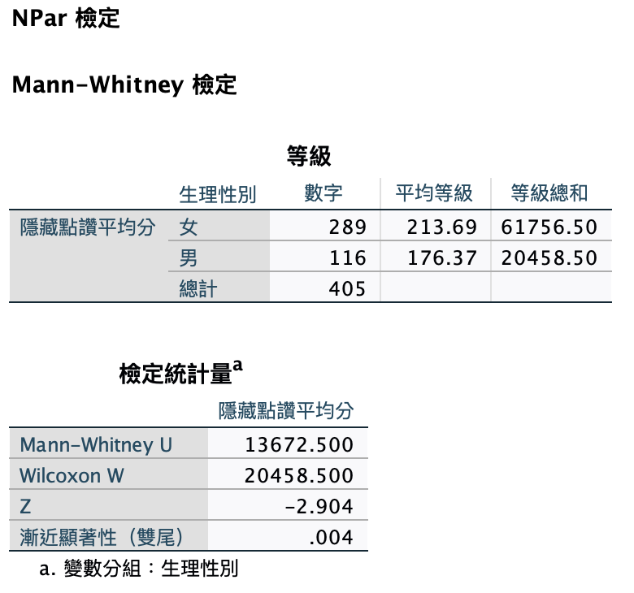
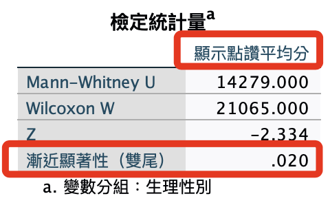

# 性別 x 自我揭露

<br>

## 說明

_以下先使用參數方法，再用非參數方法_

1. `分析 -> 一般線性模型 -> 單變異數`。

    

<br>

2. 因變數是 `avgHide`，因子選擇 `sex`。

    

<br>

3. 進入 `選項`，勾選 `同質性檢定（H）`。

    

<br>

## 語法

1. 單變量變異數分析：性別 x 自我揭露，以下語法是檢驗 `avgHide` 和 `avgShow` 這兩個變數在 `不同性別` 之間是否存在顯著差異；其中設定了 `變異數同質性檢定`，藉此觀察是否適用變異數分析。

    ```bash
    *========================================.
    *單變量變異數分析：性別x隱藏.
    UNIANOVA avgHide BY sex
    /METHOD=SSTYPE(3)
    /INTERCEPT=INCLUDE
    /PRINT HOMOGENEITY
    /CRITERIA=ALPHA(.05)
    /DESIGN=sex.

    *單變量變異數分析：性別x顯示.
    UNIANOVA avgShow BY sex
    /METHOD=SSTYPE(3)
    /INTERCEPT=INCLUDE
    /PRINT HOMOGENEITY
    /CRITERIA=ALPHA(.05)
    /DESIGN=sex.
    *========================================.
    ```

<br>

## 報表

_以下報表在同質性檢定中，顯示了不同組間的變異數不同質，將改用其他統計方法_

<br>

1. 隱藏：同質性檢定。

    

<br>

2. 隱藏：受試者間效應

    

<br>

3. 顯示：同質性檢定。

    

<br>

## 改用非參數 `Mann-Whitney U 檢驗`

1. Mann-Whitney：性別 x 自我揭露：隱藏。

    ```bash
    *========================================.
    *Mann-Whitney U 檢驗.
    NPAR TESTS
    /M-W=avgHide BY sex(0 1)
    /MISSING ANALYSIS.
    *========================================.
    ```

    

<br>

## 報表解說

_比較 `性別` 在 `隱藏點讚平均分` 上的分佈是否有顯著差異_

<br>

### 等級

1. 女性組：共有289位女性參與者，她們在「隱藏點讚平均分數」變數上的平均等級為213.69，等級總和為61756.50。

<br>

2. 男性組：共有116位男性參與者，他們在該變數上的平均等級為176.37，等級總和為20458.50。

<br>

3. 總計：整體樣本數為405。

<br>

4. 這個等級部分反映了兩組在「隱藏點讚平均分數」上的中位數差異，女性組的平均等級高於男性組，這表示女性在該變數上的得分普遍高於男性。

<br>

### 檢定統計量

1. Mann-Whitney U：13672.500，這是Mann-Whitney U檢定的U值。

<br>

2. Wilcoxon W：20458.500，這是根據U值計算的W值，通常用於報告目的。

<br>

3. Z：-2.904，這是標準常態分佈下的Z值，用於計算顯著水準。

<br>

4. 漸近顯著性（雙尾）：.004，這表示兩組在「隱藏點讚平均分數」上的分佈差異在統計上是顯著的，P值小於0.05，因此可以拒絕零假設 （即兩組分佈相同）。

<br>

## 結論

1. 基於Mann-Whitney U檢定的結果，可以得出結論，性別（男、女）兩組在「隱藏點讚平均分」上存在顯著的分佈差異，具體表現為女性組的得分普遍高於男性組，由於P值小於0.05，這個差異在統計上是有意義的。

<br>

## 語法沿用

1. Mann-Whitney：性別 x 自我揭露：顯示

    ```bash
    *========================================.
    *Mann-Whitney U 檢驗.
    NPAR TESTS
    /M-W=avgShow BY sex(0 1)
    /MISSING ANALYSIS.
    *========================================.
    ```

    

<br>

___

_END_