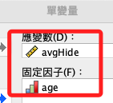
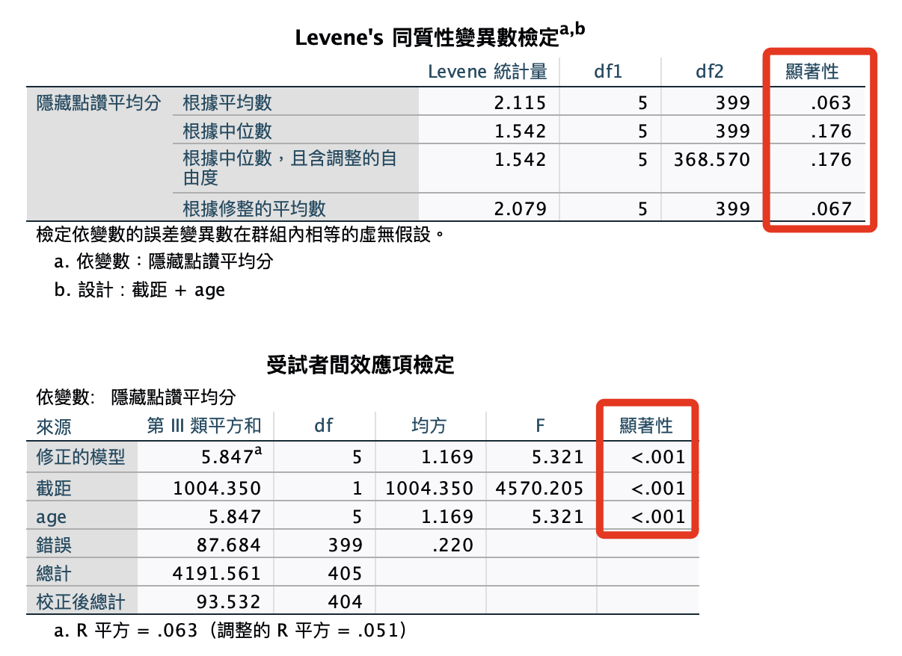
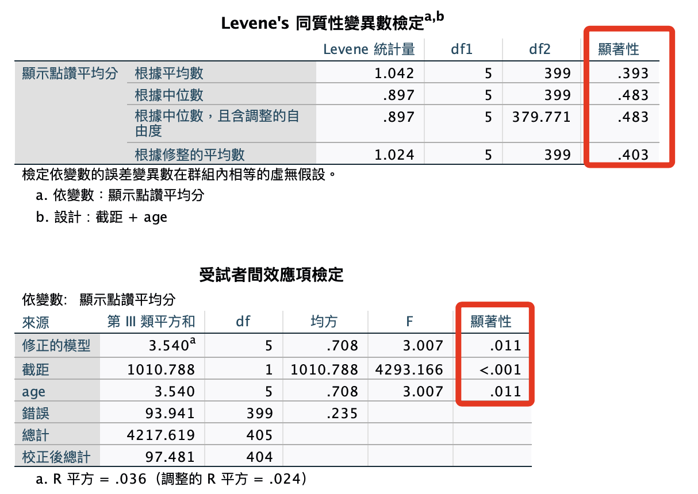

# 年齡 x 自我揭露

<br>

## 面板操作

1. `分析 -> 一般線性 -> 單變量`。

    

<br>

## 使用語法

1. 單變量：年齡 x 自我揭露：隱藏。

    ```bash
    *========================================.
    *單變量變異數分析.
    UNIANOVA avgHide BY age
    /METHOD=SSTYPE(3)
    /INTERCEPT=INCLUDE
    /PRINT HOMOGENEITY
    /CRITERIA=ALPHA(.05)
    /DESIGN=age.
    *========================================.
    ```

    

<br>

2. 單變量：年齡 x 自我揭露：顯示。

    ```bash
    *========================================.
    *單變量變異數分析.
    UNIANOVA avgShow BY age
    /METHOD=SSTYPE(3)
    /INTERCEPT=INCLUDE
    /PRINT HOMOGENEITY
    /CRITERIA=ALPHA(.05)
    /DESIGN=age.
    *========================================.
    ```

    

<br>

___

_END_