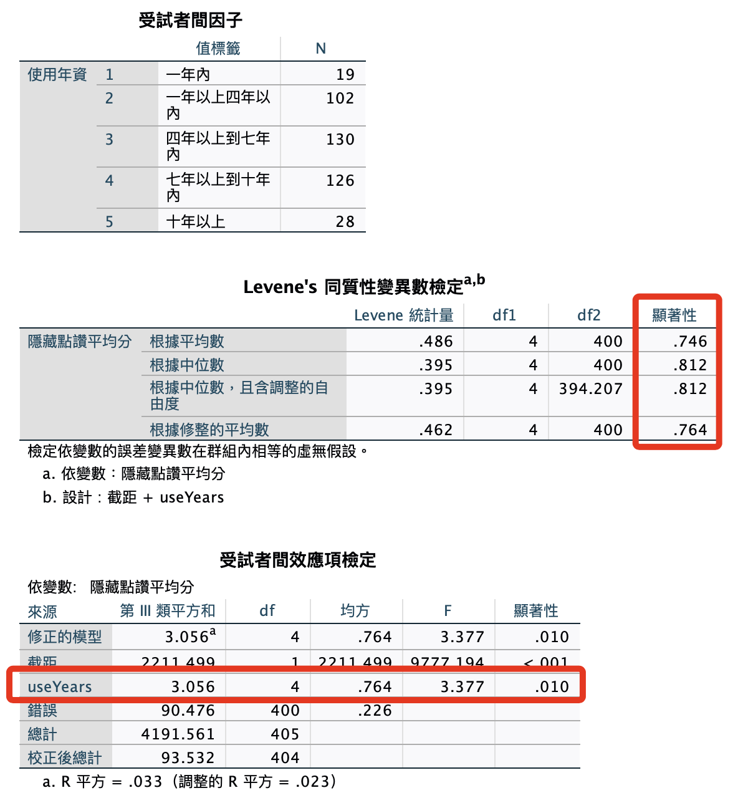
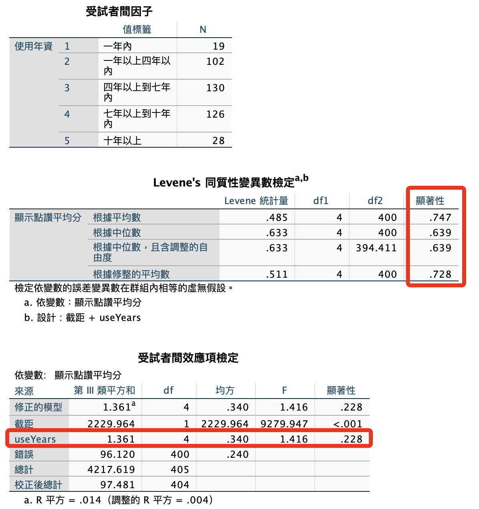

# 使用頻率 x 自我揭露

<br>

## 使用語法

1. 單變量：年資 x 自我揭露：隱藏。

    ```bash
    *========================================.
    *單變量變異數分析：使用年資x自我揭露：隱藏.
    UNIANOVA avgHide BY useYears
    /METHOD=SSTYPE(3)
    /INTERCEPT=INCLUDE
    /PRINT HOMOGENEITY
    /CRITERIA=ALPHA(.05)
    /DESIGN=useYears.
    *========================================.
    ```

    

<br>

2. 單變量：年資 x 自我揭露：顯示。

    ```bash
    *========================================.
    *單變量變異數分析：使用年資x自我揭露：顯示.
    UNIANOVA avgShow BY useYears
    /METHOD=SSTYPE(3)
    /INTERCEPT=INCLUDE
    /PRINT HOMOGENEITY
    /CRITERIA=ALPHA(.05)
    /DESIGN=useYears.
    *========================================.
    ```

    

<br>

## 結論

1. 當顯示狀態為隱藏時，不同使用年資的用戶在自我揭露分數上會表現出差異，反之，當顯示狀態設定為顯示時，用戶在自我揭露上展現的差異就會消失，也就是所有使用年資族群在自我揭露分數上無顯著差異。

<br>

___

_END_