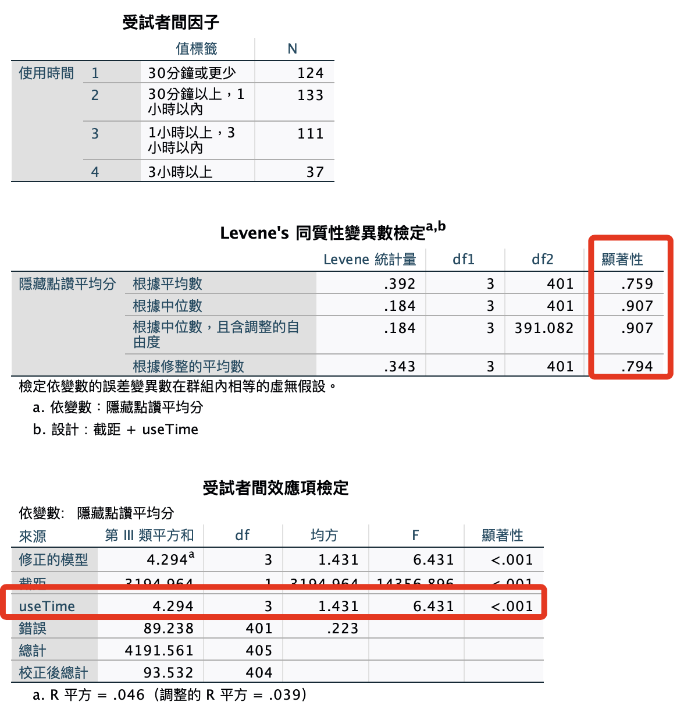
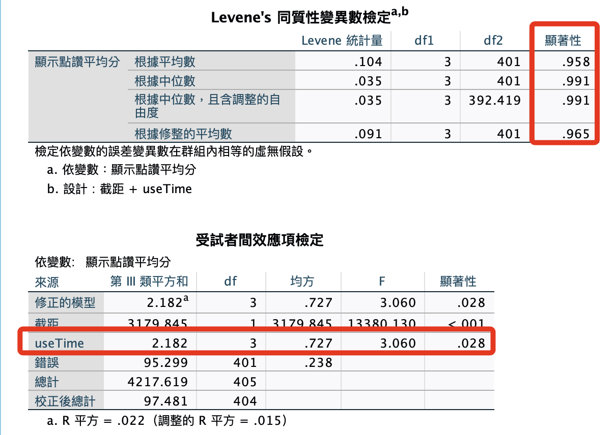

# 使用時數 x 自我揭露

<br>

## 使用語法

1. 隱藏。 

    ```bash
    *========================================.
    *單變量變異數分析：使用時數x自我揭露：隱藏.
    UNIANOVA avgHide BY useTime
    /METHOD=SSTYPE(3)
    /INTERCEPT=INCLUDE
    /PRINT HOMOGENEITY
    /CRITERIA=ALPHA(.05)
    /DESIGN=useTime.
    *========================================.
    ```

    

<br>

2. 顯示。

    ```bash
    *========================================.
    *單變量變異數分析：使用時數x自我揭露：顯示.
    UNIANOVA avgShow BY useTime
    /METHOD=SSTYPE(3)
    /INTERCEPT=INCLUDE
    /PRINT HOMOGENEITY
    /CRITERIA=ALPHA(.05)
    /DESIGN=useTime.
    *========================================.
    ```

    

<br>

___

_END_