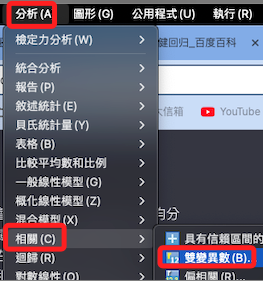
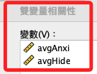
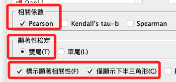
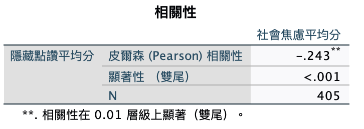
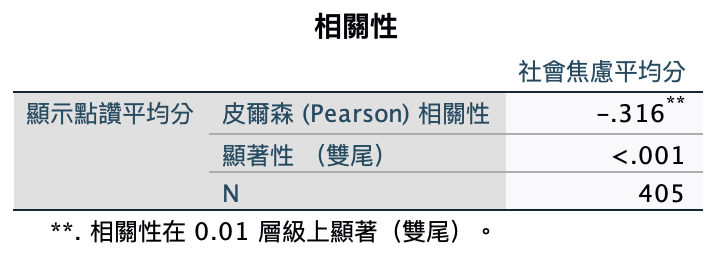

# 線性關係：相關分析

<br>

## 說明

_透過相關分析可確認兩變數間的線性關係_

<br>

1. `分析 -> 相關 -> 雙變異數`

    

<br>

2. 輸入

    

<br>

3. 選擇

    

<br>

## 語法

1. 相關係數 I

    ```bash
    *==============================================.
    *相關係數：雙尾，僅顯示下半部.
    CORRELATIONS
    /VARIABLES=avgAnxi avgHide
    /PRINT=TWOTAIL NOSIG LNODIAG
    /MISSING=PAIRWISE.
    *==============================================.
    ```

    

<br>

2. 相關係數 II

    ```bash
    *==============================================.
    *相關係數：雙尾，僅顯示下半部.
    CORRELATIONS
    /VARIABLES=avgAnxi avgShow
    /PRINT=TWOTAIL NOSIG LNODIAG
    /MISSING=PAIRWISE.
    *==============================================.
    ```

    

<br>

## 結論

1. 可充分證據表明自變數與因變數間存在線性關係，即便隱藏（-.243）僅是弱相關、顯示（-.316）僅是中度相關，但基於迴歸分析的基本假設而言，已經是滿足了假設。

<br>

2. 其他的假設都在模型擬合的同時或之後完成，所以確認了線性關係之後，可進入迴歸分析的階段。

<br>

___

_END_