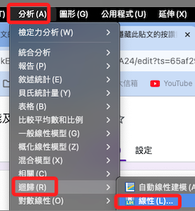

# 迴歸分析

<br>

## 名詞介紹

1. 變異數膨脹因子（Variance Inflation Factor，VIF）

<br>

## 步驟說明

_因為是寬格式數據，所以要針對兩個自變數水平的因變數做迴歸。_

<br>

1. `分析 -> 迴歸 -> 線性`

    

<br>

_在寬格式下，要分別針對 avgHide 與 avgShow  兩種狀況做分析_

<br>

2. 應變數：先針對隱藏點讚（avgHide）檢驗

    

<br>

3. 自變數：第一層將除了包含性別在內的多個類別變數加入

    

<br>

4. 點擊下一個，然後加入「社交焦慮」

    

<br>

5. 點擊「統計量」，添加一個「R平方變更量」

    

<br>

6. 也可加入共線性診斷與 D-W 殘差檢定

    

<br>

7. 儲存部分可加入「標準化殘差」

    

<br>

8. 貼上

    

<br>

## 階層迴歸分析

1. 隱藏點讚

    ```bash
    *==============================================.
    *階層迴歸分析：avgHide.
    REGRESSION
    /MISSING LISTWISE
    /STATISTICS COEFF OUTS R ANOVA COLLIN TOL CHANGE
    /CRITERIA=PIN(.05) POUT(.10) TOLERANCE(.0001)
    /NOORIGIN 
    /DEPENDENT avgHide
    /METHOD=ENTER sex age isKnowHideFunction useYears useFrequency useTime
    /METHOD=ENTER avgAnxi
    /RESIDUALS DURBIN
    /SAVE ZPRED ZRESID.
    *==============================================.
    ```

<br>

2. 會儲存標準化殘差與標準化預測值

    

<br>

3. 顯示點讚

    ```bash
    *==============================================.
    *階層迴歸分析：avgShow.
    REGRESSION
    /MISSING LISTWISE
    /STATISTICS COEFF OUTS R ANOVA COLLIN TOL CHANGE
    /CRITERIA=PIN(.05) POUT(.10) TOLERANCE(.0001)
    /NOORIGIN 
    /DEPENDENT avgShow
    /METHOD=ENTER sex age isKnowHideFunction useYears useFrequency useTime
    /METHOD=ENTER avgAnxi
    /RESIDUALS DURBIN
    /SAVE ZPRED ZRESID.
    *==============================================.
    ```

<br>

4. 會儲存標準化殘差與標準化預測值

    

<br>

## 報表

1. 檢定部分：先查看是否符合統計假設的檢定，再檢視分析結果。

    1) 獨立性檢定。

    2) 共線性檢定。

<br>

## D-W 獨立性檢定

_模型摘要中 ->（OK）_


<br>

## 共線性（VIF）」

_->（OK），VIF 是容差的倒數，用於量化自變數在模型中的多重共線性增加多少的變異量。小於（10）表示不嚴重違反無共線性假設。_

<br>

1. 隱藏

    

<br>

2. 顯示

    

<br>

## 係數ª

1. 在隱藏點讚狀況下，性別相對是比較顯著，而社交焦慮也是顯著的。

    

<br>

2. 在顯示點讚狀況下，年齡呈現顯著，同樣的，社交焦慮也是顯著的。

    

<br>

## 存檔

1. 儲存檔案。

    ```bash
    *========================================.
    *儲存檔案.
    SAVE OUTFILE='/Users/samhsiao/Desktop/02_論文_清心/00_論文數據/v6_25_迴歸寬格式.sav'.
    *========================================.
    ```

<br>

## 結論

1. 在階層迴歸分析中，發現社交焦慮對於兩個水平顯示狀態的自我揭露分數皆呈現顯著影響，另外在兩個水平中，也分別發現了性別、年齡具備顯著影響，這些訊息提供進一步探索存在於顯示狀態與自我揭露間的遮蔽或干擾。

<br>

2. 處理重複測量數據：由於研究涉及重複測量（同一個體在不同點讚顯示狀態下的自我揭露行為），故可評估適用於重複測量的重複測量變異數分析，將連續型變數社交焦慮納入作為共變數以觀察模型的變化，另外，基於年齡、性別等個體差異的顯著，亦可考慮使用能重複測量並對隨機效應進行建模的混合模型。

<br>

3. 個體差異的考慮：混合模型能夠同時分析個體層面（隨機效應）和群體層面（固定效應）的數據，這對於理解社交焦慮如何在個體間不同的方式影響自我揭露行為是重要的。

<br>

4. 個體差異：相較於傳統迴歸分析，混合模型可考慮隨機截距與隨機斜率，從而提供更全面的統計檢驗，例如可檢驗是否存在尚未觀察到的隨機效應，這可能會影響自我揭露行為的變異性，這種個體對社交焦慮的反應可能因人而異，可透過混合模型中的隨機截距和隨機斜率來探索。

<br>

___

_END_