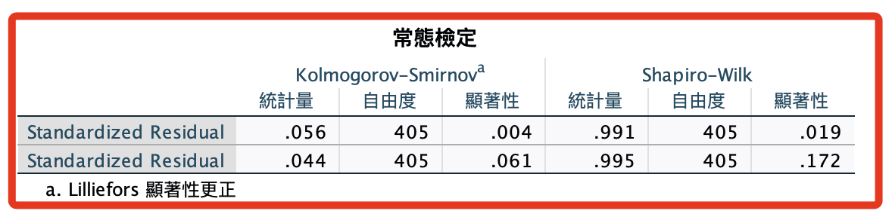
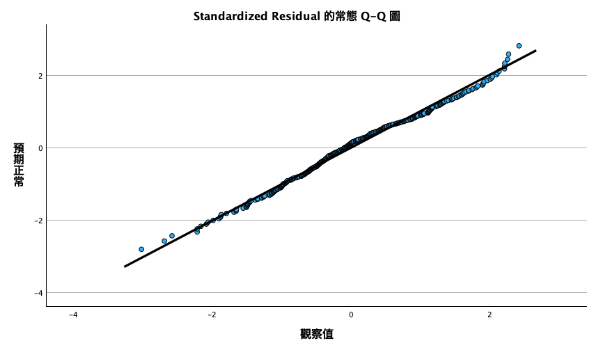
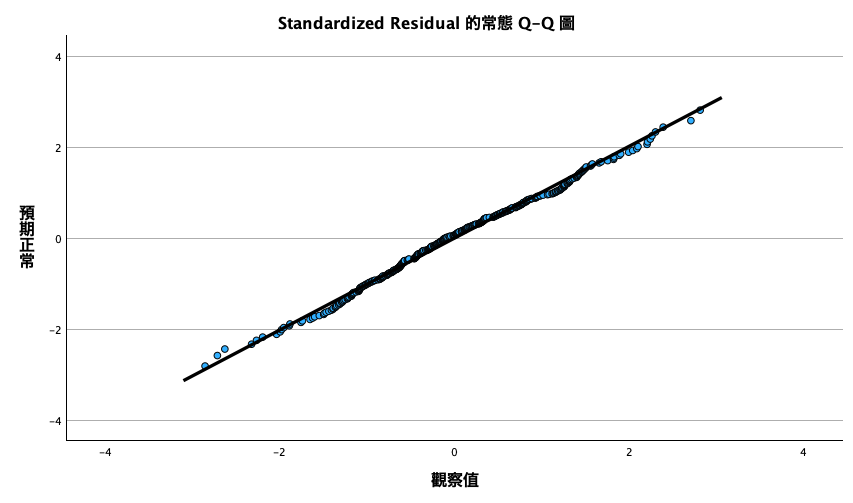

# 殘差常態性檢定

<br>

## 說明

1. 延續迴歸分析的標準化殘差（ZRESID）、標準化預測值（ZPRED ）數據。

<br>

2. 這兩個變數在建立後會被截短為（ZRE_1）、（ZPR_1）。

<br>

## 語法

1. 殘差項常態檢定。

    ```bash
    *==============================================.
    *殘差項常態檢定.
    EXAMINE VARIABLES=ZRE_1 ZRE_2
    /PLOT BOXPLOT NPPLOT
    /COMPARE GROUPS
    /STATISTICS DESCRIPTIVES
    /CINTERVAL 95
    /MISSING LISTWISE
    /NOTOTAL.
    *==============================================.
    ```

<br>

2. 報表。

    

<br>

## 說明

1. 殘差項常態檢定並未兩個都通過，基於中央極限定理，可以不處理這個問題無妨。

<br>

2. 或是觀察 QQ 圖，

<br>

3. 將另外進行「秩相關」檢定取代迴歸分析。

## QQ 圖

_這兩個QQ圖其實都挺好_

<br>

1. 第一個

    

<br>

2. 第二個

    

<br>

___

_END_
