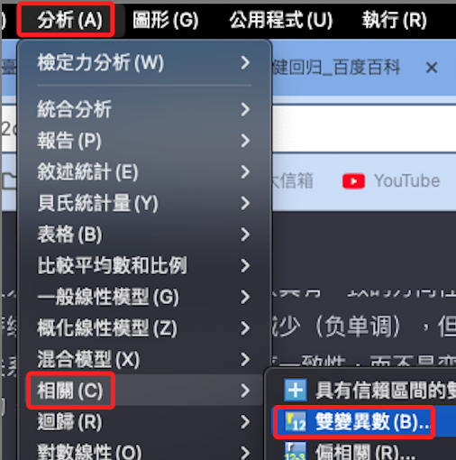
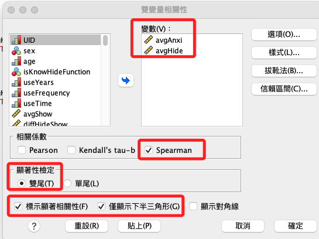
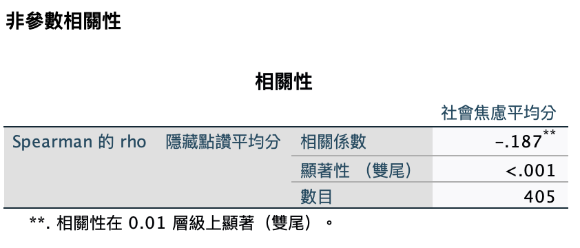
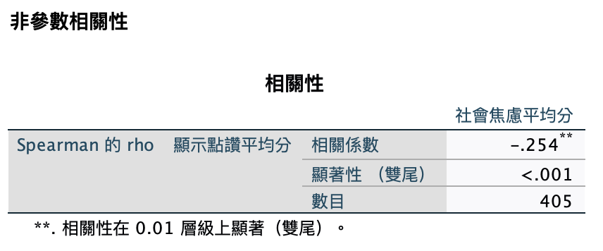

# 秩相關

<br>

## 說明

1. 對於不滿足殘差項常態檢定的迴歸模型，也可以考慮使用基於秩的非參數方法或「穩健迴歸」方法來取代迴歸模型，這些方法對殘差分佈的要求較低，特別注意，並不是取代殘差檢定，而是取代檢驗方法的本身。

<br>

2. 其中「Spearman 秩相關性」就是一種非參數的統計方法，用於評估兩個變數之間的等級（Rank，秩）相關性，它不要求資料服從常態分佈，適用於評估單調關係的強度和方向，也是處理不滿足常態分佈假設的資料的有力工具。

<br>

3. 目前的狀況是，其中一個自變數水準（隱藏）的殘差項常態檢定未通過，所以可使用「Spearman 秩相關」代替迴歸分析，尤其在這個步驟關注的僅是變數間的單調關係而非嚴格的線性關係，而「Spearman 秩相關」正好可以提供關變數間關係的方向和強度的信息。

<br>

4. 但要特別注意，假如對兩個水平採用不同的統計檢定方法（一個使用迴歸分析、一個使用 Spearman 秩相關）可能會有解釋上的困難， 在解釋時避免涉及彼此間的比較議題。

<br>

5. 承上，對於「迴歸分析」來說，關注的是自變數對因變數的影響大小和方向，以及預測能力（透過 R² 和迴歸係數來評估）；而對於「Spearman 秩相關」所關注的是兩個變數之間的單調關係的強度和方向，但不直接提供因果關係的資訊。

<br>

6. 綜合上述，儘管「Spearman 秩相關性」可作為迴歸分析的替代，但並不能完全取代迴歸分析所能提供的細節，特別是在考慮多個預測變數和控制潛在混淆變數時，所以可考慮使用「穩健迴歸」來補充「秩相關分析」的結果。

<br>

## Spearman 秩相關

1. 面板操作。

    

<br>

2. 設定。

    

<br>

## 隱藏

1. 語法。

    ```bash
    *==============================================.
    *使用 Spearman 秩相關.
    NONPAR CORR
    /VARIABLES=avgAnxi avgHide
    /PRINT=SPEARMAN TWOTAIL NOSIG LNODIAG
    /MISSING=PAIRWISE.
    *==============================================.
    ```

<br>

2. 報表。

    

<br>

3. 說明。

   1) 報表顯示社會焦慮平均分數與隱藏點讚平均分數之間的Spearman秩相關係數及其顯著性水準，Spearman秩相關係數是一種非參數的相關性測量方法，用於評估兩個變數間的單調相關性，即變數一增加時，變數二是增加還是減少。

   2) 相關係數：社會焦慮平均分數與隱藏點讚平均分數之間的Spearman的rho相關係數為-0.187，表示兩者之間有輕微的負相關性，即社會焦慮分數越高，隱藏點讚的平均分數越低，反之亦然。

   3) 顯著性（雙尾）：相關性的顯著性水準小於0.001，表示社會焦慮平均分數與隱藏點讚平均分數之間的負相關是統計上顯著的。

   4) 分析表明，在統計上，社會焦慮平均分數與隱藏點讚平均分之間存在著輕微但顯著的負相關性，可能表示在社交焦慮較高的個體中，傾向於有較低的隱藏點讚平均分數，這種關係的實際意義需要結合具體研究背景和理論來解釋。

   5) 例如，這可能表明社會焦慮較高的個體更可能隱瞞他們對內容的點贊，可能是出於對社交評價的擔憂。

   6) 特別注意：儘管這個相關性顯著，但相關係數相對較小，表示變數間的關係不是非常強，也就是說還有其他因素可能影響隱藏點讚平均分，社會焦慮只是其中之一，在解釋這種關係時，應考慮到這一點。

<br>

## 顯示

1. 語法。

    ```bash
    *==============================================.
    *使用 Spearman 秩相關.
    NONPAR CORR
    /VARIABLES=avgAnxi avgShow
    /PRINT=SPEARMAN TWOTAIL NOSIG LNODIAG
    /MISSING=PAIRWISE.
    *==============================================.
    ```

<br>

2. 報表。

    

<br>

## 結論

1. 雖然秩相關等非參數方法可以作為不滿足殘差常態之下的檢驗，但無法確認其中的方向性，似乎不符合研究需求，所以將改用「廣義線性模型」或「穩健迴歸模型」。

<br>

___

_END_