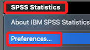
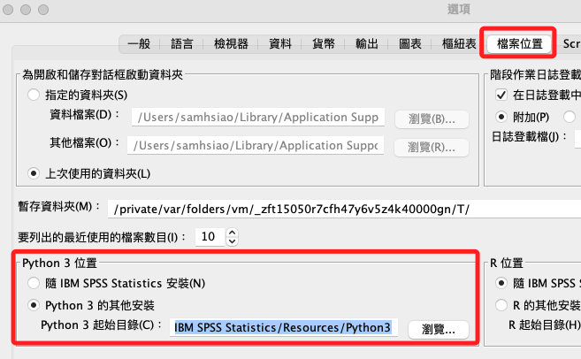
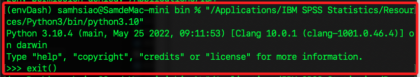

# （尚未排除）SPSS Python

1. 先進入設定

    

<br>

2. 這裡顯示的是預設路徑

    

<br>

3. 預設路徑

    ```bash
    /Applications/IBM SPSS Statistics/Resources/Python3
    ```

<br>

4. 查詢當前 Python 路徑

    ```python
    import sys
    print(sys.executable)
    ```

<br>

5. 使用終端機，記得加上引號

    

<br>

___

_未完_