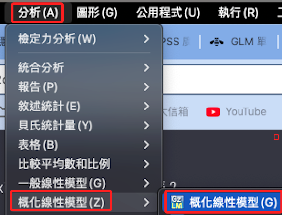

# 廣義線性模型：寬格式

<br>

## 介紹

1. 在新版 SPSS 中稱為「概化線性模型」。

<br>

## 說明

1. 特別注意，廣義線性模型還是需要檢驗殘差的常態，另外依據因變數的分佈不同，可選用不同建模方式。

<br>

2. 「Generalized linear model」，中文稱為「廣義線性模型」或「概化線性模型」，利用了「隨機成分」（Random component）及「連結函數」（Link function）將各種不同尺度的依變項作迴歸模式的統整。

<br>

3. 進行廣義線性模型之前，須先對因變數進行分配的檢驗。

<br>

4. 在檢驗開始之前，先對「avgHide」以及「avhShow」進行了分佈的檢驗，兩者皆屬於「對數常態分佈」，這個特徵將用於接下來在廣義線性模型的鏈結函數選擇。

    

<br>

5. 另一張圖。

    

<br>

## 步驟

1. `分析 -> 概化線性模型 -> 概化線性模型`。

    

<br>

2. 先通過腳本檢驗分佈特徵（後補）

<br>

3. 選擇模型類型。

    1) 自變數與因變數是正值的連續型數值，適用的分佈是「Gamma」，這個分佈適用於正值連續型資料且資料不是常態分佈時。

    2) 同時預設會搭配對數鏈接函數，若透過手動選取會有三個選項：單位（Identity）、對數（Log）、檢定力（Power），依據分佈特徵的判斷，這裡使用預設的「Log」是合適的。

    

<br>

4. 回應的部分就是「應變數」

    

<br>

5. 自變數與共變數：_這裡設定錯誤，正確應該是：因子是分類、共變是連續_。

    

<br>

6. 點擊選項可設定排序（預設即可，略）

<br>

7. 模型：先逐步加入主效應

    

<br>

8. 再將想觀察的變數加入模型

    

<br>

9. 統計量可勾選這三個

    

<br>

10. 儲存標準化殘差

    

<br>

## 語法

1. 參考模型：觀察基礎模型架構。

    ```bash
    *==============================================.
    * 概化線性模型：簡易觀察使用.
    GENLIN avgHide WITH avgAnxi
    /MODEL avgAnxi INTERCEPT=YES
    DISTRIBUTION=Gamma LINK=log
    /CRITERIA COVB=MODEL SCALE=MLE.
    *==============================================.
    ```

<br>

2. 參考模型：不包含共變數，儲存期望值（MEANPRED）、殘差（RESID）、標準化殘差（DEVIANCERESID）。

    ```bash
    *==============================================.
    * 廣義線性模型：不包含共變數.
    GENLIN avgHide BY avgAnxi (ORDER=ASCENDING) 
    /MODEL avgAnxi INTERCEPT=YES
    DISTRIBUTION=GAMMA LINK=LOG
    /CRITERIA METHOD=FISHER(1) SCALE=MLE COVB=MODEL MAXITERATIONS=100 MAXSTEPHALVING=5 
        PCONVERGE=1E-006(ABSOLUTE) SINGULAR=1E-012 ANALYSISTYPE=3(WALD) CILEVEL=95 CITYPE=WALD 
        LIKELIHOOD=FULL
    /MISSING CLASSMISSING=EXCLUDE
    /PRINT MODELINFO FIT SUMMARY
    /SAVE MEANPRED RESID DEVIANCERESID.
    *==============================================.
    ```

<br>

3. 主要觀察的是（焦慮）對（隱藏），其餘暫時不看。

    

<br>

## avgHide

1. 正式模型：隱藏，包含共變數、交互項，並儲存殘差項等數據」。

    ```bash
    *==============================================.
    * 廣義線性模型：加入共變數以及交互項.
    GENLIN avgHide BY avgAnxi (ORDER=DATA) WITH 
    sex age isKnowHideFunction useYears useFrequency useTime    
    /MODEL 
    avgAnxi sex age isKnowHideFunction useYears useFrequency useTime 
        INTERCEPT=YES
    DISTRIBUTION=GAMMA LINK=LOG
    /CRITERIA METHOD=FISHER(1) SCALE=MLE COVB=MODEL MAXITERATIONS=100 MAXSTEPHALVING=5 
        PCONVERGE=1E-006(ABSOLUTE) SINGULAR=1E-012 ANALYSISTYPE=3(WALD) CILEVEL=95 CITYPE=WALD 
        LIKELIHOOD=FULL
    /MISSING CLASSMISSING=EXCLUDE
    /PRINT MODELINFO FIT SUMMARY
    /SAVE MEANPRED RESID DEVIANCERESID.
    *==============================================.
    ```

<br>

2. 儲存期望值（MEANPRED）、殘差（RESID）、標準化殘差（DEVIANCERESID）

    

<br>

## avgShow

1. 語法。

    ```bash
    *==============================================.
    * 廣義線性模型：加入共變數以及交互項.
    GENLIN avgShow BY avgAnxi (ORDER=DATA) WITH 
    sex age isKnowHideFunction useYears useFrequency useTime    
    /MODEL 
    avgAnxi sex age isKnowHideFunction useYears useFrequency useTime 
        INTERCEPT=YES
    DISTRIBUTION=GAMMA LINK=LOG
    /CRITERIA METHOD=FISHER(1) SCALE=MLE COVB=MODEL MAXITERATIONS=100 MAXSTEPHALVING=5 
        PCONVERGE=1E-006(ABSOLUTE) SINGULAR=1E-012 ANALYSISTYPE=3(WALD) CILEVEL=95 CITYPE=WALD 
        LIKELIHOOD=FULL
    /MISSING CLASSMISSING=EXCLUDE
    /PRINT MODELINFO FIT SUMMARY
    /SAVE MEANPRED RESID DEVIANCERESID.
    *==============================================.
    ```

<br>

2. 儲存期望值（MEANPRED）、殘差（RESID）、標準化殘差（DEVIANCERESID）

    

<br>

3. 「報表：隱藏」（分析部分先省略）

    

<br>

4. 報表：顯示（分析部分先省略）

    

<br>

## 關於分佈的選擇

1. 二項分佈：適用於二分類的結果，如成功/失敗、是/否等。 如果你的依變項是表示兩種狀態的出現次數或比例，可能適合使用二項分佈。

<br>

2. 泊松分佈：適用於計數數據，如某段時間發生的事件次數。 如果因變數是表示事件發生頻率或次數，且這些事件獨立發生，可能適合泊松分佈。

<br>

3. 負二項分佈：當計數資料的變異數明顯大於平均值時，使用負二項分佈可以是更好的選擇，因為它可以處理過度離散（Overdispersion）的問題。

<br>

4. 「Gamma分佈」：適用於連續的正值數據，特別是當數據分佈偏斜，且不符合常態分佈時。

<br>

## 關於鏈接函數的選擇

_下拉選項中有三個：「單位、對數、檢定力」_

<br>

1. 單位連結函數（Identity Link）

    1) 解釋：直接將因變數的預期值設為線性預測值，也就是沒有轉換，保持原值不變，適用於因變數預期與預測變數線性相關，且資料分佈為常態分佈的情況。

    2) 適用情況：常用於常態分佈資料的線性迴歸模型。

<br>

2. 對數連結函數（Log Link）

    1) 解釋：將因變數的預期值的自然對數設為線性預測值，常用於資料為正，且變化範圍很廣時，如計數資料或具有指數成長特徵的資料。

    2) 適用情況：適用於泊松迴歸、Gamma 迴歸等，處理計數資料或某些連續資料。

<br>

3. 檢定力連結函數（Power Link，也可能指Cobb-Douglas形式）

    1) 解釋：指冪連結函數，其中冪可以是任何實數值，用於模型中變數的冪次方形式，它允許更複雜的變換，適用於多種分佈類型和非線性關係。

    2) 適用情況：這種連結函數的具體應用取決於冪的選擇，可以適應多種不同的模型需求和資料特性。

<br>

___

_END_