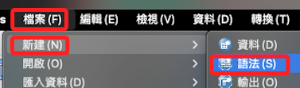
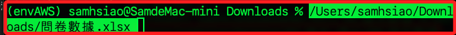
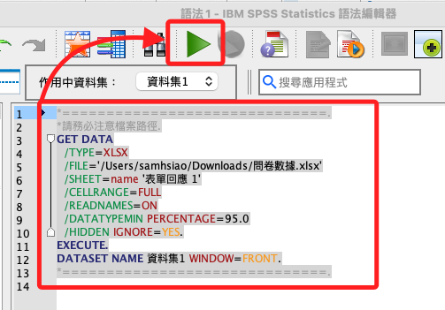
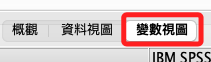
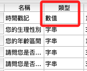

# 匯入資料

_將下載的數據更名為 `問卷數據.xlsx`_

<br>

## 步驟說明

1. 開啟 SPSS，先新建一個空白語法。

    

<br>

2. 開啟一個終端機，將 `問卷數據.xlsx` 文件從 Finder 拖曳到終端機中，並且記錄這個絕對路徑；使用 Windwos 也是相同概念，細節不贅述。

    

<br>

3. 使用語法匯入資料檔案，將絕對路徑複製貼上在 `/FILE=` 之後並以引號包覆；特別注意，SPSS Syntax 的註解是以 `星號 *` 開頭、`點 .` 結尾，之後不再贅述。

    ```bash
    *==============================.
    *請務必注意檔案路徑.
    GET DATA
      /TYPE=XLSX
      /FILE='/Users/samhsiao/Downloads/問卷數據.xlsx'
      /SHEET=name '表單回應 1'
      /CELLRANGE=FULL
      /READNAMES=ON
      /DATATYPEMIN PERCENTAGE=95.0
      /HIDDEN IGNORE=YES.
    EXECUTE.
    DATASET NAME 資料集1 WINDOW=FRONT.
    *==============================.
    ```

<br>

4. 與資料庫語法的操作相同，反白選取之後點擊執行圖標；運行之後主視窗會自動重啟；另外，若要使用組合鍵為 `command + R`。

    

<br>

5. 重啟之後，切換進入 `變數視圖`。

    

<br>

6. 可看到僅有 `時間戳記` 是 `數值`，其餘都是 `字串`；必須進行轉換，否則無法進行統計相關運算。

    

<br>

7. 可將無用的數據刪除，如 `時間戳記`、`抽獎` 等；這些在分析中沒有使用到的數據保留在原始的 Excel 檔案中即可；同樣反白選取後執行，這部分之後不再贅述。

    ```bash
    *==============================.
    *刪除時間戳記.
    DELETE VARIABLES 時間戳記.
    DELETE VARIABLES 如要參加抽獎請留下您的email，謝謝。.
    EXECUTE.
    *==============================.
    ```

<br>

8. 建立資料夾；可手動建立。

    ```bash
    mkdir /Users/samhsiao/Desktop/00_論文實作/
    ```

<br>

9. 進行第一次儲存；特別注意，這指令不會建立資料夾，務必確認資料夾已經存在。

    ```bash
    *==============================.
    *儲存檔案.
    SAVE OUTFILE='/Users/samhsiao/Desktop/00_論文實作/v01_01_匯入完成.sav'.
    *==============================.
    ```

<br>

___

_END_
