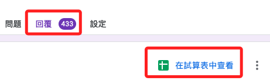
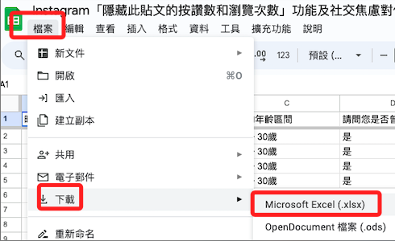
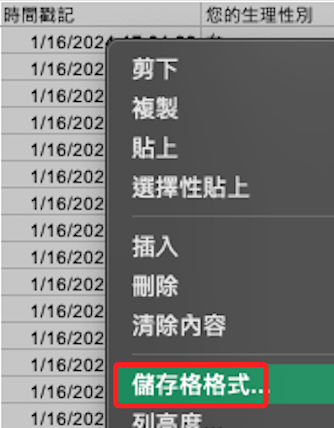
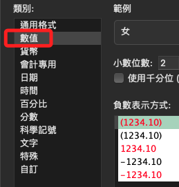
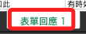
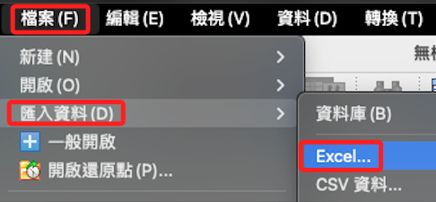

# 基本步驟

_關於下載鏈接另外提供_

 

## 說明

1. 下載。

    

 

2. 選擇 `xlsx`，因為選 `csv` 會是亂碼。

    

 

3. 使用 `Excel` 開啟，選取全部儲存格，右鍵點擊 `儲存格格式`。

    

 

4. 設定為 `數值`，不用在意時間戳記無法讀取問題。

    

 

5. 確認 Excel 的工作表名稱 `表單回應 1`，這會用在下一個步驟。

    

 

6. 儲存後退出，再到 SPSS 中匯入 `.xlsx`；這裡可以不用實作，之後再使用語法匯入即可。

    

 

7. 特別說明，這並無法改變匯入的資料會是字串的問題，不過沒關係，因為本來就要數據清洗並儲存為不同變數。

 

___

_END_