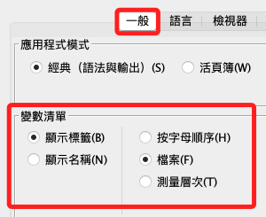
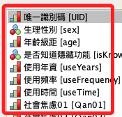
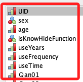
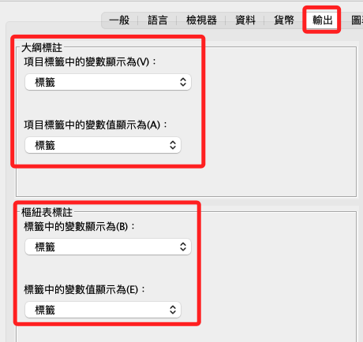

# 面板設定

_Preferences_

 

## 變數清單

1. 在 `一般` 中的 `變數清單` 區塊中，選擇 `顯示標籤`。

    

 

2. 變數清單會顯示 `標籤名稱`，後面會以括號將 `變數名稱` 列出。

    

 

3. 若選擇 `顯示名稱`，變數清單會僅顯示 `變數名稱`。

    

 

## 輸出

1. 輸出選項中的 `大綱標註` 及 `樞紐表標註` 區塊也分別可以設定 `標籤、名稱、名稱和標籤` 以及 `標籤、值、值和標籤`。

    

 

___

_持續補充_