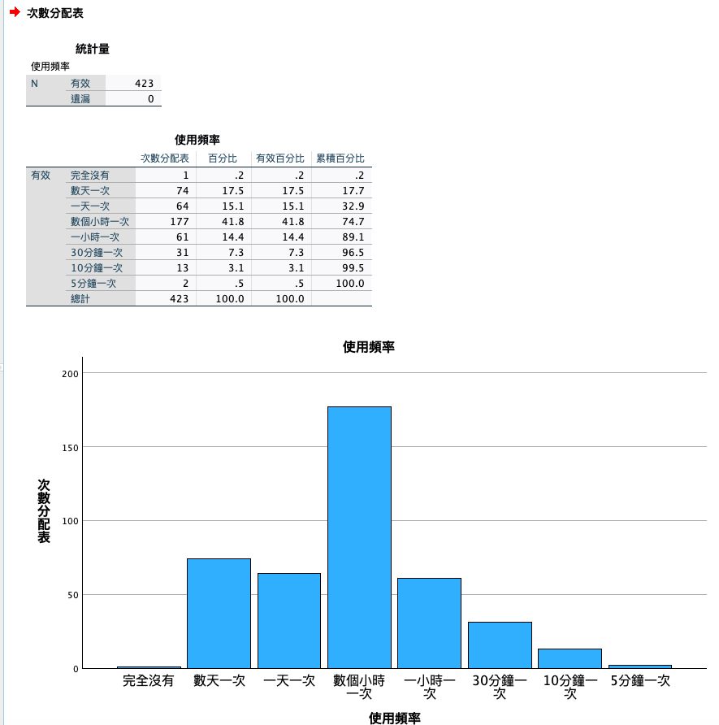
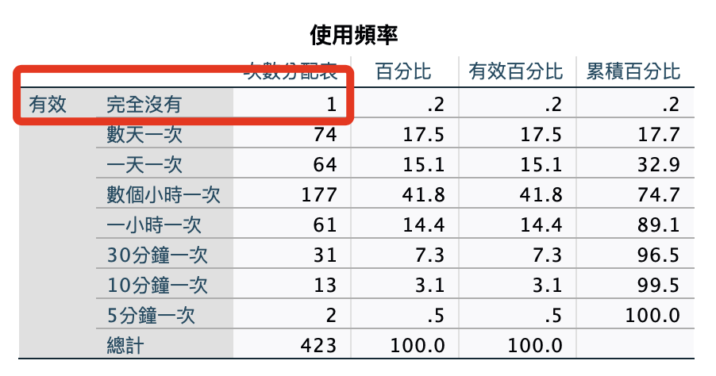
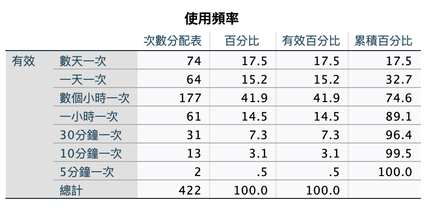

# 使用頻率

<br>

## 準備工作

1. 開啟指定的資料集。

    ```bash
    *========================================.
    DATASET ACTIVATE 資料集1.
    *========================================.
    ```

<br>

## 語法操作

1. 簡易重新編碼 `useFrequency`。

    ```bash
    *========================================.
    *重新編碼為不同變數：使用頻率 useFrequency.

    *重新編碼為不同變數，若編碼為相同變數則不要加上 INTO 即可.
    RECODE 無論Instagram應用程式的登入狀態，請問您的Instagr 
    ('完全沒有'=0) 
    ('數天一次'=1)
    ('一天一次'=2) 
    ('數個小時一次'=3) 
    ('一小時一次'=4)
    ('30分鐘一次'=5)
    ('10分鐘一次'=6)
    ('5分鐘一次'=7)
    (ELSE=8) 
    INTO useFrequency.

    *標籤名稱.
    VARIABLE LABELS  useFrequency '使用頻率'.

    *小數的位數為「0」，F 為 Format 的意思.
    FORMATS useFrequency (F1.0).

    *變數類型為序數.
    VARIABLE LEVEL useFrequency (ORDINAL).

    *執行.
    EXECUTE.
    *========================================.
    ```

<br>

2. 標籤、值標籤、小數位數、變數類型。

    ```bash
    *========================================.
    *標籤名稱.
    VARIABLE LABELS useFrequency '使用頻率'.

    *小數的位數為「0」，F 為 Format 的意思.
    FORMATS useFrequency (F1.0).

    *靠左 置中 靠右 LEFT CENTER RIGHT.
    VARIABLE ALIGN useFrequency (CENTER).

    *變數類型為序數.
    VARIABLE LEVEL useFrequency (ORDINAL).

    *值標籤.
    VALUE LABELS useFrequency
    0 '完全沒有'
    1 '數天一次'
    2 '一天一次'
    3 '數個小時一次'
    4 '一小時一次'
    5 '30分鐘一次'
    6 '10分鐘一次'
    7 '5分鐘一次'
    8 ELSE
    .

    *執行.
    EXECUTE.
    *========================================.
    ```

<br>

## 繪圖

1. 次數分配＋繪圖。

    ```bash
    *========================================.
    *次數分配＋繪圖：使用頻率.
    FREQUENCIES VARIABLES=useFrequency 
    /BARCHART FREQ
    /ORDER=ANALYSIS.
    *========================================.
    ```

<br>

2. 結果。

    

<br>

## 刪除

1. 同樣出現了一個在頻率上 `完全沒有` 的樣本。

    

<br>

2. 刪除使用頻率為零的樣本；這裡直接使用 `SELECT IF` 語法，邏輯上就是保留使用經驗非零的樣本。

    ```bash
    *========================================.
    * 選取「使用頻率」為「否（0）」以外的樣本，並將其保留.
    USE ALL.
    SELECT IF (useFrequency ~= 0).
    EXECUTE.
    *========================================.
    ```

<br>

3. 次數分配＋繪圖，再觀察一次。

    ```bash
    *========================================.
    *次數分配＋繪圖：使用頻率.
    FREQUENCIES VARIABLES=useFrequency 
    /BARCHART FREQ
    /ORDER=ANALYSIS.
    *========================================.
    ```

    _樣本數至此變更為 `422`_

    

<br>

## 刪除

1. 刪除原有變數。

    ```bash
    *========================================.
    *刪除原有變數.
    DELETE VARIABLES 無論Instagram應用程式的登入狀態，請問您的Instagr.
    *========================================.
    ```

<br>

## 存檔

1. 儲存數據。

    ```bash
    *==============================.
    *儲存檔案.
    SAVE OUTFILE='/Users/samhsiao/Desktop/00_論文實作/v01_04_使用頻率清洗完成.sav'.
    *==============================.
    ```

<br>

___

_END_
