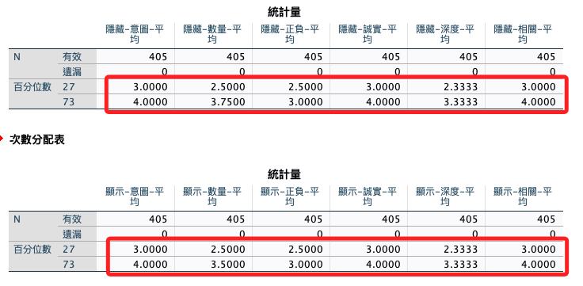
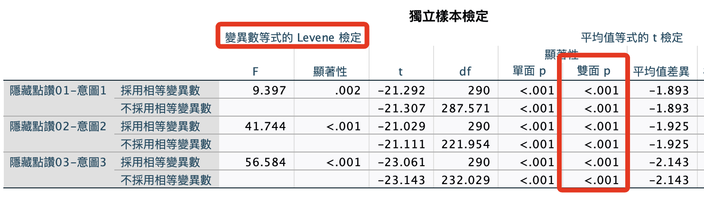
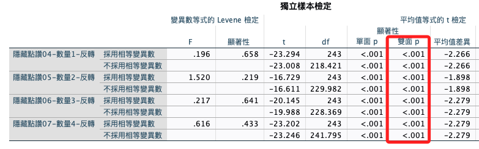
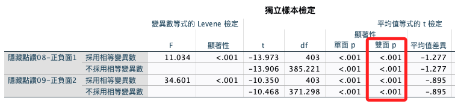
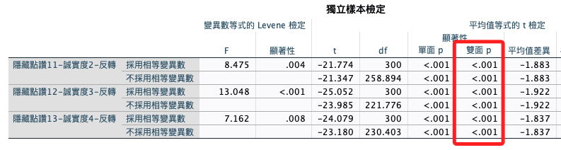
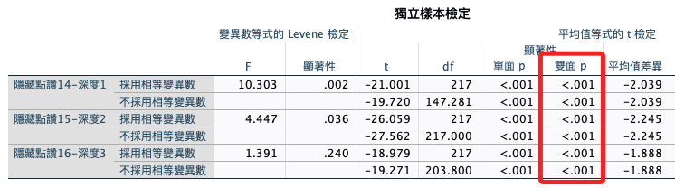
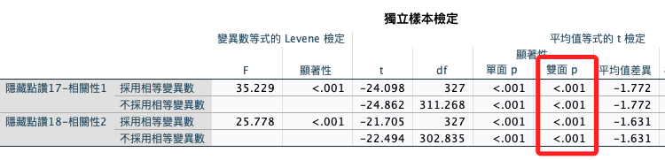

# 項目分析

<br>

## 說明

1. 與信度分析不同，項目分析不會刪題，是一種「鑑別度」有效性的檢驗，所以歸類在檢驗的範疇內。

2. 項目分析要在信度分析等會刪除題目與樣本的程序後進行。

<br>

## 步驟說明

1. 計算各構面平均分數。

2. 對平均分數做次數分配，取得（27-73）分位數。

3. 使用計算變數，透過分位數進行編組，分作高低分組。

4. 使用高低分的分類變數，對高低分進行T檢定。

<br>

## 開始進行

1. 計算平均數。

    ```bash
    *========================================.
    *計算各構面平均 Hide.
    COMPUTE avgHide1_0103=MEAN(Hide01 TO Hide03).
    COMPUTE avgHide2_0407=MEAN(Hide04 TO Hide07).
    COMPUTE avgHide3_0809=MEAN(Hide08 TO Hide09).
    COMPUTE avgHide4_1113=MEAN(Hide11 TO Hide13).
    COMPUTE avgHide5_1416=MEAN(Hide14 TO Hide16).
    COMPUTE avgHide6_1718=MEAN(Hide17 TO Hide18).

    *計算各構面平均 Show.
    COMPUTE avgShow1_0103=MEAN(Show01 TO Show03).
    COMPUTE avgShow2_0407=MEAN(Show04 TO Show07).
    COMPUTE avgShow3_0809=MEAN(Show08 TO Show09).
    COMPUTE avgShow4_1113=MEAN(Show11 TO Show13).
    COMPUTE avgShow5_1416=MEAN(Show14 TO Show16).
    COMPUTE avgShow6_1718=MEAN(Show17 TO Show18).

    *執行.
    EXECUTE.

    *標籤：隱藏.
    VARIABLE LABELS  avgHide1_0103 '隱藏-意圖-平均'.
    VARIABLE LABELS  avgHide2_0407 '隱藏-數量-平均'.
    VARIABLE LABELS  avgHide3_0809 '隱藏-正負-平均'.
    VARIABLE LABELS  avgHide4_1113 '隱藏-誠實-平均'.
    VARIABLE LABELS  avgHide5_1416 '隱藏-深度-平均'.
    VARIABLE LABELS  avgHide6_1718 '隱藏-相關-平均'.

    *標籤：顯示.
    VARIABLE LABELS  avgShow1_0103 '顯示-意圖-平均'.
    VARIABLE LABELS  avgShow2_0407 '顯示-數量-平均'.
    VARIABLE LABELS  avgShow3_0809 '顯示-正負-平均'.
    VARIABLE LABELS  avgShow4_1113 '顯示-誠實-平均'.
    VARIABLE LABELS  avgShow5_1416 '顯示-深度-平均'.
    VARIABLE LABELS  avgShow6_1718 '顯示-相關-平均'.
    *========================================.
    ```

<br>

2. 建立分位數。

    ```bash
    *========================================.
    *分位數 Hide.
    FREQUENCIES VARIABLES=
        avgHide1_0103 avgHide2_0407 avgHide3_0809 avgHide4_1113 avgHide5_1416 avgHide6_1718
    /FORMAT=NOTABLE
    /PERCENTILES=27.0 73.0 
    /ORDER=ANALYSIS.

    *分位數 Show.
    FREQUENCIES VARIABLES=
        avgShow1_0103 avgShow2_0407 avgShow3_0809 avgShow4_1113 avgShow5_1416 avgShow6_1718
    /FORMAT=NOTABLE
    /PERCENTILES=27.0 73.0 
    /ORDER=ANALYSIS.

    *執行.
    EXECUTE.
    *========================================.
    ```

<br>

3. 結果。

    

<br>

4. 進行高低分的分組：必須手動輸入前一個步驟所得的分位數。

    ```bash
    *========================================.
    *使用計算變數，透過分位數進行編組：分作高低分組.
    RECODE avgHide1_0103 (Lowest thru 3.00=1) (4.00 thru Highest=2) INTO lhHide1.
    RECODE avgHide2_0407 (Lowest thru 2.50=1) (3.75 thru Highest=2) INTO lhHide2.
    RECODE avgHide3_0809 (Lowest thru 2.50=1) (3.00 thru Highest=2) INTO lhHide3.
    RECODE avgHide4_1113 (Lowest thru 3.00=1) (4.00 thru Highest=2) INTO lhHide4.
    RECODE avgHide5_1416 (Lowest thru 2.33=1) (3.33 thru Highest=2) INTO lhHide5.
    RECODE avgHide6_1718 (Lowest thru 3.00=1) (4.00 thru Highest=2) INTO lhHide6.

    *使用計算變數，透過分位數進行編組：分作高低分組.
    RECODE avgShow1_0103 (Lowest thru 3.00=1) (4.00 thru Highest=2) INTO lhShow1.
    RECODE avgShow2_0407 (Lowest thru 2.50=1) (3.5 thru Highest=2) INTO lhShow2.
    RECODE avgShow3_0809 (Lowest thru 2.50=1) (3.00 thru Highest=2) INTO lhShow3.
    RECODE avgShow4_1113 (Lowest thru 3.00=1) (4.00 thru Highest=2) INTO lhShow4.
    RECODE avgShow5_1416 (Lowest thru 2.33=1) (3.33 thru Highest=2) INTO lhShow5.
    RECODE avgShow6_1718 (Lowest thru 3.00=1) (4.00 thru Highest=2) INTO lhShow6.

    *執行.
    EXECUTE.

    *標籤：隱藏.
    VARIABLE LABELS  lhHide1 '高低分組Hide01'.
    VARIABLE LABELS  lhHide2 '高低分組Hide02'.
    VARIABLE LABELS  lhHide3 '高低分組Hide03'.
    VARIABLE LABELS  lhHide4 '高低分組Hide04'.
    VARIABLE LABELS  lhHide5 '高低分組Hide05'.
    VARIABLE LABELS  lhHide6 '高低分組Hide06'.

    *標籤：顯示.
    VARIABLE LABELS  lhShow1 '高低分組Show01'.
    VARIABLE LABELS  lhShow2 '高低分組Show02'.
    VARIABLE LABELS  lhShow3 '高低分組Show03'.
    VARIABLE LABELS  lhShow4 '高低分組Show04'.
    VARIABLE LABELS  lhShow5 '高低分組Show05'.
    VARIABLE LABELS  lhShow6 '高低分組Show06'.
    *========================================.
    ```

<br>

## 進行檢定

1. 進行T檢定。

    ```bash
    *========================================.
    *將各題目透過高低分組做獨立 T 檢定.
    T-TEST GROUPS=lhHide1(1 2)
    /MISSING=ANALYSIS
    /VARIABLES=Hide01 Hide02 Hide03
    /ES DISPLAY(TRUE)
    /CRITERIA=CI(.95).

    *將各題目透過高低分組做獨立 T 檢定.
    T-TEST GROUPS=lhHide2(1 2)
    /MISSING=ANALYSIS
    /VARIABLES=Hide04 Hide05 Hide06 Hide07
    /ES DISPLAY(TRUE)
    /CRITERIA=CI(.95).

    *將各題目透過高低分組做獨立 T 檢定.
    T-TEST GROUPS=lhHide3(1 2)
    /MISSING=ANALYSIS
    /VARIABLES=Hide08 Hide09
    /ES DISPLAY(TRUE)
    /CRITERIA=CI(.95).

    *將各題目透過高低分組做獨立 T 檢定.
    T-TEST GROUPS=lhHide4(1 2)
    /MISSING=ANALYSIS
    /VARIABLES=Hide11 Hide12 Hide13
    /ES DISPLAY(TRUE)
    /CRITERIA=CI(.95).

    *將各題目透過高低分組做獨立 T 檢定.
    T-TEST GROUPS=lhHide5(1 2)
    /MISSING=ANALYSIS
    /VARIABLES=Hide14 Hide15 Hide16
    /ES DISPLAY(TRUE)
    /CRITERIA=CI(.95).

    *將各題目透過高低分組做獨立 T 檢定.
    T-TEST GROUPS=lhHide6(1 2)
    /MISSING=ANALYSIS
    /VARIABLES=Hide17 Hide18
    /ES DISPLAY(TRUE)
    /CRITERIA=CI(.95).

    *將各題目透過高低分組做獨立 T 檢定.
    T-TEST GROUPS=lhShow1(1 2)
    /MISSING=ANALYSIS
    /VARIABLES=Show01 Show02 Show03
    /ES DISPLAY(TRUE)
    /CRITERIA=CI(.95).

    *將各題目透過高低分組做獨立 T 檢定.
    T-TEST GROUPS=lhShow2(1 2)
    /MISSING=ANALYSIS
    /VARIABLES=Show04 Show05 Show06 Show07
    /ES DISPLAY(TRUE)
    /CRITERIA=CI(.95).

    *將各題目透過高低分組做獨立 T 檢定.
    T-TEST GROUPS=lhShow3(1 2)
    /MISSING=ANALYSIS
    /VARIABLES=Show08 Show09
    /ES DISPLAY(TRUE)
    /CRITERIA=CI(.95).

    *將各題目透過高低分組做獨立 T 檢定.
    T-TEST GROUPS=lhShow4(1 2)
    /MISSING=ANALYSIS
    /VARIABLES=Show11 Show12 Show13
    /ES DISPLAY(TRUE)
    /CRITERIA=CI(.95).

    *將各題目透過高低分組做獨立 T 檢定.
    T-TEST GROUPS=lhShow5(1 2)
    /MISSING=ANALYSIS
    /VARIABLES=Show14 Show15 Show16
    /ES DISPLAY(TRUE)
    /CRITERIA=CI(.95).

    *將各題目透過高低分組做獨立 T 檢定.
    T-TEST GROUPS=lhShow6(1 2)
    /MISSING=ANALYSIS
    /VARIABLES=Show17 Show18
    /ES DISPLAY(TRUE)
    /CRITERIA=CI(.95).
    *========================================.
    ```

<br>

## T 檢定

1. T檢定的虛無假設是沒有差異（有辨識度），所以要看雙尾檢定。

<br>

## 同質性檢定

_虛無假設是同質，所以顯著的時候要看不採用相等變異數。_

1. 第一部分。

    

<br>

2. 第二部分。

    

<br>

3. 第三部分。

    

<br>

4. 第四部分。

    

<br>

5. 第五部分。

    

<br>

6. 第六部分。

    

<br>

_另一半省略_

<br>

## 復原並儲存

1. 刪除變數：這些變數目前看來後面是用不到，先刪除，將來若會用到，再回頭來把刪除清單修改一下。

    ```bash
    *========================================.
    *刪除變數.
    DELETE VARIABLES
    avgHide1_0103 TO lhShow6.
    
    *執行.
    EXECUTE.
    *========================================.
    ```

<br>

2. 存檔：項目分析完成」應該是沒變化，但因為中間有做過很多修改，另外存一個版本有利於回覆前一個版本。

    ```bash
    *========================================.
    *儲存檔案.
    SAVE OUTFILE='/Users/samhsiao/Desktop/02_論文_清心/00_論文數據/v6_16_項目分析完成.sav'.
    *========================================.
    ```

<br>

___

_END_