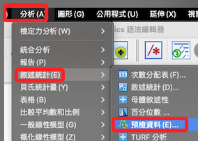
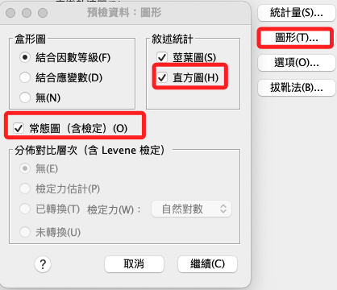
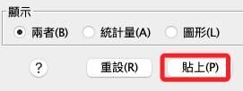
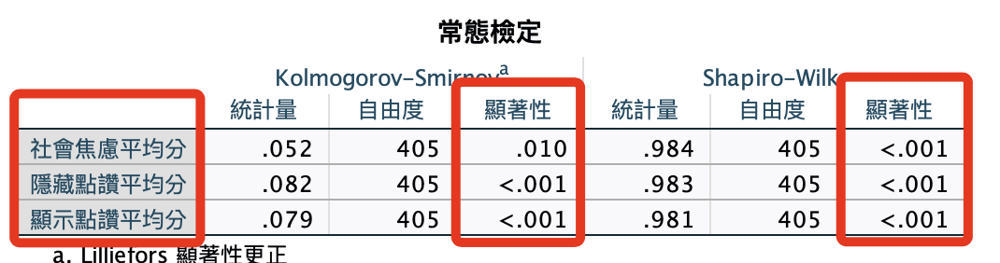
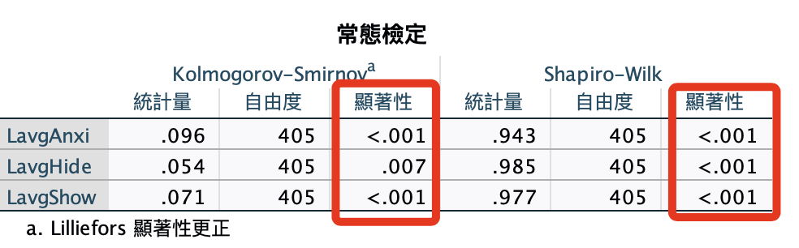
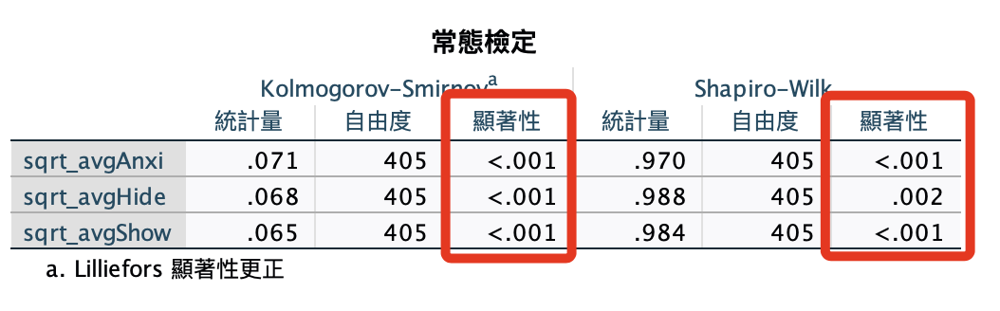

# 常態檢定

_常態檢定、常態性檢定、常態分佈檢定_

<br>

## 說明

1. 就這個研究來說，進行T檢定的時候，必須對組間差值進行常態檢定，假如不符合常態檢定，可改用非參數的 T 檢定進行。

<br>

2. 進行變異數分析時，必須對分組水平下的因變數進行常態檢定，也就是分別對 avgHide 及 avgShow 進行原始數據的常態檢定。

<br>

3. 承上，在變異數模型中的共變數主要用於解釋模型變異，對於常態性的要求並不重視，但依舊要觀察其圖形化分佈，不免極端值影響模型推論。

<br>

## 常態檢定的步驟

_初步可將常態檢定分作兩部分_

<br>

1. 因變數與連續型共變數的常態性檢定：這部分對數據本身進行檢定即可。

<br>

2. 混合模型擬合後的殘差常態性檢定。

    (1) 模型擬合後，選擇保存殘差項，並對殘差項進行常態檢定。

    (2) 這個殘差項包含了隨機效應與固定效應，反應了模型對數據整體的擬合程度。

<br>

## 步驟

1. `分析 -> 敘述統計 -> 預檢資料`。

    

<br>

2. `圖形 -> 直方圖 -> 常態圖`：直方圖比較易懂。

    

<br>

3. 貼上。

    

<br>

## 語法

1. 指定資料集。

    ```bash
    *========================================.
    *指定資料集.
    DATASET ACTIVATE 資料集1.
    *========================================.
    ```

<br>

2. 常態檢定。

    ```bash
    *========================================.
    *常態檢定：社交焦慮、顯示點讚自我揭露、隱藏點讚自我揭露.
    *avgAnxi avgHide avgShow.
    EXAMINE VARIABLES=avgAnxi avgHide avgShow
    /PLOT BOXPLOT STEMLEAF HISTOGRAM NPPLOT
    /COMPARE GROUPS
    /STATISTICS DESCRIPTIVES
    /CINTERVAL 95
    /MISSING LISTWISE
    /NOTOTAL.
    *========================================.
    ```

<br>

3. 結果不符合。

    

## 嘗試轉換 I

1. 數據轉換：對數轉換。

    ```bash
    *========================================.
    *轉換為對數.
    *avgAnxi avgHide avgShow.
    COMPUTE LavgAnxi=LN(avgAnxi).
    COMPUTE LavgHide=LN(avgHide).
    COMPUTE LavgShow=LN(avgShow).
    EXECUTE.
    *========================================.
    ```

<br>

2. 常態檢定。

    ```bash
    *========================================.
    *常態檢定：社交焦慮、顯示點讚自我揭露、隱藏點讚自我揭露.
    EXAMINE VARIABLES=LavgAnxi LavgHide LavgShow
    /PLOT BOXPLOT STEMLEAF HISTOGRAM NPPLOT
    /COMPARE GROUPS
    /STATISTICS DESCRIPTIVES
    /CINTERVAL 95
    /MISSING LISTWISE
    /NOTOTAL.
    *========================================.
    ```

<br>

3. 結果依舊不符合。

    

## 嘗試轉換 II

1. 數據轉換：平方根轉換。

    ```bash
    *========================================.
    *轉換為平方根.
    *avgAnxi avgHide avgShow.
    COMPUTE sqrt_avgAnxi = SQRT(avgAnxi).
    COMPUTE sqrt_avgHide = SQRT(avgHide).
    COMPUTE sqrt_avgShow = SQRT(avgShow).
    EXECUTE.
    *========================================.
    ```

<br>

2. 常態檢定。

    ```bash
    *========================================.
    *常態檢定：社交焦慮、顯示點讚自我揭露、隱藏點讚自我揭露.
    EXAMINE VARIABLES=sqrt_avgAnxi sqrt_avgHide sqrt_avgShow
    /PLOT BOXPLOT STEMLEAF HISTOGRAM NPPLOT
    /COMPARE GROUPS
    /STATISTICS DESCRIPTIVES
    /CINTERVAL 95
    /MISSING LISTWISE
    /NOTOTAL.
    *========================================.
    ```

<br>

3. 結果：基本的轉換都無效。

    

<br>

## 復原

1. 刪除變數。

    ```bash
    *========================================.
    *刪除變數.
    DELETE VARIABLES 
    LavgAnxi TO sqrt_avgShow.

    *執行.
    EXECUTE.
    *========================================.
    ```

<br>

___

_改用進階讀的轉換方式_
