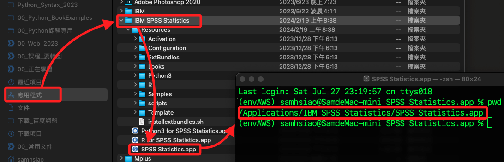

# 快速啟動 SPSS

_MacOS 通過終端機快速啟動_

<br>

## 說明

1. 從應用程式中確認 SPSS 安裝位置。

    ```bash
    /Applications/IBM SPSS Statistics/SPSS Statistics.app
    ```

    

<br>

2. 設置指令行啟動腳本 `start_spss.sh`。

    ```bash
    touch /usr/local/bin/start_spss.sh && code /usr/local/bin/start_spss.sh
    ```

<br>

3. 編輯腳本內容：在打開的編輯器中，添加以下內容，路徑就是前面所查詢到的結果。

    ```bash
    #!/bin/bash
    open "/Applications/IBM SPSS Statistics/SPSS Statistics.app"
    ```

<br>

4. 賦予並查詢執行權限。

    ```bash
    chmod +x /usr/local/bin/start_spss.sh && ls -l /usr/local/bin/start_spss.sh
    ```

<br>

5. 建立連結。

    ```bash
    sudo ln -s /usr/local/bin/start_spss.sh /usr/local/bin/spss
    ```

<br>

6. 啟動 SPSS。

    ```bash
    spss
    ```

<br>

___

_END_
