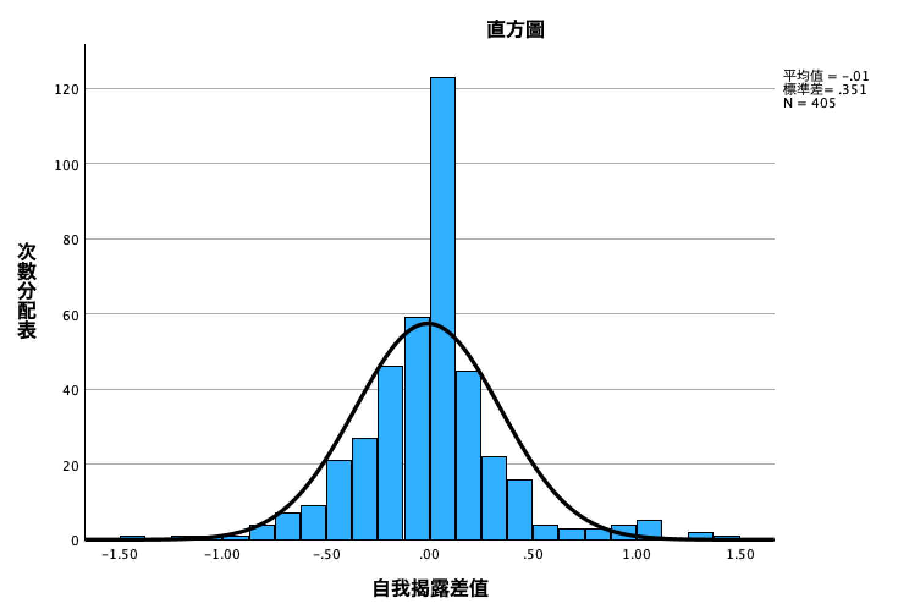
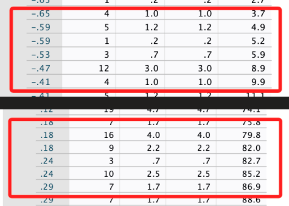
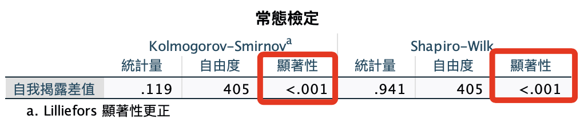
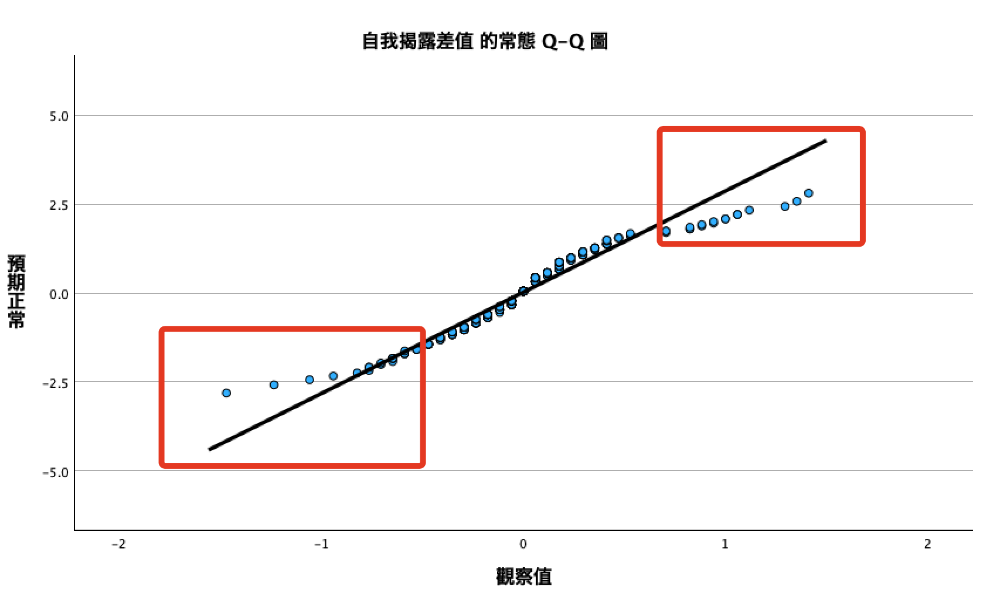
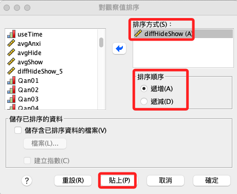

# 差分項-常態檢定與離群值

<br>

## 說明

1. 這個項目主要的目的是基於獨立樣本 T 檢定需要的差值常態檢定。

2. 另外，依據差值的分佈的結果顯示數據中可能存在的次集群，可進一步探索形成的原因。

<br>

## 報表與繪圖

1. 次數分配＋繪圖。

    ```bash
    *========================================.
    *次數分配＋繪圖.
    FREQUENCIES VARIABLES=diffHideShow 
    /HISTOGRAM NORMAL
    /ORDER=ANALYSIS.
    EXECUTE.
    *========================================.
    ```

<br>

2. 說明：這個直方圖看起來沒太大問題，大多數的樣本都集中在中間。

    

<br>

3. 但是在數據的兩端似乎出現兩個小峰的「山形」分佈。

    

<br>

## 檢定

1. 預檢資料。

    ```bash
    *========================================.
    *預檢資料.
    EXAMINE VARIABLES=diffHideShow 
    /PLOT BOXPLOT NPPLOT
    /COMPARE GROUPS
    /STATISTICS DESCRIPTIVES
    /CINTERVAL 95
    /MISSING LISTWISE
    /NOTOTAL.
    *========================================.
    ```

<br>

2. 預檢資料也顯示了不符合常態檢定。

    

<br>

3. 依據 Q-Q 圖也顯示了左右各有一個小山峰。

    

<br>

4. 參考這篇 [網路文章](https://haosquare.com/normal-distribution-qqplot/) 說明。

    

<br>

## 處理

1. 對觀察值排序。

    

<br>

2. 設定方式。

    

<br>

3. 可透過排序這個變數觀察是否有任何樣本的異樣，語法：升冪（A）、降冪（D）。

    ```bash
    *========================================.
    *排序：升冪.
    SORT CASES BY diffHideShow(A).
    *========================================.
    ```

<br>

4. 回復原狀。

    ```bash
    *========================================.
    *排序：升冪.
    SORT CASES BY UID(A).
    *========================================.
    ```

## 結論

1. 「diffHideShow」的分布在中間的值有一個明顯的峰值，而兩側則略為離散且不對稱，這樣的分佈在檢定上很容易產生不符合常態分布假設的結果。

<br>

2. 另外，在兩端所呈現的並非單純極端值，而是些微較小的兩個集群，這種「山」字形的分佈可能表示數據中存在另於的子群體，在社會科學或心理學的研究中，如果一個測量的差值集中在零附近，可能表示大多數受試者在兩個條件下的表現差異不大，而遠離零的值則在某個特定條件下的表現有群聚的現象，這需要進一步探索這個造成「群聚」的潛在變數。

<br>

___

_END_