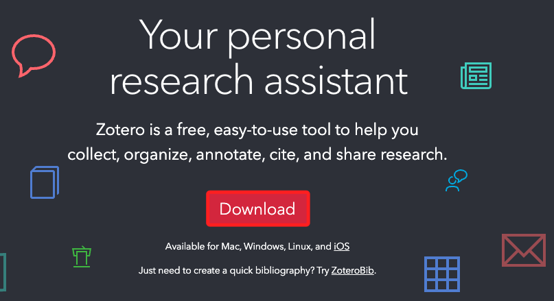
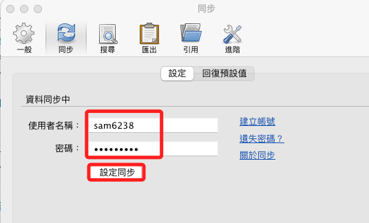
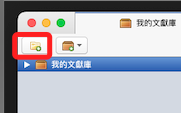
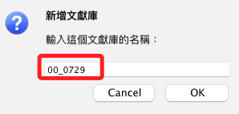
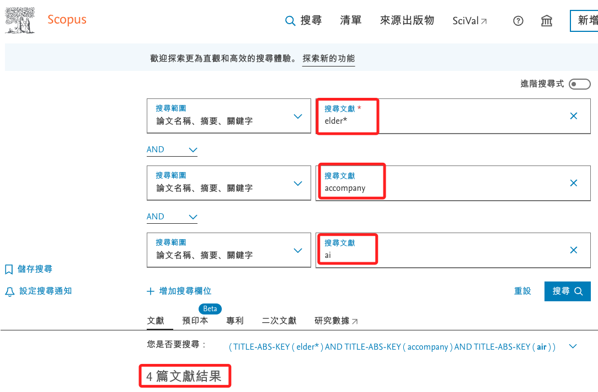
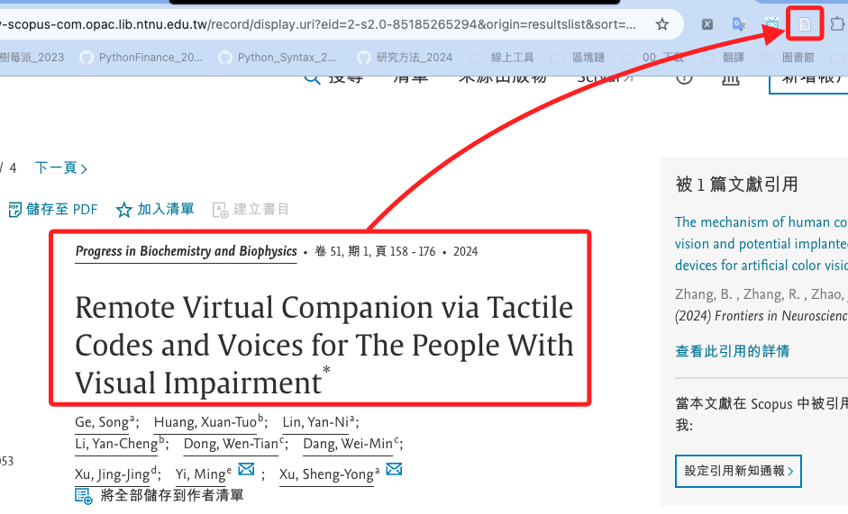
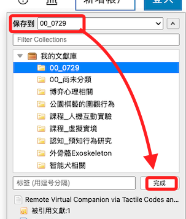
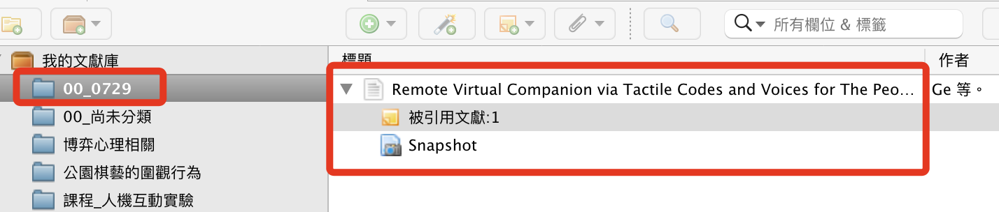
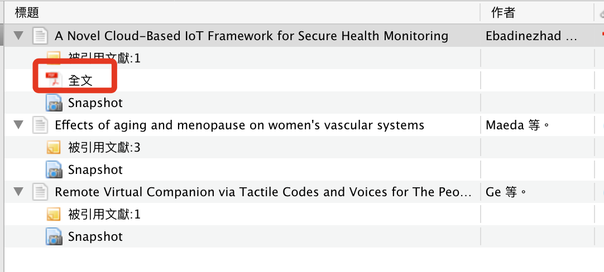

# Zotero

[官網](https://www.zotero.org/)

 

## 設定同步

 

## 實作

1. 先在 Zotero 中準備好文獻庫

    

 

2. 自訂一個名稱 `00_0729`

    

 

3. 進入圖書館系統中的 `Scopus` 進行文獻索引；舉例說，查詢關鍵字 `elder*`、`accompany`、`ai`，找到四篇文獻。

    

 

4. 任意點擊一篇進入，然後點擊 `Zotero Connector`。

    

 

5. 保存到前面步驟建立的文件夾。

    

 

6. 不過這篇沒全文。

    

 

7. 假如有全文的就會自動下載；點擊便可查看。

    

 

___

_END_