# 引用文獻

_已經在 Zotero 中儲存了文獻，接下來要在 Word 中引用文獻_

 

## 步驟

1. 安裝 Zotero 插件：Zotero 會自動為 Word 安裝插件。如果沒有，打開 Zotero，然後在 `工具 -> 插件` 中手動安裝。

    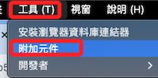

 

2. 打開 Word 並建立新的文件，點擊自動安裝好的Zotero 插件圖標。

    

 

3. 點擊 `Document Preferences`。

    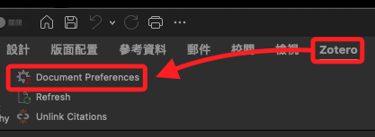

 

4. 選擇引用風格，如 `APA（7th）`。

    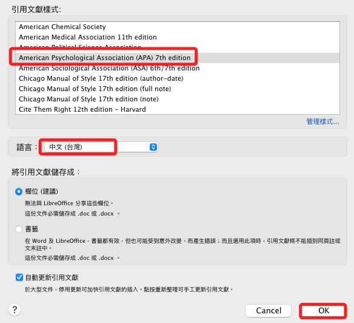

 

## 插入引用

1. 任意寫入一段文字。

    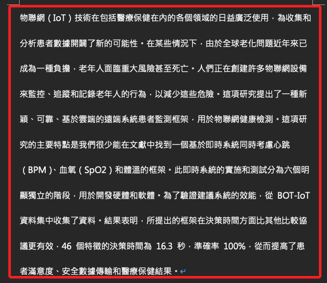

 

2. 將游標移動到要插入引用的位置，然後點擊 `Zotero` 工具欄中的 `Add/Edit Citation`，會彈出視窗。

    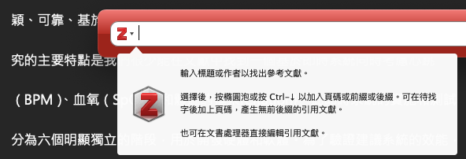

 

3. 在搜尋框中輸入關鍵詞，選擇要引用的文獻。

    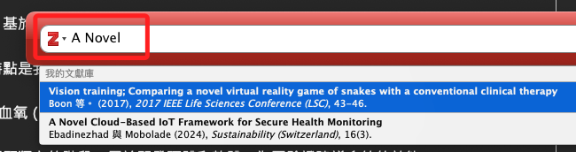

 

4. 點擊鼠標選取後按下 `ENTER` 確認，回到文本終究會自動插入引用。

    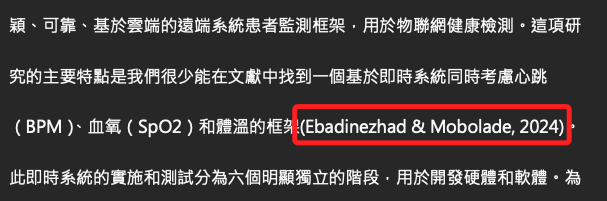

 

5. 這裡示範插入了幾個引用。

    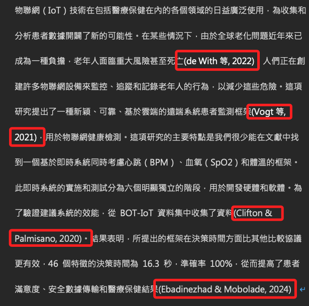

 

## 添加參考文獻列表

1. 將滑鼠游標移動到要插入參考文獻列表的位置，通常在文件的末尾，Word 的換頁組合鍵是 `command + ENTER`。點擊 Zotero 工具欄中的 `Add/Edit Bibliography`。

    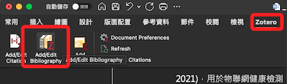

 

2. 點擊後 Zotero 將自動生成並插入參考文獻列表；如下是 APA（7th）格式。

    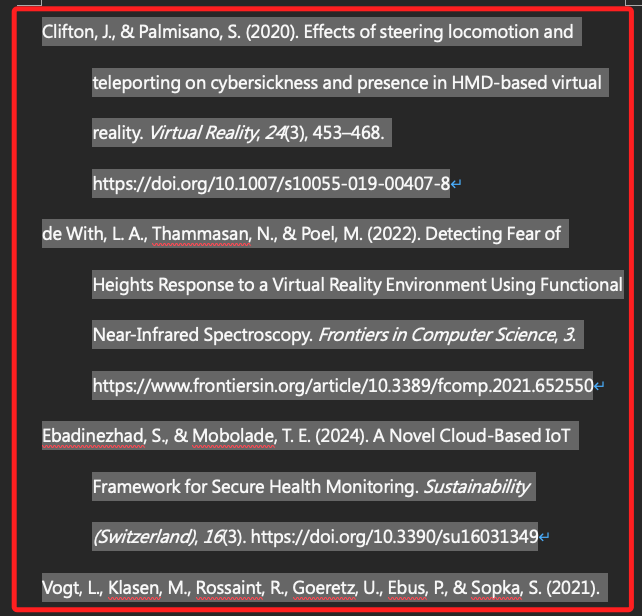

 

## 更改格式

1. 改用 `IEEE`，點擊 `OK`。

    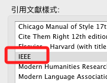

 

2. 包含內文引用註釋以及列表格式都會一次性變更。

    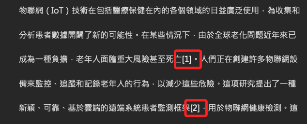

 

## 連動變更

1. 例如第一個列表原本的內容如下。

    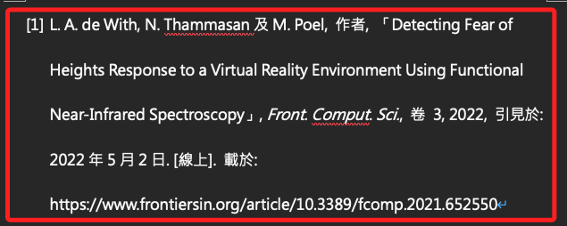

 

2. 手動進行修改，舉例說添加了一個作者。

    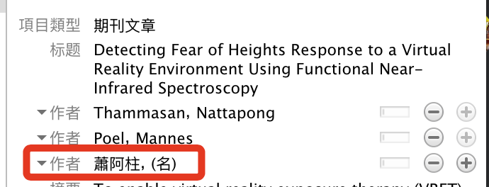

 

3. 點擊 Fresh。

    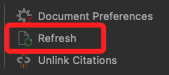

 

4. 列表中的資訊就會同步變更了。

    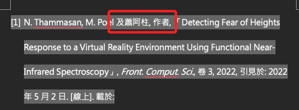

 

___

_END_