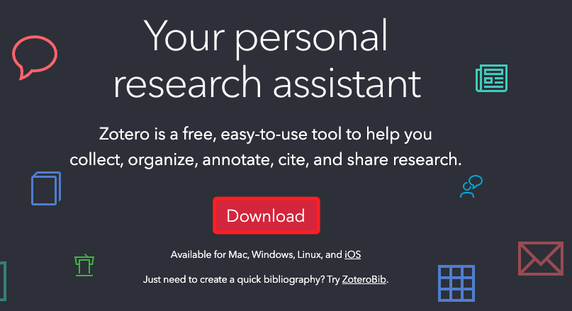
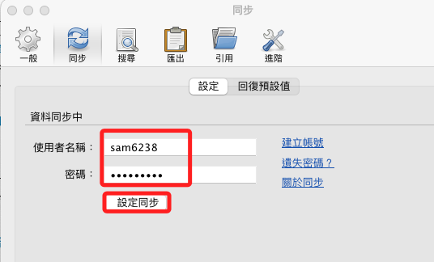
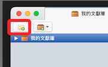
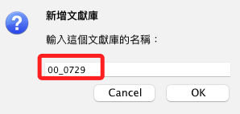
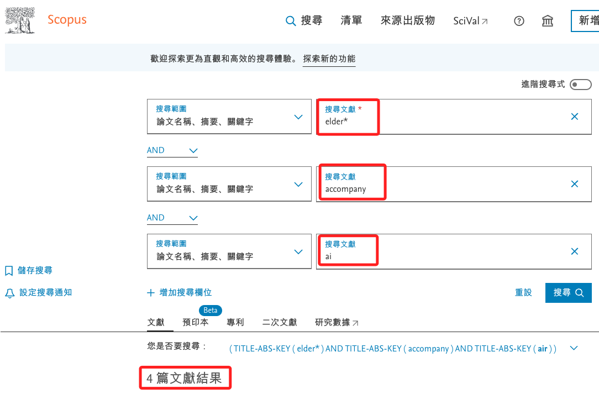
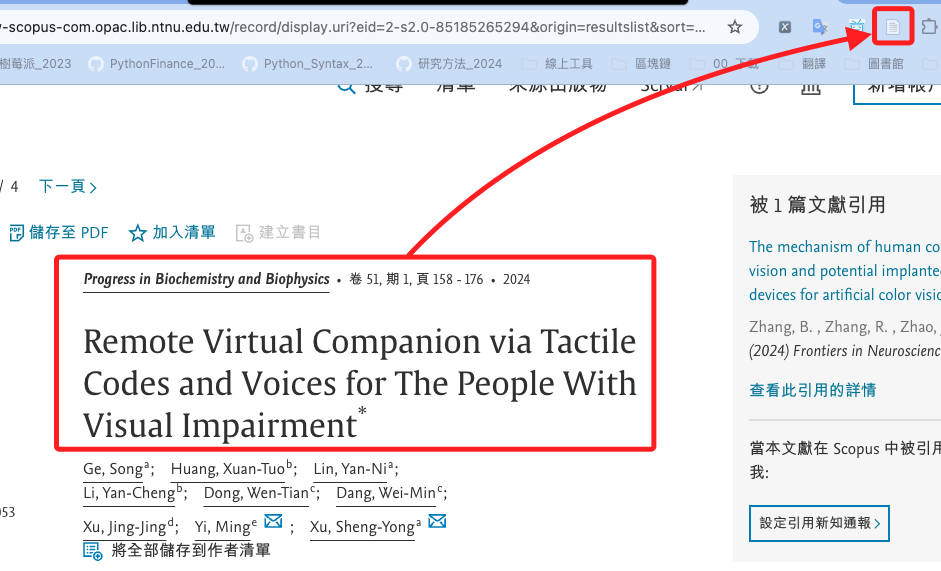
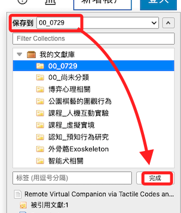
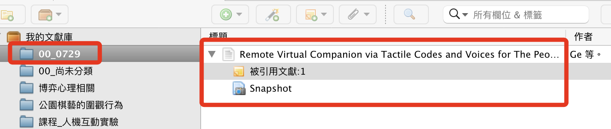
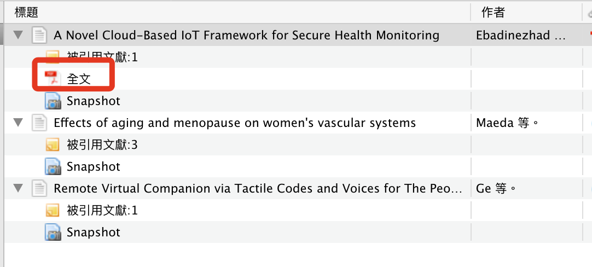

[官網](https://www.zotero.org/)

設定同步

## 實作

1. 先在 Zotero 中準備好文獻庫

2. 自訂一個名稱 `00_0729`

3. 進入圖書館系統中的 `Scopus` 進行文獻索引；舉例說，查詢關鍵字 `elder*`、`accompany`、`ai`，找到四篇文獻。

4. 任意點擊一篇進入，然後點擊 `Zotero Connector`。

5. 保存到前面步驟建立的文件夾。

6. 不過這篇沒全文。

7. 假如有全文的就會自動下載；點擊便可查看。

