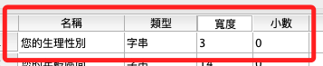
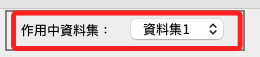
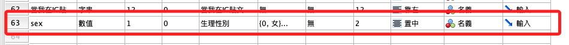
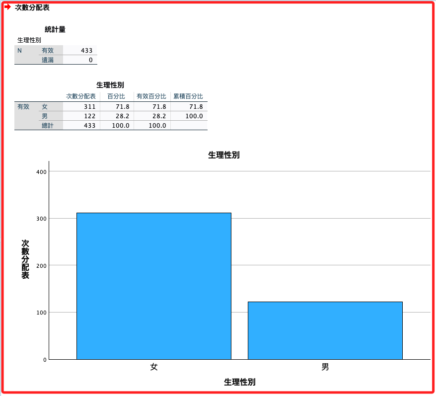

# 性別

_從第一個資料欄位開始_

<br>

## 說明

1. 可對 `變數視圖` 進行觀察，當前 `性別` 欄位的變數名稱是 `您的生理性別`，資料類型是 `字串`；在接下來的步驟中，將對資料欄位 `您的生理性別` 進行 `重新編碼為不同變數`，這是一個 _建立新變數_ 的語法，假如只是要覆蓋原本的變數，也就是執行 `重新編碼為相同變數`，那在指令中不要加入 `INTO` 語句即可。

    

<br>

2. 接著，切換到語法視窗；確認 `作用中資料集` 的名稱，這會影響語法執行的對象，需要特別注意。

    

<br>

## 重新編碼為不同變數

_對數據的屬性徹底進行修正，因為修正範圍較大，有錯誤發生時相對不易觀察，在還不熟悉操作時要特別仔細檢查_

<br>

1. 要進行編碼的內容包含了 `變數名稱`、`標籤`、`值標籤`、`小數位數`、`寬度`、`類型`、`對齊方式` 等，每個項目都由不同的語句控制。

    ```bash
    *========================================.
    *重新編碼為不同變數.
    *年齡.

    * 使用資料.
    DATASET ACTIVATE 資料集1.

    *重新編碼為不同變數，若編碼為相同變數則不要加上 INTO 即可.
    RECODE 您的生理性別 ('男'=1) ('女'=0) (ELSE=2) INTO sex.

    *變數名稱、變數標籤.
    VARIABLE LABELS  sex '生理性別'.

    *值標籤.
    VALUE LABELS sex 0 '女' 1 '男' 2 '其他'.

    *小數的位數為「0」，F 為 Format 的意思.
    FORMATS sex (F1.0).

    *變數寬度.
    VARIABLE WIDTH sex(2).

    *變數類型為名義.
    VARIABLE LEVEL sex (NOMINAL).

    *靠左 置中 靠右 LEFT CENTER RIGHT.
    VARIABLE ALIGN sex (CENTER).

    *執行.
    EXECUTE.
    *========================================.
    ```

<br>

2. 執行完會出現在 `變數視圖` 的最下面一列（row）。

    

<br>

3. 補充說明，若數據的資料集與作用中資料集不同時，可透過指令開啟指定的資料集。

    ```bash
    *========================================.
    DATASET ACTIVATE 資料集1.
    *========================================.
    ```

<br>

4. 數據的資料集在 `資料編輯器` 上方會顯示。

    

<br>

5. 作用中資料集則在 `語法編輯器` 中顯示。

    

<br>

## 簡易重新編碼

_僅針對必要的項目進行編碼_

<br>

1. 簡易編碼著重在數據值與類型的變更；後續將採用這個原則處理。

<br>

2. 簡易編碼指令。

    ```bash
    *========================================.
    *重新編碼為不同變數.
    DATASET ACTIVATE 資料集1.

    *重新編碼為不同變數，若編碼為相同變數則不要加上 INTO 即可.
    RECODE 您的生理性別 ('男'=1) ('女'=0) (ELSE=2) INTO sex.

    *小數的位數為「0」，F 為 Format 的意思.
    FORMATS sex (F1.0).

    *變數類型為名義.
    VARIABLE LEVEL sex (NOMINAL).

    *執行.
    EXECUTE.
    *========================================.
    ```

<br>

## 繪圖

1. 次數分配＋繪圖（`長條圖 BARCHART`）。

    ```bash
    *========================================.
    *次數分配＋繪圖：性別.
    FREQUENCIES VARIABLES=sex
    /BARCHART FREQ
    /ORDER=ANALYSIS.
    *執行.
    EXECUTE.
    *========================================.
    ```

2. 若有開啟檢視器，即可觀察數據的內容與圖形。

    

<br>

## 完成

1. 確認無誤後可將舊變數刪除。

    ```bash
    *========================================.
    *刪除原有變數.
    DELETE VARIABLES 您的生理性別.
    *========================================.
    ```

<br>

2. 在後續的步驟中，對於細節將不再贅述

<br>

___

_END_
