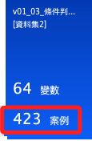

# 使用經驗

_基本上，分析應該基於具有使用經驗的受測者，所以這個變數篩選的過程著重於對數據的觀察與必要敘述，在分析階段是可以予以刪除的；但是要特別強調，任何原始數據的刪除都必須予以描述。_

<br>

## 步驟說明

1. 開啟指定的資料集；可省略。

    ```bash
    *========================================.
    DATASET ACTIVATE 資料集1.
    *========================================.
    ```

<br>

2. 簡易重新編碼，將使用者經驗的變數命名為 `Experience`。

    ```bash
    *========================================.
    *重新編碼為不同變數：使用經驗 Experience.

    *重新編碼為不同變數，若編碼為相同變數則不要加上 INTO 即可.
    RECODE 請問您是否曾使用Instagram？（若填否則不需填寫 ('是'=1) ('否'=0)  INTO Experience.

    *小數的位數為「0」，F 為 Format 的意思.
    FORMATS Experience (F1.0).

    *變數類型為名義.
    VARIABLE LEVEL Experience (NOMINAL).

    *執行.
    EXECUTE.
    *========================================.
    ```

<br>

3. 給變數添加 `標籤`、`值標籤`、`小數位數`、`變數類型`；其實這可以省略，因為之後會刪除這個變數，這是由於分析將只針對具備使用經驗的樣本進行，這個變數僅用於刪除唔使用經驗樣本之用；嚴格說來，這是一個陷阱題，也就是對無使用經驗卻進行受測的樣本進行再次篩選。

    ```bash
    *========================================.
    *標籤名稱.
    VARIABLE LABELS Experience '使用經驗'.

    *小數的位數為「0」，F 為 Format 的意思.
    FORMATS Experience (F1.0).

    *靠左 置中 靠右 LEFT CENTER RIGHT.
    VARIABLE ALIGN Experience (CENTER).

    *變數類型為名義.
    VARIABLE LEVEL Experience (NOMINAL).

    *值標籤.
    VALUE LABELS Experience
    0 '否'
    1 '是'
    2 ELSE
    .

    *執行.
    EXECUTE.
    *========================================.
    ```

<br>

## 繪圖

1. 次數分配＋繪圖。

    ```bash
    *========================================.
    *次數分配＋繪圖：使用經驗.
    FREQUENCIES VARIABLES=Experience
    /BARCHART FREQ
    /ORDER=ANALYSIS.
    *========================================.
    ```

    _輸出結果_

    

<br>

## 儲存文件

_這部分只是補充說明 `過濾器` 與 `條件判斷式` 在本質上的差異，由於可能破壞數據，所以進先儲存一個備份的版本再繼續。_

<br>

1. 儲存數據。

    ```bash
    *==============================.
    *儲存檔案.
    SAVE OUTFILE='/Users/samhsiao/Desktop/00_論文實作/v01_02_過濾使用經驗之前.sav'.
    *==============================.
    ```

<br>

## 過濾資料

1. 若要 _暫時隔離資料_，使用的語法是 `FILTER BY`；操作上先建立一個過濾器器變數 `FilterVariable`，然後基於過濾器使用過濾語句 `FILTER` 進行數據篩選，恢復原狀僅需關閉過濾器即可；再次提示，使用過濾器不會影響數據樣本，只是一個臨時的資料篩選機制。

    ```bash
    *========================================.
    * 建立一個過濾器變數.
    COMPUTE FilterVariable = (Experience ~= 0).
    * 使用過濾器變數進行篩選（不可直接進行條件篩選）.
    FILTER BY FilterVariable.

    * 次數分配表指令.
    FREQUENCIES VARIABLES=Experience /ORDER=ANALYSIS.
    *========================================.
    ```

    _觀察樣本數為 `423`_

    

<br>

2. 進入 `概觀` 查看，有效案例依舊是 `433`。

    

<br>

3. 關閉過濾器；補充說明，因為過濾器不涉及樣本數的增修，可以不用添加語句 `EXECUTE.`。

    ```bash
    * 關閉過濾器，查看所有案例.
    FILTER OFF.
    ```

<br>

4. 觀察變化；確認數據已經復原。

    ```bash
    *========================================.
    *透過次數分配進行觀察.
    DATASET ACTIVATE 資料集1.
    FREQUENCIES VARIABLES=Experience /ORDER=ANALYSIS.
    *========================================.
    ```

<br>

5. 刪除過濾用的變數。

    ```bash
    *========================================.
    *刪除變數.
    DELETE VARIABLES FilterVariable.
    *========================================.
    ```

<br>

6. 使用全部的資料。

    ```bash
    *========================================.
    USE ALL.
    EXECUTE.
    *========================================.
    ```

<br>

## 假如使用 `條件判斷式` 進行篩選

1. 條件判斷語句 `SELECT IF`。

    ```bash
    * 使用條件篩選進行篩選.
    SELECT IF (Experience ~= 0).
    EXECUTE.

    * 次數分配表指令.
    FREQUENCIES VARIABLES=Experience /ORDER=ANALYSIS.
    ```

<br>

2. 切換到 `概觀視圖` 會發現案例數確實減少了，這表示這個語句不僅僅是 `隔離` 了數據，而是將數據從資料集中刪除。

    

<br>

3. 具體說，無論是過濾或是條件判斷，其所執行的都是 `資料 -> 選取觀察值`；但是在子功能選單中， `SELECT IF` 執行的是 `刪除未選取的觀察值`，而 `FILTER BY` 所運行的是 `過濾掉未選取的觀察值`。

    

<br>

## 永久刪除

_由於研究對象是針對有使用經驗的受試者，所以在這個清洗步驟中將無使用經驗者刪除_

<br>

1. 延續前面的說明，假如想要篩選並直接永久刪除資料，可使用語句 `SELECT IF`；特別注意，只要涉及對資料的具體變動，都需要運行 `EXECUTE.` 來確認執行。

    ```bash
    *========================================.
    * 選取「使用經驗」為「否（0）」以外的樣本，並將其保留.
    USE ALL.
    SELECT IF (Experience ~= 0).
    EXECUTE.
    *========================================.
    ```

<br>

2. 觀察變化。

    ```bash
    *========================================.
    *透過次數分配進行觀察.
    FREQUENCIES VARIABLES=Experience /ORDER=ANALYSIS.
    *========================================.
    ```

<br>

3. 結果。

    

<br>

4. 刪除變數：使用經驗。

    ```bash
    *========================================.
    *刪除變數.
    DELETE VARIABLES Experience.
    DELETE VARIABLES 請問您是否曾使用Instagram？（若填否則不需填寫 .
    *========================================.
    ```

<br>

___

_END_
