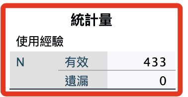

# 使用經驗

_基本上，分析應該基於具有使用經驗的受測者，所以這個變數篩選的過程著重於對數據的觀察與必要敘述，在分析階段是可以予以刪除的；但是要特別強調，任何原始數據的刪除都必須予以描述。_

<br>

## 步驟說明

1. 開啟指定的資料集；可省略。

    ```bash
    *========================================.
    DATASET ACTIVATE 資料集1.
    *========================================.
    ```

<br>

2. 簡易重新編碼，將使用者經驗的變數命名為 `Experience`。

    ```bash
    *========================================.
    *重新編碼為不同變數：使用經驗 Experience.

    *重新編碼為不同變數，若編碼為相同變數則不要加上 INTO 即可.
    RECODE 請問您是否曾使用Instagram？（若填否則不需填寫 ('是'=1) ('否'=0)  INTO Experience.

    *小數的位數為「0」，F 為 Format 的意思.
    FORMATS Experience (F1.0).

    *變數類型為名義.
    VARIABLE LEVEL Experience (NOMINAL).

    *執行.
    EXECUTE.
    *========================================.
    ```

<br>

3. 給變數添加 `標籤`、`值標籤`、`小數位數`、`變數類型`；其實這可以省略，因為之後要刪除。

    ```bash
    *========================================.
    *標籤名稱.
    VARIABLE LABELS Experience '使用經驗'.

    *小數的位數為「0」，F 為 Format 的意思.
    FORMATS Experience (F1.0).

    *靠左 置中 靠右 LEFT CENTER RIGHT.
    VARIABLE ALIGN Experience (CENTER).

    *變數類型為名義.
    VARIABLE LEVEL Experience (NOMINAL).

    *值標籤.
    VALUE LABELS Experience
    0 '否'
    1 '是'
    2 ELSE

    *執行.
    EXECUTE.
    *========================================.
    ```

<br>

## 繪圖

1. 次數分配＋繪圖。

    ```bash
    *========================================.
    *次數分配＋繪圖：使用經驗.
    FREQUENCIES VARIABLES=Experience
    /BARCHART FREQ
    /ORDER=ANALYSIS.
    *========================================.
    ```

<br>

2. 輸出結果。

    

<br>

## 暫時篩選

1. 篩選並暫時隔離資料 `FILTER`。

    ```bash
    *========================================.
    * 建立一個過濾器變數.
    COMPUTE FilterVariable = (Experience ~= 0).
    * 使用過濾器變數進行篩選（不可直接進行條件篩選）.
    FILTER BY FilterVariable.

    * 次數分配表指令.
    FREQUENCIES VARIABLES=Experience /ORDER=ANALYSIS.

    * 關閉過濾器，以查看所有案例.
    FILTER OFF.
    EXECUTE.
    *========================================.
    ```

<br>

2. 觀察變化。

    ```bash
    *========================================.
    *透過次數分配進行觀察.
    DATASET ACTIVATE 資料集1.
    FREQUENCIES VARIABLES=Experience /ORDER=ANALYSIS.
    *========================================.
    ```

<br>

3. 刪除過濾用的變數。

    ```bash
    *========================================.
    *刪除變數.
    DELETE VARIABLES FilterVariable.
    *========================================.
    ```

<br>

4. 使用全部的資料。

    ```bash
    *========================================.
    USE ALL.
    EXECUTE.
    *========================================.
    ```

<br>

## 永久刪除

1. 假如篩選並直接永久刪除資料，可改用 `SELECT IF`。

    ```bash
    *========================================.
    * 選取「使用經驗」為「否（0）」以外的樣本，並將其保留.
    USE ALL.
    SELECT IF (Experience ~= 0).
    EXECUTE.
    *========================================.
    ```

<br>

2. 觀察變化。

    ```bash
    *========================================.
    *透過次數分配進行觀察.
    FREQUENCIES VARIABLES=Experience /ORDER=ANALYSIS.
    *========================================.
    ```

<br>

3. 結果。

    

<br>

4. 刪除變數：使用經驗。

    ```bash
    *========================================.
    *刪除變數.
    DELETE VARIABLES Experience.
    DELETE VARIABLES 請問您是否曾使用Instagram？（若填否則不需填寫 .
    *========================================.
    ```

<br>

___

_END_
